# Kibitzer 홍보 영상 — 콘티

**1440×1080 (4:3) · 30fps · 1,275프레임 = 42.50초** · macOS 데스크톱(Dock 숨김, 메뉴바·시계 노출)

이 문서 하나가 영상의 전체 설계도입니다. `src/timeline.ts`에 상수로 박혀 있는 **모든 비트**를 순서대로, 그 프레임에 화면에 무엇이 있고 무엇이 움직이는지 문장으로 풀었습니다. 코드가 진실이고 이 문서는 그 코드를 읽는 방법입니다 — 프레임을 고치려면 이 문서가 아니라 `timeline.ts`를 고칩니다.

**스틸 읽는 법.** 본문 중간에 들어간 41장은 실제 컴포지션에서 그대로 뽑은 렌더입니다. 다만 **설명하는 비트와 스틸의 프레임이 항상 일치하지는 않습니다** — 그 대목에서 가장 가까운, 같은 느낌의 프레임을 골랐습니다. 캡션의 `f###`가 그 스틸의 실제 프레임이고, 괄호 안이 재생 시각과 메뉴바 시계입니다.

**시계는 뛰지 않고 흐릅니다.** 본문에 적힌 시각은 그 프레임에 표시되는 값이지 그 구간에 고정된 값이 아닙니다 — 아래 [시계](#시계는-흐른다)를 먼저 보면 나머지가 읽기 쉽습니다.

```sh
cd apps/promo && npx remotion studio      # 타임라인 스크럽
node scripts/render-stills.mjs            # 스틸 41장 전체 재렌더
node scripts/render-stills.mjs s2         # s2로 시작하는 것만
node scripts/check-timeline.mjs           # 재편집이 조용히 깨뜨리는 것들 점검
node scripts/doc-pages.mjs                # 문서 페이지·글자 수 점검

npx remotion render KibitzerPromo out/kibitzer-promo.mp4 \
  --codec=h264 --crf=17 --timeout=180000 --concurrency=3
```

> 렌더 플래그 둘은 장식이 아닙니다. 기본값으로 돌리면 300프레임 근처에서 폰트 `delayRender()`가 28초 한도를 넘겨 죽습니다.

---

## 페이싱 규칙 — 착지는 느리게, 달리기는 빠르게

이 컷의 페이싱은 두 문장으로 요약됩니다.

**착지에는 시간을 줍니다.** 씬이 바뀔 때마다 관객은 처음 보는 페이지 앞에 놓이는데, 예전 컷은 이미 아는 두 페이지 사이를 오갈 때와 **같은 속도로** 그 페이지를 떠났습니다. 지금은 도착 직후 약 0.7배로 늘어집니다 — 소셜 피드는 1초, 열린 대화창은 0.5초를 가만히 있고, 쇼핑몰 목록은 0.66초를 스크롤한 뒤에야 첫 클릭이 나옵니다. "여기가 어디인지" 알기 전에는 다음 동작이 아무 뜻도 없습니다.

**제품 화면과 빈 화면에는 그보다 더 줍니다.** 이 규칙이 가장 늦게 적용된 곳이 둘입니다. 하나는 **팝업** — 제품이 화면에 있는 유일한 장면인데도 51프레임만 떠 있어서 "무언가 떴다"까지만 읽혔습니다. 지금은 그 2.5배인 **126프레임**을 쓰고, 늘어난 프레임은 전부 읽을 것에 들어갑니다: 첫 실행 안내와 예시 칩에 24프레임, 목표 문장을 **마지막 글자까지** 치는 데 42프레임, `시작` 뒤 활성 화면에 40프레임. 다른 하나는 S2 끝의 **캐럿 공백** — 18프레임에서 **45프레임(1.5초)** 으로 늘렸습니다. 18프레임은 동작과 동작 사이의 숨이지만, 45프레임은 딴짓이 걸어 들어올 **빈자리**입니다.

**달리기는 시간이 아니라 예산입니다.** 착지 뒤에 이어지는 구간은 전부 **고정 창(window)** 을 받고, 속도를 그 창에서 나눠 씁니다. DM 세그먼트는 `(to − from) ÷ 메시지 수`로 프레임/메시지를 유도하고(`dmSegments`), 문서 블록은 `다음 블록까지의 간격 ÷ 글자 수`로 프레임/글자를 유도합니다(`rateFor`). 그래서 **대화를 더 길게 써 넣어도 상영 시간은 그대로이고 속도만 빨라집니다.** 카피를 고쳐서 영상 길이가 바뀌는 일은 구조적으로 일어나지 않습니다.

---

## 전체 지도

| 씬 | 프레임 | 초 | 시계 | 한 줄 |
|---|---|---|---|---|
| S1 목표 선언 | 0–144 | 0.0–4.8 | 2:00 | 새 탭 → 확장 아이콘 → **팝업을 읽고** → 목표 타이핑 → `추적 시작` |
| S2 리서치 루프 | 144–411 | 4.8–13.7 | 2:00→3:02 | 검색·정독·작성 3사이클, 포물선 가속 → 감속 → **커서만 1.5초** |
| S3 딴짓① 메시지 | 411–643 | 13.7–21.4 | 3:02→3:11 | `g`+Tab → 피드 → 민아와 긴 대화 + 쌓인 알림 둘 → 음악 링크 → **훈수 #1** |
| S4 딴짓②③ 쇼핑 | 643–869 | 21.4–29.0 | 3:11→3:29 | 포털 → 쇼핑몰 착지 → 격자·**옵션**·레일·**뒤로**·**몰 검색**으로 5개 → **훈수 #2** → `5분만` → **훈수 #3** |
| S5 정지 | 869–929 | 29.0–31.0 | 3:29 | 전부 멈춤 · 1.04 푸시인 · 1.2초 정적 |
| S6 정리·복귀 | 929–1043 | 31.0–34.8 | 3:29→3:31 | 무관한 탭 4개 정리 → 문서 확인 → 새 리서치 → **한참 읽은 뒤 칭찬** |
| S7 마무리 | 1043–1205 | 34.8–40.2 | 3:32→3:55 | 결론 작성 → 참고 자료 → 메일 전송 → 세션 요약 |
| S8 엔드카드 | 1205–1275 | 40.2–42.5 | — | 로고 · 워드마크 · 태그라인 |

제품이 내는 소리는 넷뿐입니다: `ding.wav`가 훈수 #1·#2·#3에, `celebrate.wav`가 칭찬에. 전부 확장의 실제 WAV이고, 붙일 프레임은 `timeline.ts`의 `sfx` 배열이 손으로 들고 있습니다.

손이 내는 소리 — 타건음과 마우스 클릭 — 는 손으로 찍지 않습니다. 수백 개인 데다 전부 어딘가의 `typed()` 호출이나 `click: true` 웨이포인트의 결과라서, 따로 적어두면 리타임 한 번에 그림과 소리가 조용히 어긋납니다. 그래서 `lib/inputsfx.ts`가 같은 숫자에서 큐를 뽑아냅니다. 두 가지 규칙이 있습니다:

- **크기** — 타건음은 알림음의 60%를 넘지 않습니다. 실측 기준 훈수가 -16.3 dBFS, 최대 타건이 54%, 최대 클릭이 58%(스프리 한복판)입니다. 파일 피크로는 계산이 안 맞습니다 — 렌더가 44.1k를 48k로 리샘플하면서 딩이 약 3 dB 손해를 봅니다. `npx remotion render KibitzerPromo out/mix.wav`로 오디오만 뽑아 재는 게 정답입니다.
- **밀도** — `timeline.ts`의 `driveAt`이 그 프레임에서 영화가 얼마나 밀어붙이는지를 0–1로 들고 있고, 타건 간격이 그걸 따라 단계로 바뀝니다. 리서치 포물선 정점에서 초당 25타, 목표 선언과 정리 구간에서 10타, 힘이 빠지는 `writeP11`에서 8타, 프리즈에서 0. 이건 `GAUGE`로 대신할 수 없습니다 — S는 리서치 내내 100에, 스프리 내내 0에 평평하게 붙어 있어서 "온 골인가"를 재지 "얼마나 빠른가"를 재지 않습니다.

샘플 자체는 합성입니다(`scripts/make-input-sfx.mjs`). 키보드 10종·클릭 10종 중에서 `paper`(아주 부드러운 노트북)와 `mouse`(표준 딸깍)를 골랐고, `node scripts/make-input-sfx.mjs --audition`으로 나머지도 들어볼 수 있습니다.

---

## S1 — 목표 선언 (0–144, 4.8초)

**f0.** 화면은 이미 켜져 있습니다. 브라우저 창 하나에 `새 탭` 한 장, 메뉴바에는 사과·`Chrome`·메뉴 이름들과 오른쪽 끝의 `8월 4일 (화) 오후 2:00`. 툴바 오른쪽 확장 아이콘에는 **배지가 없습니다** — 목표가 선언되기 전에는 배지 자체가 붙지 않습니다(`dotColor.none`). 포인터는 화면 한가운데(576, 432)에 멈춰 있습니다.

**f0→f13.** 영상에서 처음 움직이는 것은 이 포인터입니다. 6프레임을 그대로 서 있다가 오른쪽 위 확장 아이콘까지 대각선으로 건너갑니다. 화면 중앙에서 아이콘까지의 이 한 번의 이동이 도입부 전체입니다.

**popupOpen 16.** 클릭. 296px 팝업이 8프레임에 걸쳐 떠오릅니다. 확장이 직접 번들하는 **고운돋움**으로 렌더됩니다. 이 프로필에서 목표를 선언한 적이 없으므로 셋업 화면이 첫 실행 모습으로 뜹니다 — 🎯 `구체적일수록 판정이 정확해요` 안내와 예시 칩 세 장(`졸업논문 관련연구 정리` · `이력서 포트폴리오 섹션 쓰기` · `선형대수 3장 문제풀이`), 그 아래 `목표` 입력칸과 108px `사용 시간` 드롭다운이 한 줄, 초록 `시작`, 안내 한 줄, `설정`.

**f16→f34: 먼저 읽습니다.** 팝업이 뜨고 나서 **24프레임(0.8초)** 동안 아무도 아무것도 치지 않습니다. 포인터는 방금 누른 아이콘 위에 그대로 서 있고, 화면에는 안내 문구와 예시 칩 세 장만 있습니다. 예전 컷은 팝업이 뜬 지 7프레임 만에 타이핑을 시작해서, **제품이 화면에 있는 유일한 장면**을 아무도 읽지 못했습니다. 이 씬에서 팝업이 화면에 있는 시간 전체가 예전의 **2.5배**이고, 늘어난 프레임은 전부 여기와 아래 두 곳에 들어갔습니다.

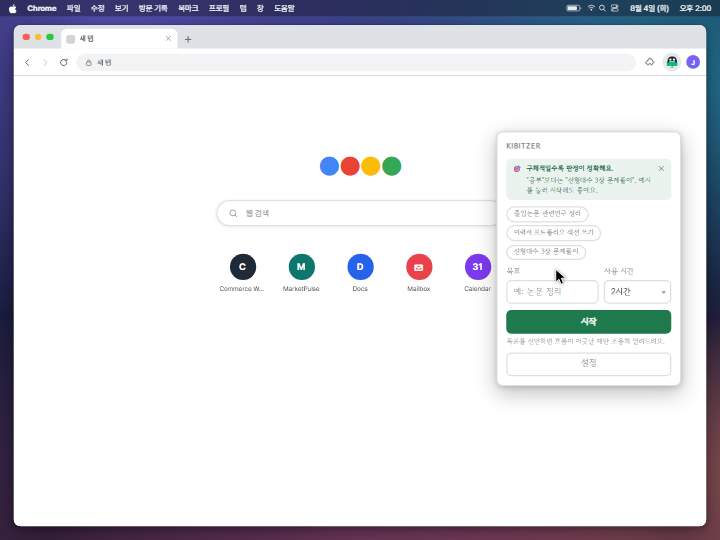
> **f32 (1.1초 · 2:00)** — 첫 실행 셋업. 🎯 안내, 예시 칩 세 장, 빈 목표 입력칸, `2시간` 드롭다운.

**f34–36 → goalTypeStart 40 → goalTypeEnd 82.** 포인터가 입력칸(897, 418)으로 내려가 클릭하고, 목표가 글자당 1.55프레임으로 찍힙니다 — **"쇼핑 플랫폼의 고객 유인 전략 분석 보고서 작성"**. 26글자 × 1.55 = 41프레임, 즉 **문장이 끝까지 다 찍힙니다.** 예전에는 `시작`이 입력칸을 먼저 걷어가서 목표가 `…유인 전략 분석 보` 근처에서 잘렸습니다 — 선언한 목표가 무엇인지 읽을 수 없으면 뒤의 훈수 세 개가 무엇을 근거로 말하는지도 읽히지 않습니다. 캐럿은 타이핑 중에는 깜빡이지 않고 켜져 있습니다.

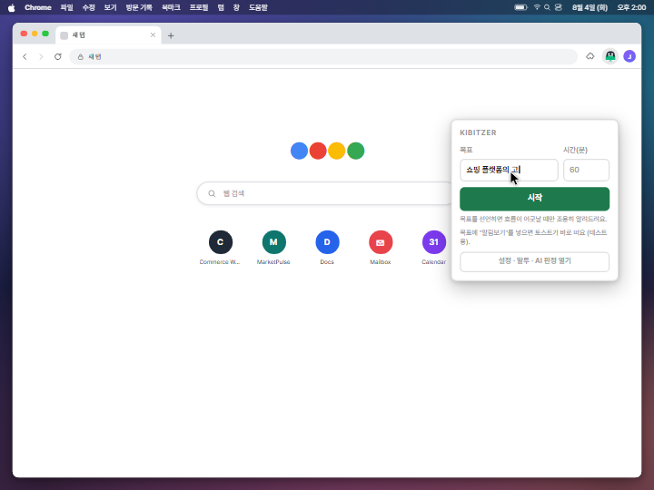
> **f74 (2.5초 · 2:00)** — 목표를 치는 중. 선언 전이라 툴바 배지가 아직 없습니다.

**startClick 100.** 포인터가 버튼(942, 466)으로 내려가 클릭하고, 버튼이 5프레임 눌린 채로 잠깁니다. 같은 프레임에 **툴바 아이콘의 상태 점이 초록으로 켜집니다** — 몰입도 S가 100에서 시작하기 때문입니다. 2프레임 뒤 팝업이 활성 화면으로 바뀝니다: `현재 목표`와 17px 굵은 목표 문장, **해시계**(새싹과 해 — 그림자는 아직 가장 짧습니다), 가득 찬 초록 **몰입 바**에 `● 집중`과 `100 / 100`, 그리고 `● AI 판정 활성화` · `말투 · 건조한 훈수꾼` · `목표 변경 / 일시정지 / 종료하기` · `설정`.

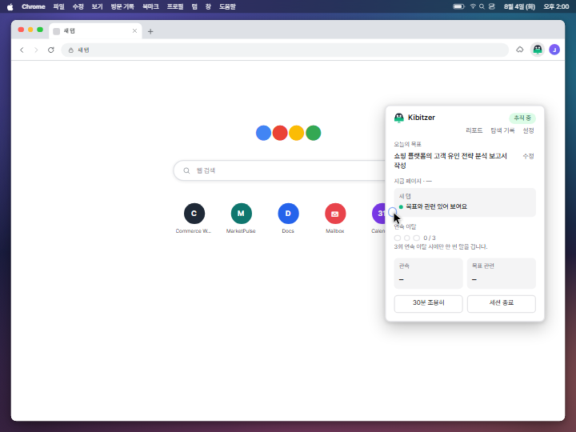
> **f120 (4.0초 · 2:00)** — `추적 시작` 직후. 초록 pill, 초록 배지.

**startClick 100 → popupClose 136.** 활성 화면은 **40프레임(1.3초)** 머뭅니다. 목표 한 줄, 해시계, `100 / 100`, 말투 줄까지 한 번씩 눈이 닿을 시간입니다 — 예전 컷은 여기에 10프레임을 줬고, 그 10프레임은 "초록색 무언가가 스쳤다"였습니다. 그동안 포인터는 버튼에서 손을 떼고 팝업 왼쪽에서 기다립니다. f136에 팝업이 6프레임에 걸쳐 사라지고, 포인터가 페이지 쪽으로 내려옵니다.

---

## S2 — 리서치 루프 (144–411, 8.9초)

리서치가 실제처럼 보이려면 **같은 두 탭을 오가는 그림이 아니라, 자료를 찾아 들어가는 그림**이 필요합니다. S2는 검색 결과 페이지로 세 번 돌아가고, 매번 **다른 행**을 클릭해 **서로 다른 세 개의 자료**를 엽니다. 탭 스트립이 그만큼 채워지는 것이 이 씬의 진행 표시줄입니다.

페이싱은 포물선입니다. 도입은 따라 읽을 수 있는 속도로 갑니다 — 검색 결과 12프레임, 기사 정독 20프레임. 그 뒤 5초가 가속했다가 뭉개졌다가 다시 내려옵니다. 정점에서는 **자료 페이지가 11프레임(0.37초)** 떠 있고 **문단 하나가 12프레임**에 완성됩니다.

### 사이클 A — 첫 자료를 제대로 찾는다 (144–211)

**searchEnter1 146.** 탭은 검색 결과 하나뿐입니다. 주소창은 `search.norra.com/?q=`, 페이지 상단 검색 상자에 `marketplace customer acquisition cost benchmark`가 글자당 0.16프레임으로 밀려 들어오고, 그 아래 `전체 / 이미지 / 뉴스 / 동영상 / 도서` 줄과 `검색결과 약 1,240,000개 (0.31초)`. 결과 세 건은 각각 아이콘·호스트·경로·제목·요약 두 줄이고, 호스트는 전부 가상입니다(`commerceweekly.com`, `retailops.io`, `thelanding.dev`). 하단에는 `관련 검색어` 칩 넉 장.

> **클릭하지 않는 두 행이 일을 합니다.** 세 질의 모두 선택되지 않은 행이 보고서 §1이 말하는 선행 논의의 두 갈래입니다 — 한쪽은 채널 귀속의 정확도(`last touch, first touch, and what each one hides`), 다른 한쪽은 할인의 가격 탄력성(`discount elasticity, re-estimated for 2026`). 둘을 지나쳐 세 번째 자료로 가는 그림이 있어야 "두 갈래 모두 획득을 하나의 사건으로 취급한다"가 주장이 아니라 **선택**으로 읽힙니다. 관련 검색어 칩은 다음 질의가 어디서 나왔는지를 대고, 세 번째 세트의 마지막 칩은 복귀 후에 실제로 타이핑되는 질의입니다.

**result1Click 158.** 클릭 5프레임 전인 f153에 첫 행이 **회색으로 들리고 제목에 밑줄이 그어집니다** — 포인터가 그 위에 있다는 표시입니다. f158에 클릭. 결과 페이지에 12프레임을 주는 것이 이 씬의 착지입니다.

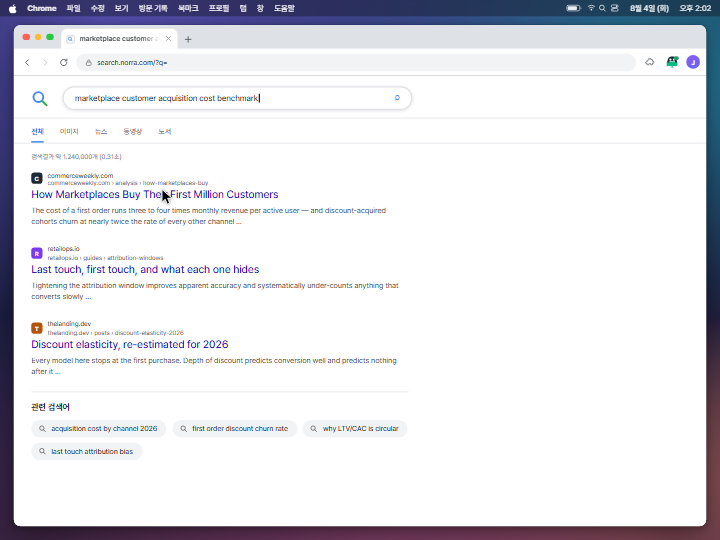
> **f152 (5.1초 · 2:02)** — 검색 ①. 질의가 아직 밀려 들어오는 중입니다.

**newsEnter 160.** 기사가 **새 탭으로** 열립니다(탭 두 장). 자료를 찾는 데 든 4분이 여기서 지나가고, 메뉴바 분침이 처음으로 도는 것이 보입니다. f163부터 f180까지 본문이 430px 흘러갑니다 — 읽는 동작이고, 그 사이 시계는 **2:04에서 2:11까지** 계속 올라갑니다.

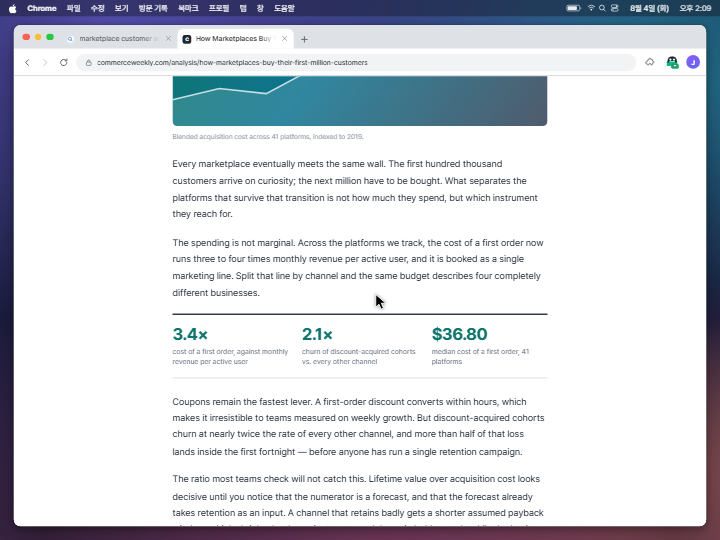
> **f168 (5.6초 · 2:06)** — 첫 번째 자료 정독. 시계가 도는 중이라 숫자에 살짝 잔상이 걸려 있습니다.

**switchToEditor1 180.** Cmd-Tab. 6프레임짜리 스위처 오버레이가 뜨고 **정중앙인 f183에 포커스가 넘어갑니다** — 실제 제스처처럼, 오버레이가 떠 있는 동안 앱이 바뀝니다. 메뉴바 앱 이름이 `Chrome`에서 `Writer`로 바뀌고, 브라우저 창은 신호등 색이 빠지며 그림자가 줄고, 워드프로세서 창이 앞으로 나옵니다. 창 제목은 `Writer — 쇼핑 플랫폼 고객 유인 전략 분석`, 하단 상태바에 `1 / 1 페이지 · 0자`.

> **에디터는 탭이 아니라 별도 앱입니다.** 이 결정 하나가 뒤의 여러 장면을 규정합니다 — 시계가 왜 15분씩 달릴 수 있는지(브라우저가 에디터를 가리는 동안 글이 써집니다), 칭찬 토스트가 왜 브라우저에서 떠야 하는지(확장은 탭 안에만 그릴 수 있습니다) 전부 여기서 나옵니다.

**writeH1 186 · writeP1 193 · writeP2 203.** 제목 `1. 문제 정의 — 신규 고객 획득 비용`과 문단 둘이 화면에서 타이핑됩니다. 타이핑 속도는 상수가 아니라 **다음 블록까지의 간격을 글자 수로 나눈 값**입니다(`script.ts`의 `rateFor`). 이 영상은 계속 재편집되므로 속도를 박아 두면 컷을 넘겨 버리고, 그러면 다음 문단이 앞 문단 위에 겹쳐 자라기 시작합니다. 간격에서 유도하면 어긋날 수가 없습니다.

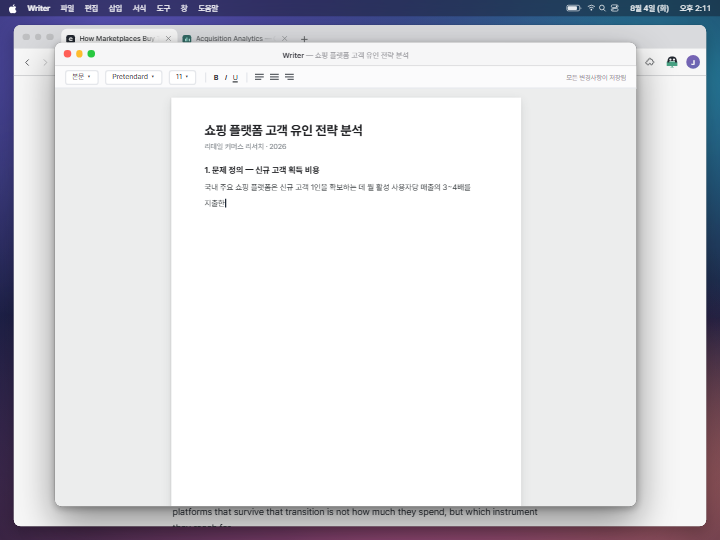
> **f208 (6.9초 · 2:12)** — 사이클 A 끝. 제목·부제·1장 제목·2문단. 상태바 **`1 / 1 페이지 · 101자`**. 이 그림을 뒤의 `s2-doc-full`과 나란히 놓으면 한 시간의 분량 차가 보입니다.

### 사이클 B — 숫자를 찾아와 표를 붙인다 (211–269)

**switchToBrowser1 211.** 다시 Chrome. 이 순간부터 **에디터는 브라우저 뒤에 완전히 가려집니다.** 그 뒤에서 `writeIntroBody 217`(§1 나머지 — LTV/CAC 비판, 선행 논의, 연구 질문 3개)와 `writeMethod 221`(§2.1–2.3 — 표본, 조작적 정의, 측정상의 유의점)가 **통째로** 존재하게 됩니다. 타이핑이 아니라, 다음 Cmd-Tab이 도착했을 때 이미 있는 상태입니다.

그리고 이 순간 **시계가 달리기 시작합니다.** f212쯤부터 분침이 붙기 시작해 f216~222에 프레임당 한두 분씩 넘어가고, f225에 속도가 죽으면서 **2:26**에 멈춰 섭니다 — **2:13에서 2:26까지 열다섯 프레임(0.5초)**. 스냅이 아니라 가속·감속이 있는 회전이라, 카메라 밖에서 시간이 얼마나 지나갔는지가 숫자가 아니라 **속도로** 읽힙니다.

**searchEnter2 217.** 포인터가 첫 번째 탭(검색 결과)을 클릭합니다. 두 번째 질의가 상자에 들어오고, **result2Click 224**에 이번엔 **두 번째 행**을 클릭합니다.

**statsEnter 226.** 분석 대시보드가 세 번째 탭으로 열립니다. 상단 `Acquisition / Cohorts` 탭, 그 오른쪽에 **범위 칩 여섯 장**(`2025-10 → 2026-03` · `12 platforms` · `72 monthly cohorts` · `1.18M signups` · `Attribution: last touch` · `KRW 1,320 / $`), 요약 카드 넉 장, 채널 상세 표(Coupon / Referral credit / Editorial curation / Paid membership × CAC · D90 · ROI), 그 아래 **획득 비용 분포 상자그림**(median $36.80 · IQR $22.00–$53.80), **첫 주문까지의 단계 수**(1–2 단계 $28.40 / 3단계 $39.10 / 4단계 이상 $71.30), **재주문 간격과 회수 기간**(멤버십 31d→19d · 4.1개월, 쿠폰 34d→41d · 회수 없음), 맨 아래 한 줄로 **조작적 정의**. 시계가 방금 멈춰 선 자리가 **2:26**입니다.

> **대시보드는 붙여넣을 네 행보다 훨씬 많이 보여줘야 합니다.** 보고서 §2.2가 인용하는 정의도, §2.3이 밝히는 라스트 터치와 환율도, §2.4의 중앙값과 사분위 범위도 전부 이 페이지에 실제로 떠 있습니다. 문서가 화면에 없는 숫자를 인용하기 시작하면 리서치가 아니라 숫자가 지어낸 것으로 보입니다. 표 위쪽에는 **아무것도 끼워 넣을 수 없습니다** — 드래그가 (676, 376)→(1092, 488) 좌표에 고정돼 있어서, 한 줄만 밀려도 선택이 표를 벗어납니다.

**select1 232 → copy1 238.** 포인터가 표 첫 행 왼쪽(676, 376)에서 마지막 행 오른쪽(1092, 488)까지 드래그하고, 선택 영역이 6프레임에 걸쳐 파랗게 차오릅니다. 드래그가 표 중간을 건너뛸 수는 없으므로 **네 행이 전부** 선택됩니다. f238에 화면 하단 중앙에 **`⌘ C` 키 칩**.

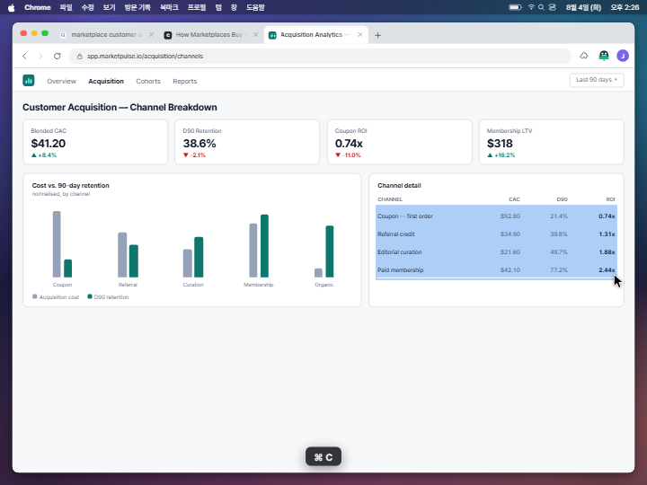
> **f238 (7.9초 · 2:28)** — 네 행 드래그 선택 + ⌘C.

**switchToEditor2 242 → paste1 248.** Cmd-Tab, 그리고 **`⌘ V` 칩**과 함께 인용 블록이 통째로 등장하며 10프레임 동안 파랗게 번쩍입니다. 블록에는 왼쪽 괘선과 **출처 한 줄**(`[자료 1] app.marketpulse.io — Channel detail (2026-08-04 조회)`)이 붙습니다. 인용구 밑에 호스트명을 손으로 치는 사람은 없으므로, 이 줄이 붙여넣기의 증거입니다. 그새 §2.4 기술 통계도 뒤에서 들어와 있습니다. 시계 **2:33**.

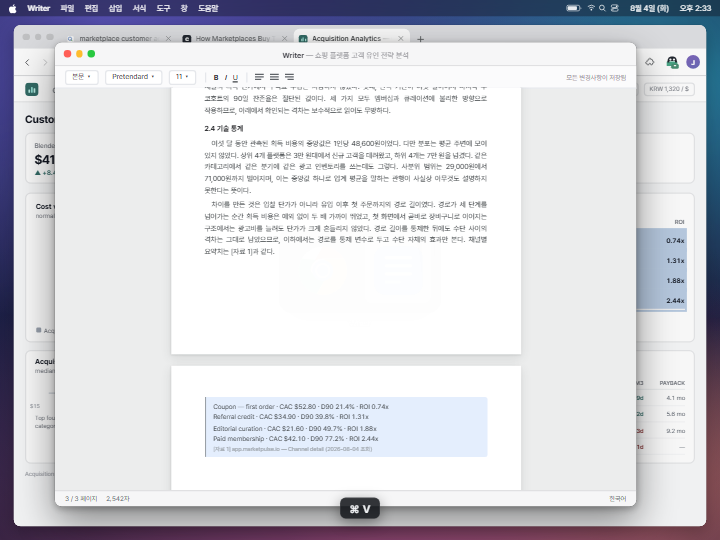
> **f251 (8.4초 · 2:33)** — ⌘V. 붙여넣은 표 위로, 없던 문단들이 이미 늘어 있습니다.

**writeH2 253 · writeP6 260.** `3. 유인 수단 — 쿠폰 · 멤버십 · 큐레이션`과 첫 문단이 화면에서 타이핑됩니다.

### 사이클 C — 정점 (269–304)

**switchToBrowser2 269.** 뒤에서 `writeCoupon 273`(§3.1 쿠폰 전체 + §3.2 소제목)가 통째로 들어옵니다.

**searchEnter3 275 → result3Click 279 → cohortsEnter 280.** 세 번째 검색, **세 번째 행**, 네 번째 탭. 코호트 페이지가 열립니다 — D0부터 D90까지의 생존 곡선 네 줄(Membership / Curation / Referral / Coupon)에 **D14 점선**(`coupon has lost 58%`), 그 옆에 **할인 폭 대 D90 산점도**(플랫폼당 한 점, `Pearson r = -0.61`), 월별 잔존율 격자는 여섯 줄인데 **마지막 두 코호트의 D60·D90 칸이 점선 빈칸**입니다. 아래 줄에는 열두 플랫폼을 두 축에 얹은 **거래액 분위별 산점도**(회수 1.0배 기준선 포함)와 **분위별 유인 수단 구성**. 시계 **2:41**.

> **여기서만 나오는 근거가 셋입니다.** 절단된 코호트(§2.3의 세 번째 유의점)는 숫자를 **비워 두어야** 믿기고, `r = -0.61`은 §3.1이 그대로 인용하며, 분위별 산점도는 §4가 읽고 `[표 1]`이 재현하는 바로 그 그림입니다. 열한 프레임짜리 페이지에 이만큼 넣는 이유는 읽으라고가 아니라, **되돌려 볼 때 다 있어야** 하기 때문입니다.

이 페이지는 **f280부터 포커스가 넘어가는 f294까지, 14프레임(0.47초)** 화면에 있습니다. 읽으라고 띄운 것이 아닙니다. 긴 작업 시간이 밖에서 어떻게 보이는지가 이것입니다.

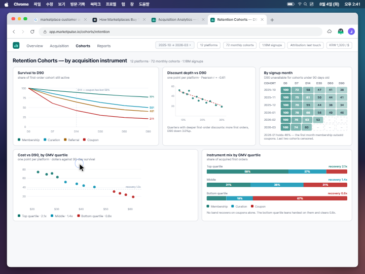
> **f286 (9.5초 · 2:41)** — 세 번째 자료. 열몇 프레임짜리 페이지.

**switchToEditor3 291 → writeP8 296.** 영상 전체에서 **가장 빠른 속도**로 문단이 타이핑됩니다(`RATE_MIN` = 0.1프레임/자 ≈ 0.1초에 서른 글자). 그리고 다 치기 전에 컷이 떠납니다 — 다음 컷에서 그 문단이 완성돼 있는 것이 "쓰다 만 자리에서 이어졌다"로 읽힙니다.

### 내려오는 구간 — 인용구, 그리고 김이 빠진다 (304–411)

**switchToBrowser3 304 → newsReturn 307.** 처음 그 기사 탭으로 돌아갑니다. 이번엔 읽으러 온 게 아니라 **가져가려고** 온 것입니다. 뒤에서 `writeCuration 314`이 §3.2 꼬리 + 코호트 표 `[자료 2]` + §3.3 큐레이션을 통째로 채웁니다.

**select2 311 → copy2 317.** 본문이 430px에서 1,020px까지 흘러가 인용구가 화면 위쪽으로 올라오고, (295, 288)에서 (855, 322)까지 드래그, `⌘ C`. 지나가는 길에 LTV/CAC가 왜 순환하는지를 설명하는 문단이 스쳐 갑니다 — §1의 그 대목입니다.

> **1,020은 계산값이 아니라 맞춰 놓은 값입니다.** 기사 블록 높이는 600px 컬럼에서 15px 라틴 문자가 어떻게 접히느냐로 정해지고, 여기서는 아무도 DOM을 되읽지 않습니다. `NewsMock`의 인용구 **위쪽**에 무엇이든 더하면 이 숫자가 어긋나고, 확인은 `node scripts/render-stills.mjs s2-select-news` 한 장입니다.

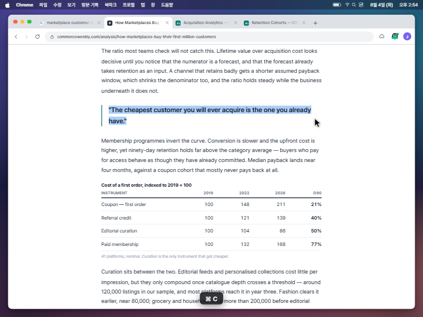
> **f317 (10.6초 · 2:54)** — 기사 인용구 선택 + ⌘C. 드래그는 화면 안에서 일어나지만 에디터는 뒤에 가려져 있으므로, 이 컷에서도 시계는 돌고 있습니다.

**switchToEditor4 320 → paste2 326.** 두 번째 `⌘ V`. `"The cheapest customer you will ever acquire is the one you already have."` — `commerceweekly.com — Retail Desk` 출처와 함께. 시계 **2:55**.

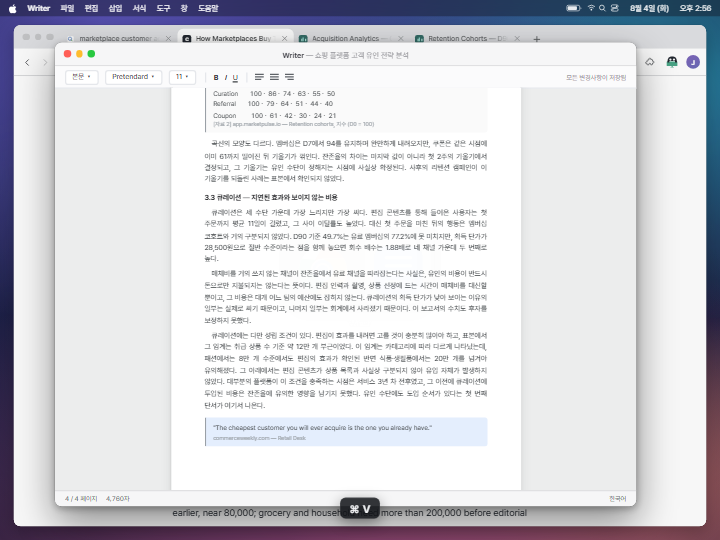
> **f329 (11.0초 · 2:56)** — 두 번째 붙여넣기.

**writeP10 332 → writeP11 338.** 여기서 속도가 꺾입니다. `writeP11`은 `linger` 블록이라 **엔터까지 남은 간격을 통째로 다 씁니다** — 앞 문단보다 네 배 가까이 느리고, 얼마나 느릴지는 타임라인이 그 자리에 얼마를 주느냐로 정해집니다. 문장은 `세 수단은 순서의 문제일지도 모른다.` 시계 **2:58**.

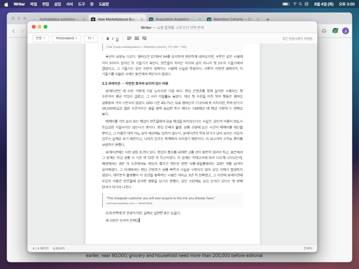
> **f352 (11.7초 · 3:00)** — 한 시간 뒤의 문서. 상태바 **`4 / 4 페이지 · 4,467자`**. `s2-write-1`의 101자와 같은 창입니다.

**enter1 361 · enter2 366.** `⏎` 칩이 두 번. 커서가 빈 줄로 두 칸 내려갑니다.

**f366–411.** 그리고 **45프레임(1.5초) 동안 아무 일도 일어나지 않습니다.** 화면에는 다 쓴 문서와 **16프레임 주기로 깜빡이는 캐럿**뿐입니다 — 스크롤도, 포인터도(`switchToEditor4` 이후 숨어 있습니다), 시계도 없습니다. **시계는 3:02에 멈춥니다** — 방금까지 분 단위로 달리던 숫자가 서는 것이 이 공백을 더 길게 만듭니다.

예전에는 18프레임이었고, 그건 동작과 동작 사이의 숨으로만 읽혔습니다. 45프레임은 다릅니다: 캐럿이 세 번 깜빡이는 동안 화면이 관객에게 **아무것도 주지 않고**, 그 빈자리로 다음 씬의 딴짓이 걸어 들어옵니다. 집중이 끊긴 자리를 보여주지 않으면 딴짓은 그냥 딴짓입니다.

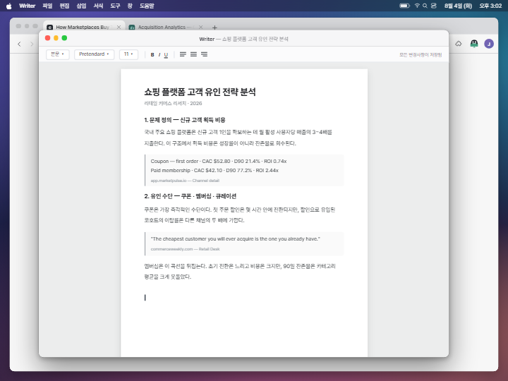
> **f372 (12.4초 · 3:02)** — 엔터 두 번 뒤, **막 넘어간 빈 5페이지에 커서만.** 꽉 찬 4페이지가 위로 밀려나 있고 상태바는 `5 / 5 페이지 · 4,811자`.

---

## S3 — 딴짓① 메시지 (411–643, 7.7초)

> **대화는 두 종류입니다.** 오후를 실제로 잡아먹는 것은 알림 여덟 개가 아니라 **지금 같이 한가한 친구 한 명**입니다. 그래서 민아(0번 스레드)는 **하나의 긴 티키타카**로 갑니다 — 여기서 시작해서, 다른 탭에 가 있는 동안에도 계속 흐르고, 영상이 그를 세 번 다시 찾아옵니다. 준호(1)·다영(2)·스터디 단톡(3)은 **쌓인 알림**입니다 — 안 읽은 게 넉 줄 쌓여 있고, 한눈에 읽고, 한 번 답하고, 나옵니다. 로그도 그렇게 생겼습니다: 민아 로그만 양방향이고 나머지는 마지막 한 줄만 내 말입니다.

**switchToBrowser4 411.** Cmd-Tab으로 브라우저가 앞으로 나옵니다. 탭 넉 장(검색·기사·대시보드·코호트)이 그대로 있고 기사 탭이 활성입니다.

**newTabClick 423.** 포인터가 탭 스트립 끝의 `+`를 클릭합니다. 새 탭에는 색색의 원 넷과 `웹 검색` 상자, 바로 가기 다섯 개(Commerce W… / MarketPulse / Docs / Mailbox / Calendar).

**omniType 430 → omniSuggest 436 → omniTab 443.** 주소창에 **`g` 한 글자**를 칩니다. 곧바로 나머지가 파랗게 반전된 채 자동완성되고(`g`+`ramline.com`), 툴바 아래로 제안 줄이 내려옵니다 — 파비콘, `gramline.com`, `— 다이렉트 메시지`. f443에 **`Tab` 칩**과 함께 확정. 자주 가는 곳에 도달하는 데 드는 노력이 **한 글자**라는 것이 이 비트의 요점입니다.

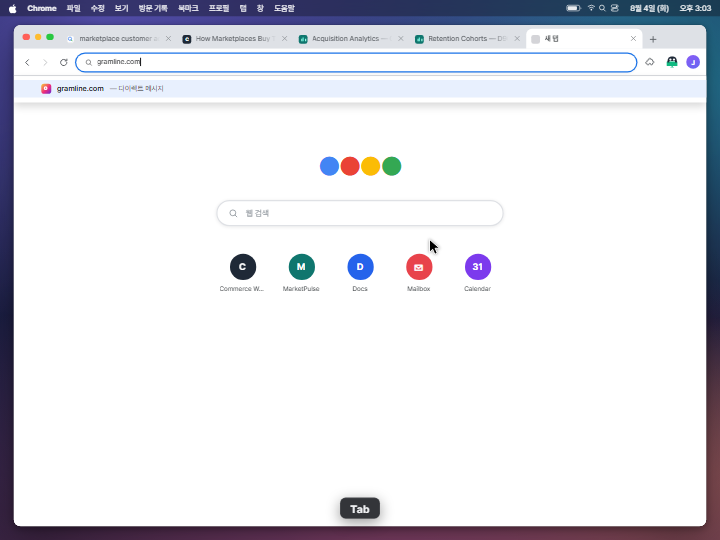
> **f445 (14.8초 · 3:03)** — `g` → 자동완성 → Tab.

**igEnter 449.** 소셜 피드가 다섯 번째 탭으로 열립니다. 시계 **3:04** — 여기가 딴짓의 시작점이고, 나중에 칭찬 문구의 "26분"을 세는 기준점입니다. 이 프레임의 표시값은 앵커라 정확히 3:04입니다.

**여기가 첫 착지입니다.** 피드는 **30프레임(1초)** 떠 있습니다. 스토리 줄과 게시물 하나, 오른쪽 추천 레일이 230px 흘러가는 동안 포인터는 페이지 위를 한 번 훑고 지나갑니다. 예전 컷은 여기를 20프레임에 떠났는데, 그러면 "소셜에 들어왔다"가 아니라 "무언가를 지나쳤다"로 읽힙니다.

여기서부터 S4 끝까지 **시계는 거의 실시간으로 갑니다.** 딴짓의 요점은 시간이 많이 지났다는 게 아니라 **지난 줄 몰랐다는 것**이라, 이 구간에서 분침이 달리면 관객이 먼저 알아차려 버립니다. 25분이 지났다는 사실은 시계가 아니라 배지와 장바구니가 말합니다.

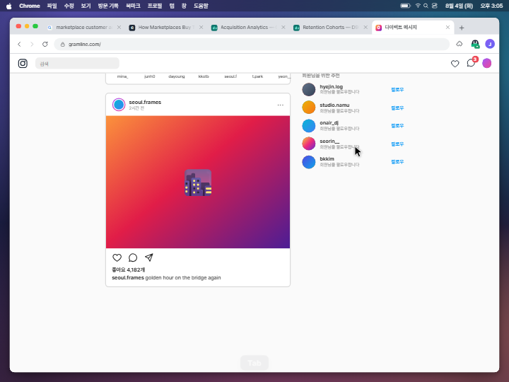
> **f459 (15.3초 · 3:04)** — 피드 착지. 1초를 온전히 씁니다.

**igDmEnter 479 → dmRun1 493.** 헤더 오른쪽 DM 아이콘(1065, 144) 클릭. 좌측 대화 목록 + 우측 대화창 레이아웃으로 바뀌고, **열린 대화는 14프레임(0.5초) 동안 그대로 멈춰 있습니다** — 두 번째 착지입니다. 이 구간의 세그먼트는 `first === last`, 즉 "메시지 0개를 배달하는 구간"으로 명시돼 있습니다.

이 프레임부터 두 개의 카운터가 **화면에 있든 없든** 올라가기 시작합니다 — 안 읽음 배지는 14프레임마다 1씩(최대 28), 안 읽은 대화 줄은 48프레임마다 1씩(최대 8).

**dmRun1 493 → dmSwitch2 529 · 민아.** 착지가 끝나면 대화가 달립니다. 36프레임에 메시지 일곱 줄이 양방향으로 오가고, 상대 쪽 `입력 중…` 점 세 개가 매 줄이 도착하기 직전 절반 구간에만 켜집니다. **속도는 상수가 아니라 36 ÷ 7입니다** — 로그를 더 길게 써 넣으면 이 구간은 길어지는 게 아니라 빨라집니다.

**dmReply1 507.** 포인터가 아래 입력칸을 클릭합니다. 입력칸이 치는 글자는 **다음에 나갈 내 메시지 그 자체**이고, 그 메시지가 말풍선으로 도착하는 정확한 프레임에 타이핑이 끝납니다(`dmPage`가 도착 시각에서 역산합니다). 예전에는 입력칸 문구가 고정 문자열이라 말풍선과 딴 소리를 했습니다.

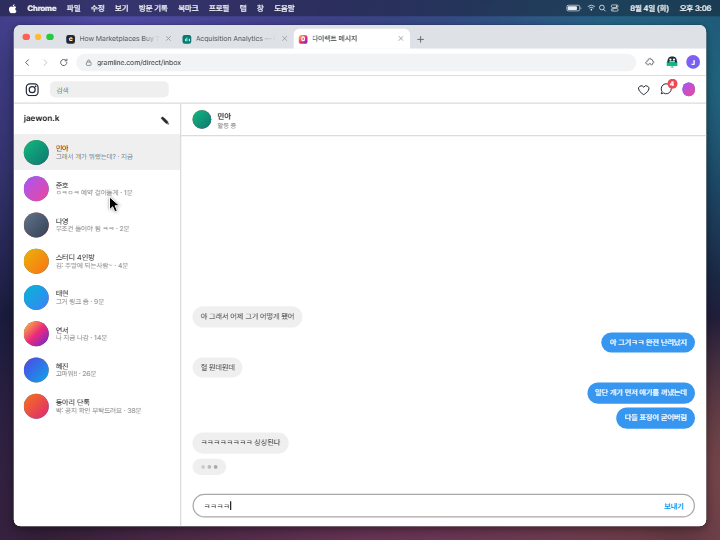
> **f520 (17.3초 · 3:07)** — 민아와의 티키타카. 양쪽 말풍선이 번갈아 쌓입니다.

**dmSwitch2 529 → dmReply2 537 · 준호.** 목록 두 번째 줄을 클릭합니다. 이쪽은 성격이 다릅니다 — **안 읽은 넉 줄이 이미 쌓여 있고**, 한 번 훑고, `ㅇㅋ 나 됨` 한 줄을 보내고 끝입니다. 20프레임.

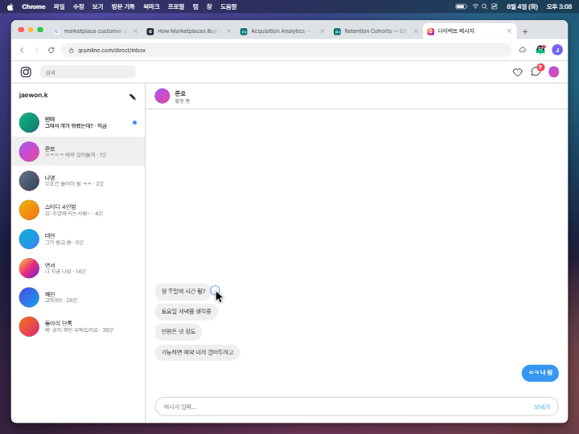
> **f541 (18.0초 · 3:08)** — 쌓인 알림을 읽고 한 번 답장. 왼쪽 목록에서는 민아 줄에 안 읽음 점이 다시 붙어 있습니다.

**dmInterrupt 543 → dmSwitch3 549.** 답장을 마치기 무섭게 **세 번째 줄이 파랗게 점등합니다.** 6프레임 뒤 포인터가 그쪽으로 갑니다.

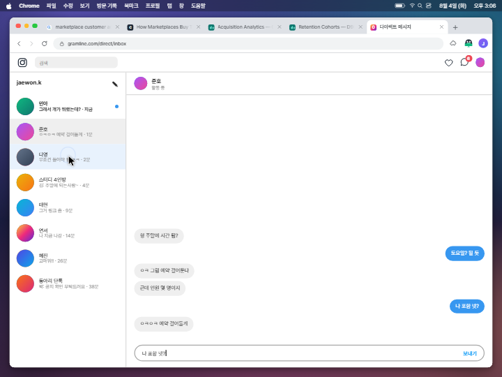
> **f545 (18.2초 · 3:08)** — 다른 대화가 끼어드는 순간.

**musicLink 569 → musicOpen 579 · 다영.** 여기도 쌓인 알림입니다. `오 뭔데`를 치고 나면 **뮤직비디오 링크 카드**가 도착합니다 — 이미 거기 있던 게 아니라 화면 안에서 도착합니다. 카드가 6프레임 동안 밝아지다가 f579에 클릭 → 여섯 번째 탭에서 재생이 시작되고 진행바가 흘러갑니다. 시계 **3:09**.

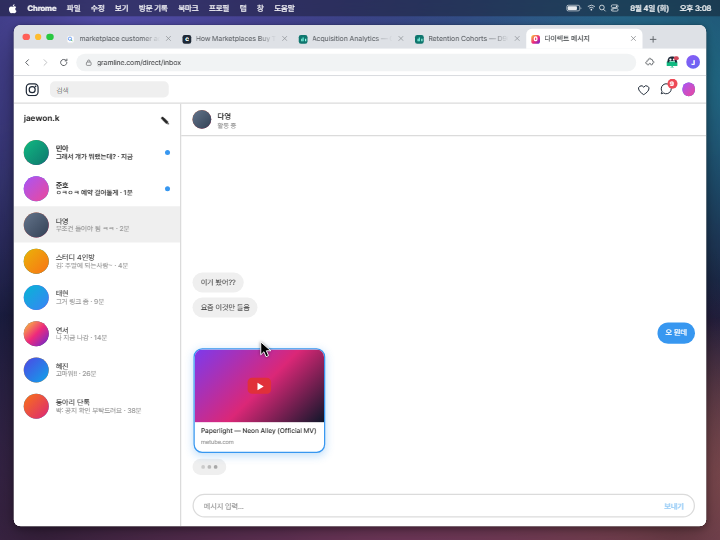
> **f575 (19.2초 · 3:08)** — 링크로 받은 뮤직비디오 카드.

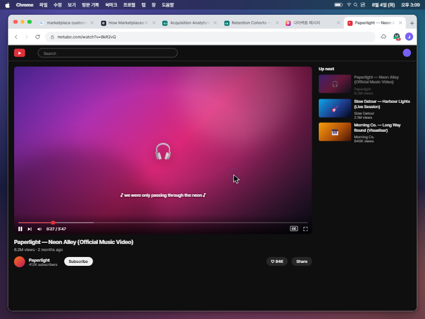
> **f587 (19.6초 · 3:09)** — 새 탭에서 재생.

> 음악은 **사용자가 고른 딴짓이 아니라 딴짓에 딸려 온 것**입니다. 그래서 S6 정리 때 다른 표류 탭들과 함께 닫힙니다.

**dmReturn 593.** DM 탭으로 돌아옵니다. 열려 있는 것은 **다시 민아**이고, 자리를 비운 사이 로그가 세 줄 더 늘어 있습니다. 배지도 올라 있습니다.

**nudge1In 601.** 배지는 이미 초록에서 앰버를 지나 빨강으로 내려와 있습니다 — 게이지 S가 이 프레임에서 0에 닿고, **0으로 내려가는 그 교차가 첫 훈수를 발화시킵니다.** 우하단에서 토스트가 올라옵니다 — 10프레임 동안 26px 위로, `cubic-bezier(.2,.8,.3,1)`. 마스코트 머리는 2프레임 늦게 카드 위로 빼꼼 올라옵니다. 카드에는 `Kibitzer` 라벨과 `✕`, 메시지, `gramline.com - 다이렉트 메시지` 컨텍스트 줄, 버튼 셋(`목표와 관련 있어요` · `5분만` · `30분 조용히`). **`ding.wav`가 이 프레임에 붙습니다.**

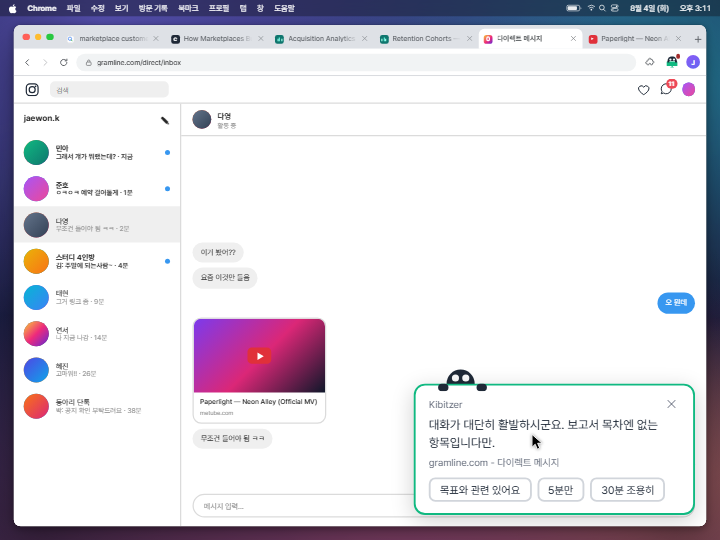
> **f613 (20.4초 · 3:11)** — 첫 훈수. 토스트는 1.5배 확대 상태입니다.

**nudge1Dismiss 633.** 포인터가 `✕`로 올라가고(9프레임 전부터 호버 상태), 클릭. 카드는 8프레임에 걸쳐 아래로 빠지며 사라집니다. **버튼을 고른 게 아니라 그냥 닫았습니다.**

---

## S4 — 딴짓②③ 포털 → 쇼핑몰 (643–869, 7.5초)

> **쇼핑은 루프가 아니라 브라우징입니다.** 그전 컷은 상품 페이지 하나에서 `장바구니`를 누르고 `함께 본 상품` 레일에서 하나를 집는 동작을 **일곱 번 그대로** 반복했습니다. 메커니즘 자체는 맞습니다 — 방금 담은 것 옆에 다음 것을 놓아 주는 게 쇼핑몰이 사람을 붙잡는 방식이고, 방치되고 있는 그 보고서가 다루는 것도 정확히 그것입니다. 문제는 **일곱 번 연속**이라는 데 있었습니다: 버튼 하나와 레일 한 줄만 번갈아 눌리는 그림은 사람이 아니라 매크로로 읽힙니다.
>
> 그래서 같은 창(226프레임) 안에서 **사람이 실제로 쇼핑몰을 돌아다니는 방법**을 전부 씁니다. 연속한 두 상품이 같은 방식으로 열리는 일은 없습니다.
>
> | 어떻게 왔나 | 비트 | 화면 |
> |---|---|---|
> | 목록 격자 | `shopPick` | 두 번에 나눠 스크롤하고, 중간 카드 하나를 **보기만 하고** 지나친 뒤 |
> | `함께 본 상품` 레일 | `hop1` `hop2` `hop3` | 쇼핑몰이 옆에 놓아 준 것 |
> | **브라우저 뒤로 가기** | `backClick` | 직전 상품 페이지로 돌아가서, 이번엔 **다른 레일 줄**로 나감 |
> | **쇼핑몰 자체 검색** | `shopSearch` | 헤더 검색창에 `캠핑 의자`를 치고 결과 격자에서 하나 |
>
> **그리고 경로보다 중요한 것이 체류입니다.** 앞 버전은 경로는 네 가지였는데 **상품 페이지에 8프레임, 6프레임** 머물렀습니다. 사람은 그 속도로 물건을 사지 않습니다 — 페이지를 읽고, 사이즈를 고르고, 그다음에 버튼을 누릅니다. 그래서 담기는 여섯 번에서 **다섯 번**으로 줄었고, 남은 프레임은 전부 체류로 갔습니다: 모든 상품 페이지가 **최소 8프레임, 대개 10–16프레임**을 받고, 그중 하나(`optionPick`)는 **사이즈를 고르는 데만 8프레임**을 씁니다. `check-timeline.mjs`가 이 최소 체류를 검사합니다.
>
> **훈수 #2도 이제 클릭 뒤가 아니라 클릭 전에 뜹니다.** 레일로 연 키보드 페이지를 14프레임째 보고 있는 중에 토스트가 올라오고, 그 상품은 스누즈 **뒤에** 장바구니로 들어갑니다. 훈수가 끝난 행동을 지적하는 게 아니라 **진행 중인 결정을 멈춰 세우는** 그림이 됩니다.

> **훈수 #2는 쇼핑이 시작된 뒤에 뜹니다.** DM 위에서 뜨면 훈수가 할 수 있는 말이 "대화가 많으시군요"의 변주뿐입니다. 쇼핑몰로 옮기면 이 영상만 할 수 있는 말이 생깁니다 — **고객 유인 전략을 분석하던 사람이 유인당하는 중**입니다. 비트의 모양도 생깁니다: 하나를 담고, 두 번째를 고르는 중에 훈수가 멈춰 세우고, `5분만`으로 다시 풀리고, 넉 개가 더 들어갑니다.

**portalEnter 645 → portalQuery 649.** DM을 잠깐 더 보다가 새 탭에서 포털. 검색 상자에 `러닝화 추천`이 글자당 1.1프레임으로 들어오고, 결과 왼쪽 아래에 **쇼핑 특가 패널**이 붙어 있습니다.

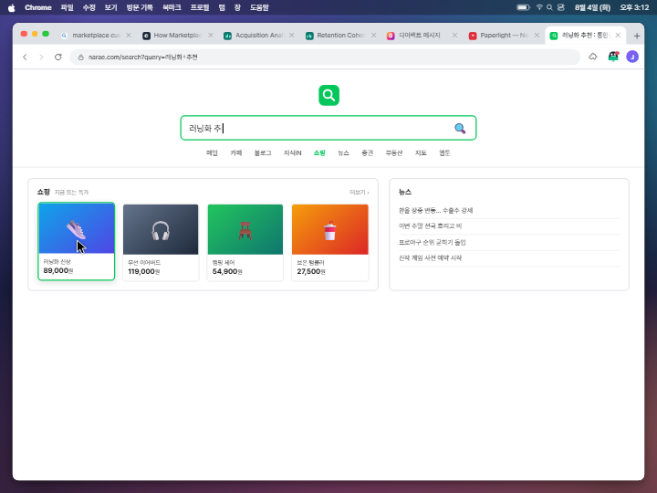
> **f655 (21.8초 · 3:12)** — 포털 검색. 다음 클릭 대상은 왼쪽 아래 특가 카드입니다.

**shopEnter 661 → shopPick 679.** 특가 배너(133, 419)를 클릭해 쇼핑몰 목록 페이지로 넘어갑니다. 상단에 카테고리 줄(베스트/신상/패션/디지털/리빙/식품/특가), `타임특가 · 02:41:08 남음`, 아래로 상품 카드 열 장이 격자로 깔립니다.

**여기가 영상에서 가장 긴 착지입니다 — 18프레임(0.6초).** 그리고 이 18프레임은 한 번에 흘러가지 않습니다: 격자가 **52px 내려가다 멈추고**, 그 정지 구간에 포인터가 가운데 카드(캠핑 체어) 위에 올라가 **테두리만 들었다가 그냥 지나가고**, 다시 44px이 내려간 뒤에야 **첫 번째 카드**가 들리고 클릭됩니다. 한 번에 매끄럽게 흐르는 스크롤은 화면을 미는 손이고, 멈췄다 가는 스크롤은 **보고 있는 사람**입니다. 안 누른 카드 하나가 그걸 확정합니다.

그 클릭되는 카드는 포털에서 찾던 **러닝화**입니다 — 검색어와 첫 클릭이 이어져야 딴짓이 "아무거나 눌렀다"가 아니라 "찾던 걸 찾아 들어갔다가 눌러앉았다"로 읽힙니다.

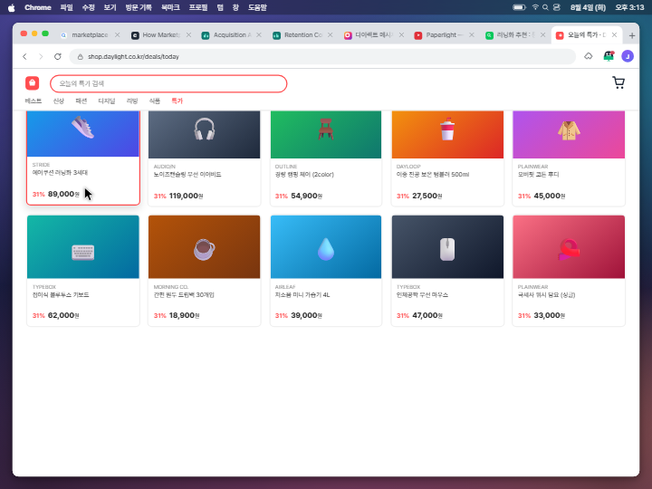
> **f677 (22.6초 · 3:13)** — 쇼핑몰 착지. 격자를 훑는 중이고, 탭은 이미 여덟 장입니다.

**shopPick 679 → optionPick 687 → cart1 695.** 상품 페이지에 도착해서 **16프레임**을 씁니다. 포인터가 먼저 스펙 블록 쪽으로 내려가고(f683), `사이즈` 줄의 **265**로 가서 클릭하고(f687), 그다음에야 `장바구니`입니다(f695).

**옵션 한 번이 이 씬에서 가장 값싼 개선입니다.** 상품 페이지는 그림 밑에 버튼이 달린 판이 아니라 **고를 것이 있는 화면**이고, 고르는 순간이 "구경"과 "산다"의 경계입니다. 8프레임으로 그 경계를 그립니다. 나머지 네 페이지는 첫 옵션이 이미 선택된 상태로 열립니다 — 가장 많이 나가는 옵션을 미리 잡아 두는 쇼핑몰의 실제 동작이고, 덕분에 **옵션 없이 장바구니에 들어가는 상품은 하나도 없습니다.** 다섯 번 다 고르게 하면 40프레임이 들고 같은 말을 다섯 번 하게 됩니다.


> **f689 (23.0초 · 3:13)** — 사이즈 265를 고르는 순간. `장바구니`는 아직 눌리지 않았습니다.

담는 동작 자체는 그대로입니다.

- `장바구니` 버튼(455, 468) 클릭 → 헤더 카운터가 1 오르고 8프레임 펄스, 같은 8프레임 동안 오른쪽 위에 검은 **`장바구니에 담았습니다`** 칩이 내려왔다 사라집니다. 배지 펄스만으로는 이 템포에서 놓치기 쉬워서, 같은 값(`cartPulse`)으로 말까지 붙였습니다.
- 오른쪽 **`함께 본 상품` 레일** 세 줄 중 하나가 빨갛게 들립니다. 어느 줄이 뜨느냐는 hop마다 다르고(0·2·1), **뜨는 줄에는 반드시 다음에 열릴 상품이 들어가 있습니다**(`railFor`가 그 자리를 덮어씁니다). 클릭이 자기가 한 일과 다른 말을 하면 안 됩니다.
- **손은 누른 자리에서 곧바로 떠나지 않습니다.** 클릭 프레임에서 3프레임(또는 다음 이동까지의 절반) 동안 버튼 위에 머물렀다가 출발합니다(`cursor.ts`의 `CLICK_HOLD`). 예전에는 자기 클릭 링이 아직 퍼지는 중인데 포인터가 이미 다음 목표로 1/3쯤 가 있었습니다 — 합성 커서가 로봇처럼 보이는 가장 큰 이유가 그것입니다.
- 클릭 → 다음 상품 상세. 주소창 슬러그도 상품에 맞춰 바뀝니다(`/products/typebox-fold-keyboard` …).

무엇이 어떻게 열리는지는 `script.ts`의 **`MALL` 한 배열**이 들고 있습니다 — 페이지마다 `via`(격자·레일·뒤로·검색결과)가 붙어 있고, 장바구니 내용도 레일 내용도 포인터 좌표도 전부 거기서 유도됩니다. 담기는 순서는 러닝화, 키보드, 이어버드, 마우스, 캠핑 체어.

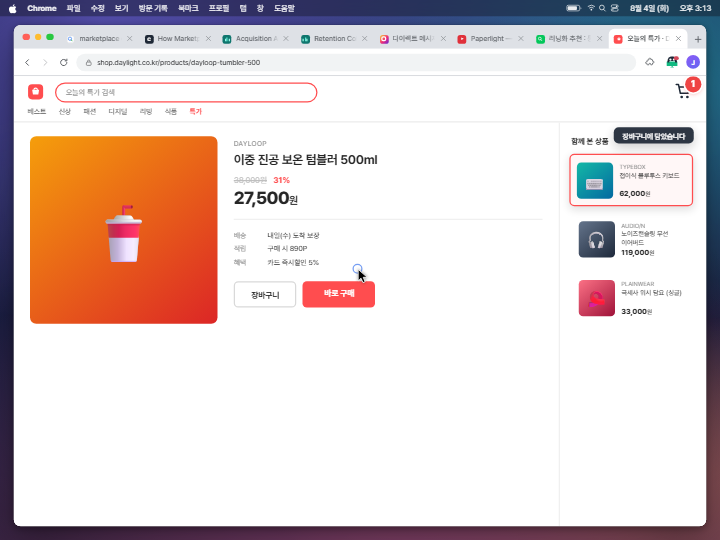
> **f698 (23.3초 · 3:13)** — 담긴 직후. 카운터 1, 확인 칩, 그리고 레일 첫 줄이 이미 다음 상품을 들고 밝아져 있습니다.

**hop1 703 → nudge2In 717.** 레일 첫 줄로 키보드 페이지를 엽니다. 그리고 **14프레임 동안 아무것도 담지 않습니다** — 포인터가 이름 쪽으로 올라갔다 스펙 쪽으로 내려오는, 그냥 읽는 시간입니다. 장바구니가 **1**인 상태에서 두 번째 토스트가 올라옵니다. 컨텍스트 줄은 `shop.daylight.co.kr - 오늘의 특가 · DAYLIGHT`. `ding.wav`. **결정이 여기서 멈춥니다** — 보고 있던 그 상품은 스누즈 뒤에야 장바구니로 들어갑니다.

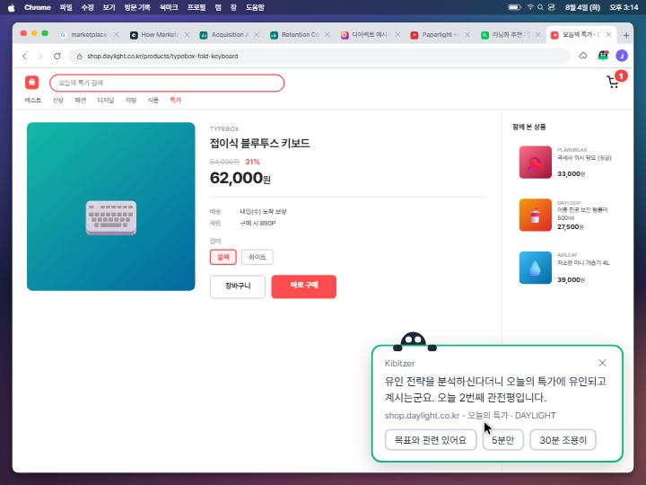
> **f731 (24.4초 · 3:14)** — 두 번째 훈수. 카운터는 1에서 멈춰 있고, 아직 담지 않은 상품 페이지 위로 토스트가 올라옵니다.

**snoozeClick 747.** 포인터가 가운데 버튼 `5분만`(896, 782) 위에서 대기하다 클릭합니다. 클릭과 동시에 툴바 배지가 **스누즈 색으로** 바뀝니다. 시계 **3:15** — 이 프레임이 훈수 #3 문구의 "5분만"이 가리키는 시각입니다.

**cart2 757.** 스누즈 10프레임 뒤, 아까 보던 그 키보드가 장바구니로 들어갑니다. 훈수가 멈춘 시간은 30프레임(1초)이고, 그 대가로 5분을 벌었습니다.

**backClick 765 → hop2 775 · cart3 785.** 여기서 처음으로 **브라우저 크롬**이 쓰입니다. 포인터가 창을 가로질러 툴바 왼쪽 끝 **뒤로 가기**(43, 100)로 가고, 버튼이 눌린 채로 잠깁니다. 돌아가는 곳은 목록이 아니라 **직전 상품 페이지(러닝화)** — 히스토리가 실제로 들고 있는 게 그것뿐이기 때문입니다. 같은 프레임에 **앞으로 가기 화살표가 살아납니다**(다음 클릭 전까지). 돌아간 페이지를 10프레임 보고, 이번엔 **다른 레일 줄**로 나갑니다. "아까 그거 다시 볼까" 한 번이 들어가는 것만으로 스프리가 직선이 아니게 됩니다.

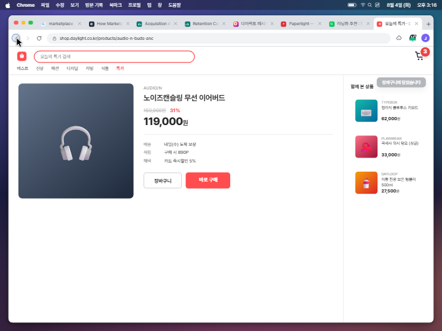
> **f764 (25.5초 · 3:16)** — 뒤로 가기가 눌리는 순간. 직전의 러닝화 페이지로 돌아갑니다.

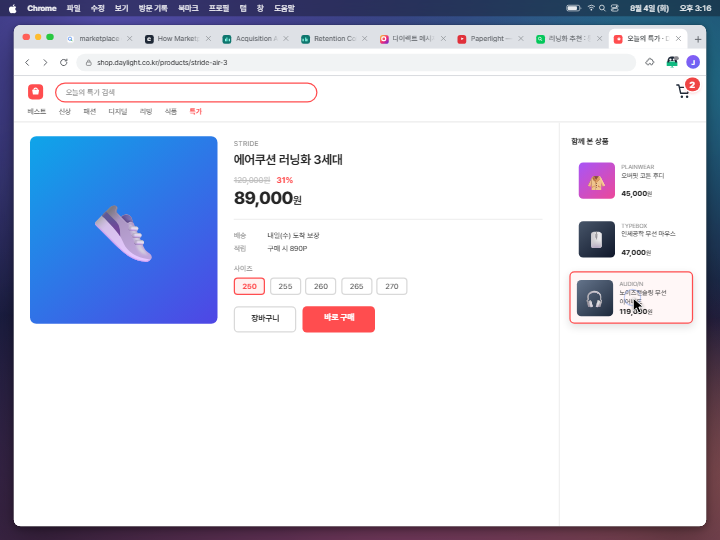
> **f772 (25.7초 · 3:16)** — `함께 본 상품` 세 번째 줄이 밝아지고 포인터가 그리로 건너가는 중. 이 줄에 들어 있는 이어버드가 다음 상세 페이지입니다.

**dmPeek1 791 → dmPeek1End 803.** DM 탭으로 **돌아갑니다.** 열려 있는 것은 민아이고, 자리를 비운 사이 로그가 또 늘어 있습니다 — **긴 대화는 내가 보고 있든 아니든 계속 흐른다**는 게 이 왕복의 요점입니다. 배지도 껑충 뛰어 있습니다.

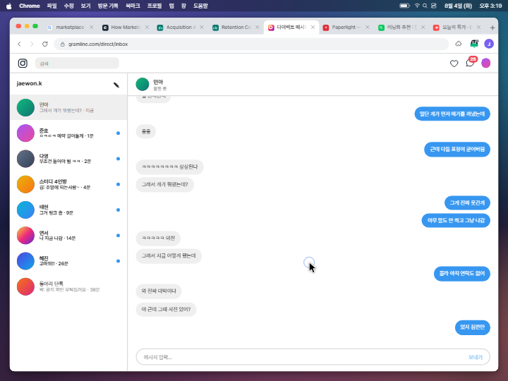
> **f797 (26.6초 · 3:19)** — DM 왕복 ①. 민아 쪽은 계속 흐르고 있었습니다.

**dmPeek1 791 → dmPeek1End 803 → hop3 809 · cart4 817.** DM을 한 번 다녀오고, 돌아와 레일로 마우스 페이지. 8프레임 보고 담습니다.

**shopSearch 835 → searchResults 844 → searchPick 851 · cart5 859.** 두 번째 왕복에서 돌아온 포인터가 이번엔 **쇼핑몰 헤더의 검색창**(300, 147)을 클릭합니다. 빨간 테두리 안에 캐럿이 서고 `캠핑 의자`가 글자당 1.2프레임으로 들어갑니다 — 영상에서 **주소창이 아닌 페이지 안에 타이핑되는 유일한 질의**입니다. **f844, 엔터 소리가 나는 바로 그 프레임에** 결과 격자(`'캠핑 의자' 검색결과 · 38개 상품`)로 바뀌고, 주소창도 `shop.daylight.co.kr/search?q=캠핑 의자`가 됩니다. 7프레임 뒤 첫 카드를 클릭하고, 8프레임 뒤 담습니다.

목록 격자와 결과 격자는 같은 컴포넌트이고 **헤더 높이를 일부러 맞춰 두었습니다** — 포인터가 좌표로 카드를 때리기 때문에, 두 격자에서 카드 줄의 y가 달라지면 클릭이 빈 곳에 떨어집니다(목록은 96px 스크롤된 상태라 그만큼만 차이 납니다).

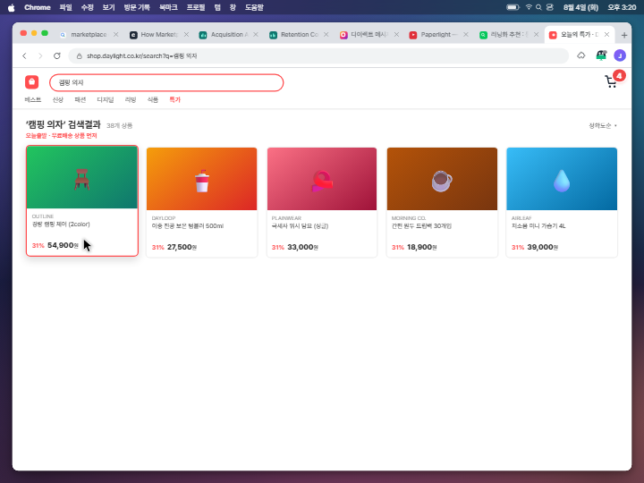
> **f849 (28.3초 · 3:27)** — 쇼핑몰 자체 검색 결과. 첫 카드가 들려 있고 장바구니는 4입니다.

**dmPeek2 821 → dmPeek2End 831.** 두 번째 왕복은 **스터디 단톡** — 쌓인 알림 쪽이고, 짧게 한 줄 답하고 나옵니다. **두 카운터가 동시에 오르는 것**이 시간 경과의 실체입니다. 시계는 3:19 → 3:28로 갑니다.

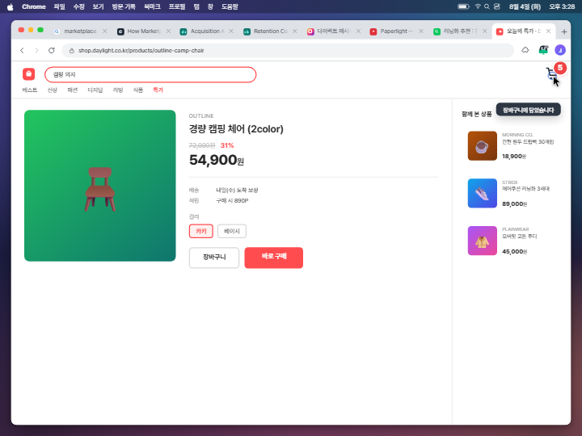
> **f862 (28.7초 · 3:28)** — 장바구니 5개.

**cartViewEnter 863.** 헤더의 장바구니 아이콘(1096, 147)을 클릭해 장바구니 페이지로 착지합니다. 다섯 줄과 **합계 371,900원**. 탭 제목도 `오늘의 특가 · DAYLIGHT`에서 `장바구니 · DAYLIGHT`로 바뀝니다 — 페이지와 제목이 어긋나면 그 프레임 전체가 거짓말이 됩니다. 시계 **3:29**.

**nudge3In 867.** 그 위로 세 번째 토스트. 배지는 스누즈 색에서 다시 이탈 색으로. 컨텍스트 줄은 `shop.daylight.co.kr - 장바구니`. `ding.wav`.

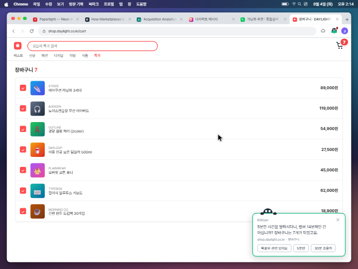
> **f879 (29.3초 · 3:29)** — 스누즈 콜백. 3:15에 `5분만`을 눌렀고 지금이 3:29 — 문구의 "14분"이 화면에서 실제로 맞습니다.

---

## S5 — 정지 (869–929, 2.0초)

**freezeStart 879 → freezeEnd 915.** 전부 멈춥니다. 커서도 미동 없이 (700, 430)에 붙어 있고, **시계도 3:29에 못 박혀 있습니다** — 다른 곳에서는 계속 흐르는 숫자라 여기서 서 있는 것이 더 크게 들립니다. 22프레임에 걸쳐 화면이 **1.04배로 밀려 들어오고**(푸시인), 36프레임 뒤 원래대로 빠집니다.

푸시인은 **메뉴바 아래에만** 겁니다. 시계가 프레임 밖으로 밀려나면 3:29가 사라지고, 그러면 이 씬이 무엇에 대한 정적인지 알 수 없게 됩니다.

**영상에서 유일하게 느린 1.2초입니다.** 앞의 25초가 전부 가속과 누적이었기 때문에, 아무것도 움직이지 않는 이 36프레임이 가장 큰 소리를 냅니다.

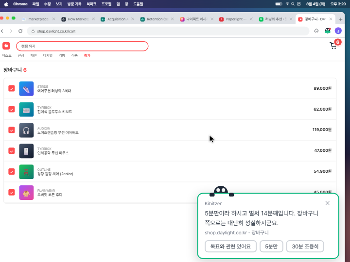
> **f894 (29.8초 · 3:29)** — 장바구니 5개, 탭 여덟 장, 훈수 #3, 그리고 정적.

---

## S6 — 정리하고 다시 시작 (929–1043, 3.8초)

**closeTab1 935 · closeTab2 943 · closeTab3 951 · closeTab4 959.** 무관한 탭 넉 장을 오른쪽부터 닫습니다. 탭은 8프레임에 걸쳐 폭이 0으로 줄며 접힙니다.

여기가 **같은 클릭 네 번이 아닌** 이유는 이렇습니다. 활성 탭을 닫으면 옆 탭으로 떨어지므로, 닫는 동안 **쇼핑몰 → 포털 → 음악 → DM**이 차례로 화면을 스쳐 갑니다. 오후 전체가 역순으로 한 번 더 지나가고, 마지막 하나를 닫는 순간 클릭 없이 **목표 관련 페이지에 착지합니다.**

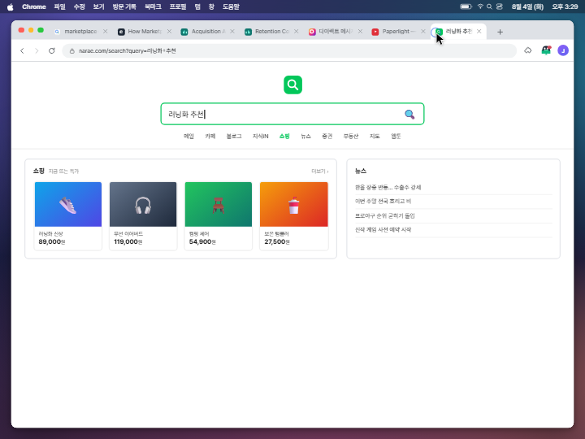
> **f947 (31.6초 · 3:29)** — 두 장째. 뒤에 남은 탭이 줄어드는 게 보입니다.

**returnToGoalTab 969.** 포인터가 리서치 탭 위로 올라오고, 게이지가 여기서부터 다시 차오르기 시작해 **배지가 빨강 → 앰버 → 초록으로 되돌아옵니다.** 시계 **3:30** — 딴짓 시작 3:04로부터 26분.

**switchToEditor5 977 → switchToBrowser5 997.** 문서를 **한 번 열어 봅니다.** 아무것도 쓰지 않습니다. 아까 엔터 두 번으로 만들어 놓고 떠난 그 빈 줄이 그대로 거기 있습니다. 20프레임 — 이것도 착지라, 문서를 알아볼 시간이 있어야 "떠날 때 그대로"가 읽힙니다.

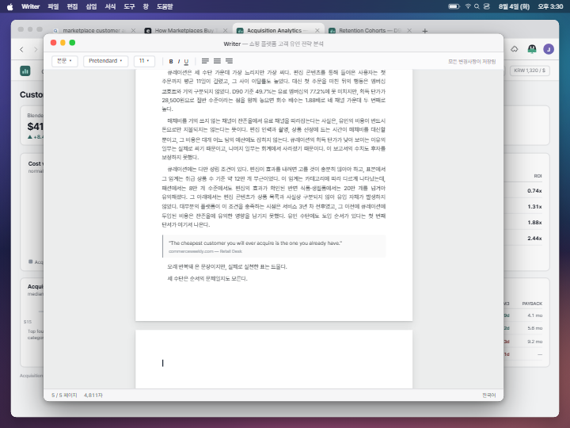
> **f987 (32.9초 · 3:30)** — 떠날 때 그대로의 문서.

**newResearchTab 1004 → researchLoad 1013.** 브라우저로 돌아와 새 탭을 열고 주소창에 **새 질의**(`membership retention benchmark 2026`)를 칩니다. 이전 페이지로 돌아가는 게 아니라 **다음 질문으로 넘어가는 것**이 복귀의 모양입니다. f1013에 자료가 로드되고 본문이 **거래액 분위별 표**까지 단숨에 흘러갑니다 — `Top 63–74% · 2.1×  /  Middle 41–52% · 1.4×  /  Bottom 19–31% · 0.8×`, 그리고 "어느 분위에서도 쿠폰 단독으로는 회수되지 않는다"는 각주. 몇 비트 뒤 `writeRetention 1037`가 §4를 통째로 채우는데, **그 §4가 바로 이 표를 읽고 쓴 것**입니다. 뒤에서는 `writeSynthesis 1006`이 §3.4 소결 — 딴짓이 끊어 먹은 그 문장의 결론 — 을 먼저 채웁니다.

**praiseIn 1033.** 칭찬 토스트. 테두리가 에메랄드가 아니라 **세이지 `#79B7A0`**, 마스코트 눈이 **웃는 눈**, **버튼이 없습니다**(✕만 있습니다). 컨텍스트 줄도 없습니다. `celebrate.wav`. 시계 **3:31**.

**칭찬은 자료가 로드된 지 20프레임 뒤에 뜹니다.** 예전에는 `researchLoad` 2프레임 뒤였는데, 그러면 확장이 축하하는 대상이 **일이 아니라 페이지 로드**가 됩니다 — 탭을 열자마자 잘했다고 하는 도구는 판정을 하는 게 아니라 반응을 하는 것이고, 훈수 세 번이 쌓아 온 "보고 있다가 말한다"를 마지막 순간에 무너뜨립니다. S가 `cCelebrate = 80`을 넘는 지점을 뒤로 물려서, 본문이 분위별 표까지 스크롤되고 **읽히고 난 다음에** 말하게 했습니다. 그만큼 S6가 18프레임 길어졌습니다.

칭찬이 **브라우저에서** 뜨는 것이 중요합니다. 확장은 탭 안에만 그릴 수 있으므로 네이티브 앱 위에 토스트를 띄우면 그 프레임이 거짓이 됩니다. 그래서 순서가 정리 → 문서 확인 → 브라우저에서 새 리서치 → 칭찬입니다.

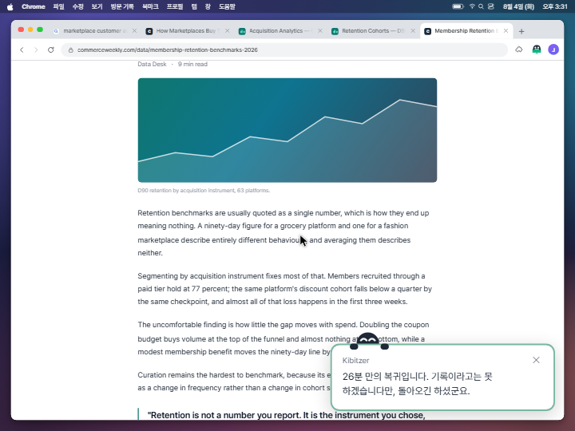
> **f1045 (34.8초 · 3:32)** — 새 리서치 자료 위에서 칭찬. 뒤에서는 §4가 채워지고 있고, 그래서 시계도 다시 움직이기 시작했습니다.

---

## S7 — 마무리 (1043–1205, 5.4초)

**praiseOut 1065.** 토스트가 10프레임에 걸쳐 빠집니다.

**switchToEditor6 1069 → writeH3 1077 → writeP12 1085 · writeP13 1095 · writeP14 1107.** 마지막으로 에디터. `5. 결론 — 유인은 선택이 아니라 순서다`와 세 문단이 화면에서 타이핑됩니다. 시계 **3:38**. §4(규모별 분석)와 `[표 1]` 도표는 그 앞에 이미 뒤에서 들어와 있습니다.

**chartIn 1119.** **참고 자료** 다섯 항목이 통째로 붙으며 문서가 끝납니다. 도표가 아니라 참고 자료로 닫는 이유는, 도표는 그것을 분석하는 절(§4)에 속해야 하고 마지막 장이 참고 문헌이어야 **슬라이드가 아니라 논문으로** 읽히기 때문입니다.

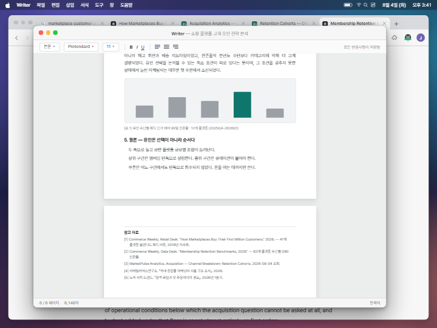
> **f1123 (37.4초 · 3:41)** — 완성. 상태바 **`6 / 6 페이지 · 6,146자`**, 마지막 장은 참고 자료. 이 프레임 직후 시계가 마지막으로 한 번 달립니다.

**switchToBrowser6 1135 → mailOpen 1141.** 완성본을 16프레임 보여준 뒤 시계가 **3:41에서 3:52까지** 올라갑니다 — 내보내고 첨부하고 메일을 여는 11분입니다. 메일 탭. 받는 사람 `research-team@marketpulse.io`, 제목 `Report — Shopping Platform Customer Acquisition`, 짧은 본문, 그리고 `shopping-platform-acquisition.pdf` 첨부. 시계 **3:52**.

**sendClick 1155 → mailSent 1163.** `Send` 버튼(706, 817)이 6프레임 밝아진 뒤 클릭. 컴포즈 창이 닫히고 좌하단에 `Message sent. Undo` 스낵바가 뜹니다.

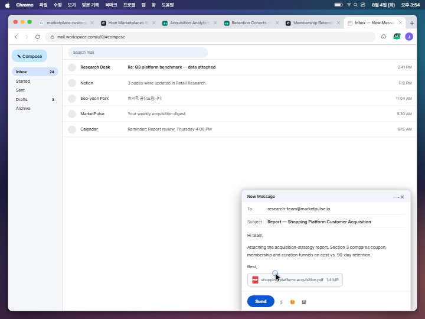
> **f1158 (38.6초 · 3:54)** — 전송.

**popupOpen2 1169.** 확장 아이콘을 다시 클릭합니다. 활성 화면이 다시 뜨고, 몰입 바는 가득 찬 초록 `● 집중 100 / 100`입니다. 해시계의 해는 돔 끝에 걸려 있고 그림자는 가장 길게 누워 있습니다 — 두 시간이 다 갔다는 뜻입니다. 시계 **3:55**.

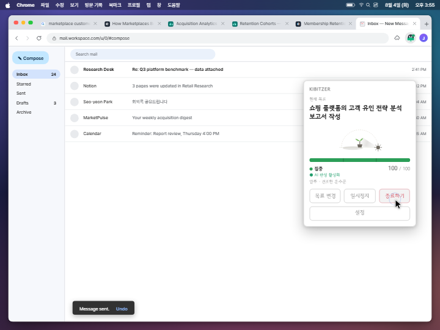
> **f1177 (39.2초 · 3:55)** — 몰입 복귀. 26분을 흘렸고, 0까지 떨어졌고, 다시 100입니다.

**endSessionClick 1181 → summaryShown 1183.** 빨간 `종료하기`를 누르면 팝업이 **세션 요약**으로 바뀝니다: `유효 페이지 비율 37/63 · 59%`와 앰버 미터, `유효 방문 시간 1시간 12분 / 1시간 55분 · 63%`와 앰버 미터, `받은 훈수 3회`, 그리고 `가장 오래 머문 페이지 — 장바구니 · DAYLIGHT / 이탈 · shop.daylight.co.kr · 14분`. 아래에 `세션 더보기 ▾`(페르소나 한 줄 평과 리포트 카드가 접혀 있음)와 초록 `확인`.

두 미터가 모두 **흔들림** 구간에 걸린 채로 끝나는 것이 이 영상의 요지입니다. 보고서는 완성됐고 메일은 보냈지만, 오후의 40%는 다른 곳에 있었고 가장 오래 머문 페이지는 장바구니였습니다. 만점으로 끝내지 않는 것이 이 제품이 하는 말입니다.

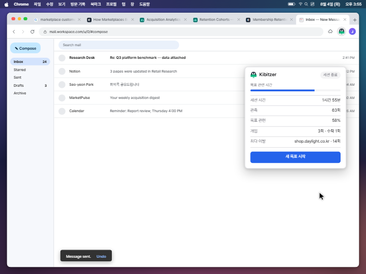
> **f1191 (39.7초 · 3:55)** — 세션 요약. 뒤에는 방금 보낸 메일.

---

## S8 — 엔드카드 (1205–1275, 2.3초)

**endCardIn 1205.** 데스크톱이 어두운 배경으로 넘어가고, 가운데에 로고(초록 담장 + 잉크색 머리)·`Kibitzer` 워드마크·태그라인·서브 한 줄이 차례로 페이드인합니다.

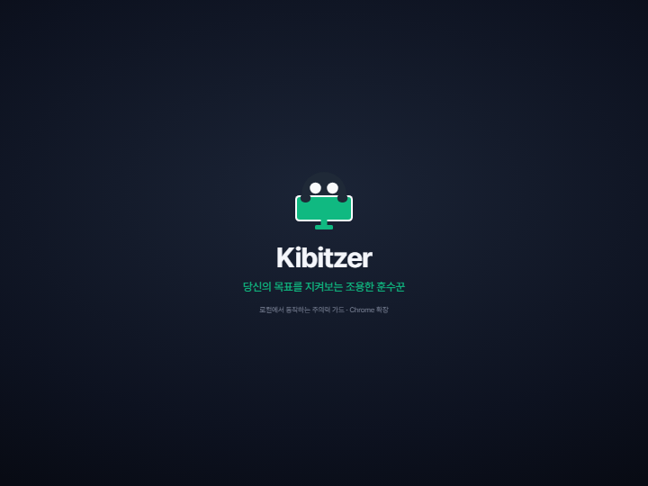
> **f1235 (37.1초)** — 엔드카드.

---

## 문서는 어떻게 쌓이는가

에디터가 최전면에 있는 시간은 영상 전체를 통틀어 **250프레임이 채 되지 않습니다.** 여섯 페이지를 그 안에서 칠 수는 없습니다. 그래서 작성 스케줄(`script.ts`의 `WRITING`)은 블록을 두 종류로 나눕니다.

**타이핑 블록 — 화면 안.** 다음 블록까지의 간격을 글자 수로 나눈 속도로 찍힙니다. 속도를 상수로 박지 않고 **간격에서 유도**하는 이유는 이 타임라인이 계속 재편집되기 때문입니다. 54초 기준으로 맞춘 0.25는 32초에서 컷을 넘겨 버리고, 그러면 다음 문단이 앞 문단 위에 겹쳐 자랍니다. 대신 **길이 제한이 생깁니다** — `RATE_MIN`(0.1프레임/자) 아래로 내려가면 타이핑이 아니라 붙여넣기로 보이므로, 화면 안 블록은 20~50자로 짧고 인용할 만한 문장만 맡습니다.

**통째 블록 — 화면 밖(`whole: true`).** 브라우저가 에디터를 완전히 가리는 구간 안에 비트가 놓입니다. 타이핑이 아니라, 다음 Cmd-Tab이 도착했을 때 이미 존재하는 상태입니다. **분량은 전부 여기서 나옵니다** — 방법, 조작적 정의, 유의점, 코호트 해석, 규모별 분석. 그리고 **시계가 달리는 구간이 정확히 이 구간입니다.** 통째로 들어오기 때문에 어떻게 재편집해도 절반만 그려진 채 화면에 나올 수 없습니다.

화면 밖 구간은 넷뿐이고, 통째 블록은 반드시 그 안에 놓여야 합니다. 밖에 놓이면 멀쩡히 보이는 문서 위로 문단이 튀어나옵니다.

| 구간 | 프레임 | 시계 | 들어오는 것 |
|---|---|---|---|
| ① | 133–164 | 2:13 → 2:33 | §1 본문 · 연구 질문 · §2.1–2.4 |
| ② | 191–213 | 2:36 → 2:42 | §3.1 쿠폰 · §3.2 소제목 |
| ③ | 226–242 | 2:44 → 2:55 | §3.2 꼬리 · `[자료 2]` · §3.3 큐레이션 |
| ④ | 895–946 | 3:30 → 3:38 | §3.4 소결 · §4 규모별 · `[표 1]` |

컷마다 늘어나는 분량:

| 컷 | 하는 일 | 문서 |
|---|---|---|
| 사이클 A | 기사 정독 → 1장 제목 + 2문단 타이핑 | **1페이지 · 101자** |
| 사이클 B | 표 네 행 ⌘C → ⌘V → 2장 작성 | 2페이지 |
| 사이클 C | 코호트 → 문단 하나 치다 컷이 떠남 | 3페이지 |
| 마무리 | 인용구 ⌘C → ⌘V → 감속 → 엔터 두 번 | **4페이지 · 4,467자** |
| S6 | 열어만 봄 | 그대로 |
| S7 | 결론 3문단 + 참고 자료 | **6페이지 · 6,146자** |

문서는 연속된 한 장이 아니라 **실제 페이지로 끊깁니다.** 시트는 560px 폭에 A4 비율이라 한 장이 792px이고 사이에 회색 거터가 들어갑니다. 하단 상태바의 `4 / 4 페이지 · 4,467자`가 분량을 스크롤 위치로 짐작하지 않게 해 줍니다. 페이지 높이는 측정이 아니라 `lib/doclayout.ts`의 추정(11.5px 본문에서 줄당 52자, 실측 54~55자)이고, 문단은 페이지를 걸치지 않고 통째로 넘어갑니다. 높게 잡으면 여백이 남을 뿐이지만 낮게 잡으면 고정 높이 시트 밖으로 글이 밀려나므로, 안전한 쪽으로 틀렸습니다.

**⌘C/⌘V는 하단 키 칩으로 명시합니다.** 붙여넣기는 화면상 "블록이 갑자기 생기는" 것뿐이라, 키 이름이 없으면 아주 빠른 타이핑과 구분되지 않습니다. 칩은 **가장 최근 것이 이깁니다** — ⌘C와 ⌘V가 열 프레임 안에 붙어 있어서, 먼저 걸린 것을 쓰면 ⌘C가 페이드아웃하는 동안 정작 ⌘V가 화면에 못 뜹니다.

**보고서 본문은 실제로 읽힙니다.** 서론 / 자료와 측정 틀 / 분석 / 결론 / 참고 자료 구조에, 변수마다 조작적 정의가 있고 자기 결론에 반대하는 유의점 절이 따로 있습니다. 한 문장도 읽지 않아도 그 구조가 **일**로 보이는 것이 목적입니다.

### 근거는 화면에 있다

모든 수치·출처·호스트는 지어냈습니다. 다만 **보고서가 인용하는 숫자는 예외 없이 그 앞에 열린 페이지에 실제로 떠 있습니다.** 문서가 화면에 없는 값을 인용하기 시작하면, 리서치가 아니라 숫자 쪽이 지어낸 것으로 보입니다. 자료 페이지를 고칠 때는 이 표가 깨지지 않는지부터 봐야 합니다.

| 보고서 | 근거 | 어디에 |
|---|---|---|
| §1 획득 비용이 MAU당 매출의 3~4배 | `3.4×` 지표 스트립 | 기사 ① |
| §1 LTV/CAC 비율의 순환 | 「Lifetime value over acquisition cost…」 문단 + 검색 ②의 두 번째 행 | 기사 ① · 검색 ② |
| §1 선행 논의 두 갈래 | 클릭하지 않은 두 행(귀속 정확도 · 할인 탄력성) | 검색 ① |
| §2.1 12개 플랫폼 · 72 코호트 · 118만 건 | 상단 범위 칩 | 대시보드 |
| §2.2 조작적 정의 · 환율 1,320원 | 하단 정의 한 줄 + `KRW 1,320 / $` 칩 | 대시보드 |
| §2.3 라스트 터치 · 절단 코호트 | `Attribution: last touch` 칩 · 격자의 점선 빈칸 | 대시보드 · 코호트 |
| §2.4 중앙값 48,600원 · 사분위 29,000–71,000원 | 획득 비용 분포 상자그림($36.80 · $22.00–$53.80) | 대시보드 |
| §2.4 세 단계를 넘으면 두 배 | `Steps to first order` 패널 | 대시보드 |
| §3.1 D14에 절반 이상 소실 | 생존 곡선의 D14 점선 | 코호트 |
| §3.1 상관계수 -0.61 · 잔존율 -3%p | 할인 폭 대 D90 산점도 | 코호트 · 기사 ② |
| §3.2 재주문 간격 31→19일 · 손익분기 4.1개월 | `Reorder interval & payback` 패널 | 대시보드 |
| §3.3 첫 주문까지 11일 | 같은 패널의 `1ST ORDER` 열 | 대시보드 |
| §3.3 카탈로그 임계 12만/8만/20만 개 · 3년 차 | 큐레이션 문단 | 기사 ① |
| §4 분위별 조합 · 회수 1.0배 | 분위별 산점도 + 수단 구성 · `By GMV quartile` 표 | 코호트 · 기사 ② |
| §4 재고 회전과 배송 리드타임 | 「the binding constraints are…」 문단 | 기사 ② |

---

## 메시지는 어떻게 흐르는가

DM 구간은 **세그먼트 목록**입니다(`script.ts`의 `dmSegments`). 각 세그먼트가 `{from, to, thread, first, last}`를 들고, `dmPage`가 프레임당 메시지 속도를 **`(to − from) ÷ (last − first)`** 로 유도합니다.

| 세그먼트 | 프레임 | 스레드 | 메시지 | 성격 |
|---|---|---|---|---|
| 착지 | 374–388 | 민아 | 3 → 3 | 아무것도 안 움직임 (0.5초) |
| 티키타카 | 388–424 | 민아 | 3 → 10 | 양방향 · 36프레임에 7줄 |
| 알림 ① | 424–444 | 준호 | 4 → 6 | 쌓인 넉 줄 + 답장 한 줄 |
| 알림 ② | 444–474 | 다영 | 2 → 5 | 링크 카드가 여기서 도착 |
| 복귀 | 488–516 | 민아 | 11 → 14 | 자리 비운 사이 늘어 있음 |
| 왕복 ① | 680–696 | 민아 | 15 → 18 | 긴 대화는 계속 흐름 |
| 왕복 ② | 726–740 | 스터디 단톡 | 5 → 7 | 다시 쌓인 알림 쪽 |

이 표에서 **`프레임` 열은 고정이고 `메시지` 열은 자유롭습니다.** 민아 로그에 네 줄을 더 써 넣으면 티키타카 구간이 길어지는 게 아니라 빨라집니다. 반대로 페이싱을 바꾸고 싶으면 `timeline.ts`의 비트를 고칩니다 — 카피가 아니라.

**입력칸도 유도됩니다.** 대화창 하단 입력칸이 치는 글자는 **다음에 나갈 내 메시지 그 자체**이고, 그 메시지가 말풍선으로 도착하는 프레임에 타이핑이 정확히 끝나도록 시작 프레임과 글자당 속도를 역산합니다. 고정 문자열을 쓰던 예전 버전은 로그를 한 줄만 고쳐도 입력칸과 말풍선이 딴 소리를 했습니다. `입력 중…` 점 세 개도 같은 계산에서 나옵니다 — 다음 줄이 **상대 것**이고 도착까지의 후반부일 때만 켜집니다.

---

## 시계는 흐른다

메뉴바 시계는 **가속과 감속이 있는 다이얼**입니다. 예전 컷은 프레임 하나에서 2:11이 2:26으로 바뀌는 방식이었는데, 그건 시간이 지났다는 정보를 줄 뿐 **얼마나 지루하게 지났는지**를 주지 못했습니다. 두 프레임 사이에서만 바뀌고 다시는 안 바뀌는 값은 결국 컷과 구분되지 않습니다.

지금은 `timeline.ts`의 `clockAnchors`가 **프레임 → 분**을 찍어 두고, 앵커 사이를 `easeInOut`으로 보간합니다. 그래서 한 구간의 성격이 **속도로** 표현됩니다.

| 시계의 상태 | 어디에서 | 화면 |
|---|---|---|
| **정지** | S1 전체 / S2 끝 캐럿 공백 / S5 프리즈 | 값이 못 박혀 있음. 지금 벌어지는 일이라는 뜻 |
| **완만** | 화면 안 작성, 모든 착지 구간, S3–S4 딴짓 전체 | 몇십 프레임에 1분. 거의 실시간 |
| **질주** | 브라우저가 에디터를 가리는 네 구간 | 프레임당 1~2분, 최대 0.5초. 숫자에 모션 블러 |

가장 빠른 구간은 `switchToBrowser1`(211) 직후입니다 — **2:13에서 2:26까지 열다섯 프레임**. f212에 붙기 시작해 f216~222에 최고 속도, f225에 감속해서 정지합니다.

**블러가 필요한 이유.** 매 프레임 분이 바뀌면 그건 시계로 안 읽히고 렌더 오류로 읽힙니다. 그래서 `clockRushAt(frame)`이 분당 변화율을 0~1로 환산해 시각 숫자에만 최대 0.9px 블러와 15% 감광을 겁니다. 빠른 다이얼을 카메라로 찍으면 실제로 그렇게 번지고, 옆의 `8월 4일 (화)`는 선명하게 두었기 때문에 그 대비가 "번진 것"을 "빠른 것"으로 읽게 만듭니다. 숫자는 `tabular-nums`라 분이 돌아도 시계가 좌우로 흔들리지 않습니다.

**딴짓 구간에서 시계가 달리지 않는 것은 의도입니다.** 딴짓의 요점은 시간이 많이 지났다는 게 아니라 지난 줄 몰랐다는 것입니다. 여기서 분침이 달리면 관객이 먼저 알아차려 버려서, 훈수가 알려 줄 것이 없어집니다. 3:04에서 3:29까지 25분이 지난 사실은 **안 읽음 배지와 장바구니 숫자**가 말합니다.

**시계는 문구를 참으로 만듭니다.** `5분만` 클릭이 3:15, 훈수 #3이 3:29 → **정확히 14분**. 딴짓 시작(피드 진입) 3:04, 복귀 3:30 → **26분**. 네 시점 중 셋은 앵커이고, 훈수 #3(867)은 앵커가 아니지만 `cartViewEnter`(863)와 `freezeEnd`(915)가 같은 분을 들고 있는 **평평한 구간 안**에 있어서 정확히 3:29로 표시되고 프리즈 내내 그대로 서 있습니다 — 관객이 시계를 읽을 시간이 있는 유일한 구간이 거기입니다. `clockAt`의 1e-6 보정이 88.99999를 3:28로 내려 읽는 것을 막습니다.

앵커는 **프레임 오름차순**이어야 합니다 — 폭이 0인 구간은 0으로 나누고, 뒤집힌 구간은 시간을 거꾸로 돌립니다.

---

## 커서 규칙

**포인터는 기다렸다가 건너갑니다.** 웨이포인트의 프레임은 **출발 시각이 아니라 도착 시각**입니다. `cursorAt`이 두 점 사이 거리로 이동 시간을 정하고(대략 Fitts — 카드 하나 폭이 8프레임, 화면 대각선이 17프레임), 그 시간만큼 **도착 프레임에서 역산해** 출발합니다. 그전까지는 앞 웨이포인트에 가만히 서 있습니다.

예전에는 두 웨이포인트 사이 간격 **전체**에 이동을 폈습니다. 그러면 컷이 길어질수록 포인터가 느려져서, 시계가 15분을 돌리는 동안 손은 버튼 쪽으로 1.5초를 표류하는 그림이 됐습니다. 손은 그렇게 움직이지 않습니다. 지금 방식은 **컷을 늘려도 늘어나는 것은 정지 시간뿐**이라, 재편집에 대해 안전하기도 합니다.

**커서 경로는 반드시 프레임 오름차순이어야 합니다.** `cursorAt`은 배열을 앞에서부터 훑으므로, 뒤 프레임 항목이 앞 프레임 항목보다 먼저 오면 보간이 거꾸로 돌아 포인터가 클릭 대상과 전혀 다른 곳에 있게 됩니다. Cmd-Tab 뒤 다시 나타나는 프레임은 `reappear(afterSwitch, before)` 헬퍼로 묶었습니다 — "다음에 가 있어야 할 자리"보다 앞이면서 **스위치 자체보다는 뒤**가 되도록 양쪽으로 clamp합니다. 뒤쪽만 clamp하던 버전은 브라우저가 아직 에디터 뒤에 있는 프레임에 포인터를 띄웠습니다.

**좌표는 계산이 아니라 실측입니다.** 팝업은 창이 아니라 **페이지 뷰포트의 자식**이라 `POPUP.top`이 창 상단이 아니라 콘텐츠 상단(y=122)에서 잽니다. `HIT.shopRec` 세 줄도 `RecRail`의 기하(236px 폭 · 84px 행 · 10px 간격 · 22px 패딩 + 제목)에서 유도했지만, 확인은 `node scripts/render-stills.mjs s4-shop-rec` 한 장입니다. 쇼핑몰 격자 좌표도 마찬가지입니다 — 5열 · 열 너비 201.6 · 간격 13에서 `146.8 + 214.6k`가 나오지만, 믿는 건 `s4-shop-list`와 `s4-shop-search` 두 장입니다.

**클릭 좌표는 손으로 두 번 적지 않습니다.** S4의 모든 쇼핑몰 클릭은 `mallHit(beat)`이 `MALL` 배열에서 그 페이지의 `via`/`row`/`card`를 읽어 좌표로 바꿉니다. 포인터와 페이지는 같은 거짓말의 두 쪽이고, 그 거짓말이 깨지는 방식은 언제나 **한쪽만 고쳐지는 것**이었습니다 — 레일 순서를 바꿨는데 포인터는 옛 줄을 누르는 식으로. 한 배열에서 둘 다 나오면 어긋날 자리가 없습니다.

### 손처럼 움직이기

포인터가 트윈이 아니라 **손**으로 읽히게 하는 것은 속도 곡선 하나가 아니라 네 가지가 겹친 결과입니다. 전부 `lib/cursor.ts`에 있고, 전부 **도착 프레임에서 정확히 0이 되는 오프셋**입니다 — 그래야 클릭이 버튼 밖에 떨어지지 않습니다.

| 무엇 | 왜 | 값 |
|---|---|---|
| **최소 저크(minimum jerk)** | 사람 팔이 두 점 사이를 움직일 때 따르는 표준 궤적. `10t³ − 15t⁴ + 6t⁵`. 양 끝에서 속도도 가속도도 0이라, 출발이 튀지 않고 도착이 꺾이지 않습니다 | 이동 전체 |
| **두 번째 서브무브먼트** | 손은 한 번에 목표에 닿지 않습니다 — 시각 피드백 없이 크게 던지고(탄도), 몇 % 어긋난 것을 짧게 보정합니다(Woodworth 2성분 모델). 오버슈트해서 돌아오기도, 못 미쳐서 기어들어가기도 합니다 | 시간의 72%가 탄도, 이득 1±0.06, 거리 110px 초과일 때만 |
| **곡률** | 팔꿈치와 손목이 회전하므로 마우스 경로는 직선이 아니라 활입니다. 중점을 진행 방향의 직각으로 밀어낸 2차 베지어 — 베지어는 양 끝점이 정확해서 활을 그려도 클릭이 밀리지 않습니다 | 거리의 3~9%, 방향은 시드로 |
| **떨림과 안착** | 빠르게 움직이는 손은 흔들리고, 착지 직후 1~2px을 되돌려 줍니다. 떨림은 `4t(1−t)`로 감싸 최고 속도에서 가장 크고 양 끝에서 0, 안착은 18프레임짜리 반주기 사인이라 **도착 프레임에 정확히 0** | 떨림 0.9px, 안착 0.8px |
| **클릭 후 정지** | 누르고, 떼고, 그다음에 움직입니다. 눈이 클릭 결과를 확인하기 전에 팔이 다음 목표로 출발하지 않습니다. 이동 시간에서 앞쪽을 잘라 쓰므로 클릭도 도착도 비트에 그대로 붙어 있고 건너가는 구간만 짧아집니다 | 3프레임, 간격이 짧으면 그 절반 |

**난수는 렌더 시각이 아니라 웨이포인트에서 옵니다.** Remotion은 프레임을 병렬로, 필요하면 다시 렌더합니다. `Math.random()`이 한 줄이라도 있으면 같은 프레임이 워커에 따라 다른 좌표를 내고, 그게 정확히 "사람처럼 흔들리는 커서"가 **드롭된 프레임**처럼 보이는 이유입니다. 그래서 모든 흔들림은 웨이포인트 인덱스와 프레임에서 나온 해시로 시드합니다 — 같은 컷은 몇 번을 렌더해도 같은 곡선을 그립니다.

**안착이 영원히 이어지지 않는 것도 의도입니다.** S5 프리즈는 36프레임 동안 포인터가 **완전히 멎어 있어야** 하는 구간이라, 손 떨림을 상시 드리프트로 넣으면 그 정적이 깨집니다. 18프레임 반주기 사인은 착지 직후에만 살아 있고 긴 정지 구간에서는 이미 0입니다.

---

## 훈수 토스트 크기

이 컷에는 토스트 줌인이 없으므로 **토스트 전체를 1.5배로 확대**했습니다(`theme.ts`의 `TOAST_SCALE`). 내부 CSS 값은 `toastOverlay.ts`의 실제 값을 한 글자도 바꾸지 않았고, 앵커(우하단 18/18)를 원점으로 하는 `transform: scale(1.5)` 한 줄만 걸었습니다. 커서의 토스트 클릭 좌표도 같은 배율을 곱해 계산합니다(`toastHit`). 실측 재현과 영상 가독성을 둘 다 지키는 방법입니다.

---

## 실제 UI 재현 근거

목업이 아니라 **확장 소스의 실제 값을 옮긴 것**입니다.

| 요소 | 출처 | 재현 방식 |
|---|---|---|
| 훈수/칭찬 토스트 | `apps/extension-next/src/content/toastOverlay.ts` | shadow-root 스타일시트 수치 그대로 — 300px 폭, `1.5px solid #10B981`(칭찬 `#79B7A0`), radius 12, `0 6px 24px rgba(0,0,0,.18)`, 메시지 13px/1.55, 컨텍스트·버튼 10.5/11.5px, 등장 `cubic-bezier(.2,.8,.3,1)`. peek·hands SVG는 좌표까지 동일(`circle cx32 cy24 r15`, `rect x6/47 y4 w11 h8 rx4`) |
| 팝업 (셋업/활성/요약) | `apps/extension-next/src/popup/popup.html` + `popup.ts`의 `showSetup`/`renderActive`/`showSummary` | 296px 폭(`width:268` + `padding:14`, body에 `box-sizing` 없음), 표제 12px `.06em`, 목표 17px/700, 몰입 바 10px에 33·66 눈금, 상태어+`S / 100`, 보조행 11px, 시작·확인 `#1e7a4c`, 고스트 버튼 7px 패딩. 화면 **셋** 모두 등장 |
| 본문 폰트 | `assets/fonts/GowunDodum-Regular.woff2` | 확장이 번들하고 `@font-face`로 시스템 폰트보다 먼저 선언하는 **고운돋움**. 파일을 그대로 복사해 씁니다 — 대체품이 아니라 실제 출고 서체. Regular 하나뿐이라 600/700은 브라우저 합성인 것까지 동일 |
| 해시계 | `lib/sundial.ts` | `sundialSVG(frac, night)`를 **파일째 복사**해 그대로 호출합니다. 새싹·돔·그림자 길이·광선 8개·밤의 달과 별 전부 동일 좌표. 팝업 `:root`의 `--sd-*`를 읽으므로 팝업 컨테이너에 같은 변수를 얹었습니다 |
| 몰입 밴드 | `lib/sessionStats.ts`의 `bandOf` | ≥66 `집중` `#2b9e57` / 33–65 `흔들림` `#ad7d15` / <33 `이탈` `#c94f4f` / 일시정지 `#8e8b84`. 트랙은 같은 색 18% |
| 툴바 상태 점 | `lib/badge.ts`의 `drawStatusDot` | 네이티브 배지가 아니라 **아이콘 비트맵에 합성**하는 맨 점입니다(네이티브 배지는 글자 뒤 둥근 상자를 항상 그리므로). 우상단, `r = max(3, size*0.2)`, 테두리 없음. 초록 `#1f9d6b`(S≥66) / 앰버 `#e0a100` / 빨강 `#d1495b` / 회색 `#8a8a90`(스누즈 우선) / **목표 선언 전에는 점 자체가 없음** |
| 게이지 곡선 | `core/gauge/reducer.ts` · `core/gauge/config.ts` | `scenes/script.ts`의 `GAUGE` 한 곳에서만 정의하고 배지와 팝업이 함께 읽습니다. 첫 훈수는 연속 횟수가 아니라 **S가 0에 닿는 하강 교차**에서, 재훈수는 `renagDebt`(40, 회마다 2배)로, 칭찬은 `cCelebrate = 80` 상향 교차에서 |
| 페르소나 문구 | `lib/personas.data.ts`의 `dry_kibitzer` | 훈수 #2는 `fallbackTemplates`의 "오늘 {nag_count}번째 관전평입니다" 계열 그대로. 세 문구 모두 제목·호스트 단어만 쓰며 본문 세부(가격·개수)는 쓰지 않습니다 — Writer가 페이지 발췌를 받지 않기 때문 |
| 로고 | `apps/extension-next/icons/icon-128.png` | 옛 `icon-128.svg`와 바이트 동일. SVG 도형 좌표 그대로 React 포팅 |
| 효과음 | 알림음 `.wav` | 파일 그대로 복사 사용 |

초기 렌더에서 잡아 고친 실제 오차: 토스트 마스코트 크기(46→30px), 카드 패딩(13→12), 브랜드/컨텍스트 색(`#71717a`/`#9ca3af` → `#6b7280`), 버튼 패딩(5×8→5×10), 칭찬 토스트에도 ✕가 있다는 점.

### 실제와 다른 것으로 남아 있는 부분

- **팝업 밖의 폰트**: 브라우저 크롬·목업 사이트·문서 편집기는 Pretendard입니다. 실제 제품이 아닌 무대 장치라 중립 서체를 쓰는 편이 팝업의 고운돋움과 부딪히지 않습니다. **팝업만은 실제 번들 폰트 그대로**입니다.
- **세션 요약 수치**: 실제 세션 데이터가 아니라 이 영상의 사건에 맞춰 지은 값입니다(63페이지 중 37, 1시간 55분 중 1시간 12분, 훈수 3회, 최다 체류 = 장바구니 14분). 계산식과 표기 형식은 `showSummary`와 동일합니다.
- **`세션 더보기 ▾`는 접힌 채로 둡니다.** 실제로도 기본이 접힌 상태이고, 펼치면 페르소나 한 줄 평(Tier-2 비동기)과 리포트 카드가 나옵니다 — 40초 안에 담을 분량이 아닙니다.
- **첫 훈수 토스트는 쓰지 않습니다.** 실제 `toastOverlay.ts`에는 `firstRun` 분기가 있어, 프로필이 처음 받는 개입에는 `Kibitzer` 옆에 `첫 훈수` 배지와 응답 버튼 설명 상자가 붙습니다. 영상은 기본 카드로 갑니다 — 설명 상자가 카드 높이를 두 배로 늘려 정작 이 컷이 보여주려는 메시지를 묻어버리기 때문입니다. 다만 셋업 화면은 첫 실행 모습(🎯 안내 + 칩)으로 남아 있어, 둘을 엄밀히 맞추려면 셋업도 첫 실행이 아닌 모습으로 바꿔야 합니다.
- 나머지 상태 전이(상태 점 색 타이밍, 스누즈 콜백, 칭찬 조건)는 실제 동작을 따릅니다. 특히 훈수 #3은 더 이상 가정이 아닙니다 — `maybeRenag`가 스누즈 중에도 `renagDebt`를 계속 쌓고 말만 아끼므로, 5분이 끝나는 순간 임계를 이미 넘겨 바로 말을 겁니다.

---

## 연출 결정 메모

- **에디터는 브라우저 탭이 아니라 별도 앱입니다.** Cmd-Tab 스위처가 뜨고, 메뉴바 앱 이름이 `Chrome` ↔ `Writer`로 바뀌며, 비활성 창은 신호등 색이 빠지고 그림자가 줄어듭니다. 시계가 15분씩 달릴 수 있는 것도, 칭찬이 브라우저에서 떠야 하는 것도 전부 이 결정에서 나옵니다.
- **사이트 워드마크는 전부 제거**하고 아이콘만 남겼습니다. 브랜드 세이프티를 위해 **호스트명도 전부 가상**입니다(`search.norra.com`, `commerceweekly.com`, `app.marketpulse.io`, `retailops.io`, `thelanding.dev`, `gramline.com`, `metube.com`, `narae.com`, `shop.daylight.co.kr`, `mail.workspace.com`). 탭 제목과 호스트는 남기는데, 훈수의 컨텍스트 줄(`host - title`)이 제품의 실제 동작이기 때문입니다.
- **쇼핑몰 상품은 전부 개인 소비재**입니다. 목표가 쇼핑 플랫폼 리서치라 "관련 작업"으로 오독될 수 있는데, 개인 소비 + 장바구니 카운터로 분리했습니다. 오히려 **고객 유인 전략을 분석하다가 본인이 유인당하는** 구조가 이 영상의 중심 농담이고, `함께 본 상품` 레일과 몰 자체 검색을 오가는 그림이 그 농담을 동작으로 보여 줍니다.
- **DM은 한 명만 길게 갑니다.** 여덟 개의 스레드를 고르게 오가면 "알림이 많다"로 읽히고, 그건 시간을 잡아먹는 이유가 못 됩니다. 한 명과의 티키타카를 축으로 놓고 나머지를 "쌓였다가 한 번에 처리되는 것"으로 두면, 왕복해서 돌아올 때마다 **그 대화만 계속 흐르고 있다**는 그림이 생깁니다.
- **S5 푸시인은 메뉴바 아래에만** 적용해 시계가 프레임에서 사라지지 않게 했습니다.

---

## 카피 슬롯 (확정 필요)

전부 `src/copy.ts` 한 곳에 있습니다. 여기만 고치면 전부 반영됩니다.

| 슬롯 | 현재 문구 | 상태 |
|---|---|---|
| 목표 | 쇼핑 플랫폼의 고객 유인 전략 분석 보고서 작성 | **확정** |
| 훈수 #1 (DM) | 대화가 대단히 활발하시군요. 보고서 목차엔 없는 항목입니다만. | 초안 |
| 훈수 #2 (쇼핑몰) | 유인 전략을 분석하신다더니 오늘의 특가에 유인되고 계시는군요. 오늘 2번째 관전평입니다. | 초안 — **위치는 확정(쇼핑 시작 뒤)** |
| 훈수 #3 (스누즈 콜백) | 5분만이라 하시고 벌써 14분째입니다. 장바구니 쪽으로는 대단히 성실하시군요. | 초안 |
| 칭찬 | 26분 만의 복귀입니다. 기록이라고는 못 하겠습니다만, 돌아오긴 하셨군요. | 초안 |
| 태그라인 | 당신의 목표를 지켜보는 조용한 훈수꾼 | **초안 — 톤 결정 필요** |
| 엔드카드 서브 | 로컬에서 동작하는 주의력 가드 · Chrome 확장 | 초안 |
| 메일 제목/본문 | `Report — Shopping Platform Customer Acquisition` (영문) | 초안 — **한국어 전환 여부 결정 필요** |

**훈수가 볼 수 있는 것은 제목과 호스트뿐입니다.** 확장은 Writer에게 페이지 발췌를 주지 않으므로(`personas.data.ts`의 페르소나 규칙 3), 메시지는 **탭 제목·호스트 단어와 목표 문장**만 짚을 수 있습니다. 훈수 #2가 "쿠폰"이 아니라 "오늘의 특가"라고 말하는 이유가 이것입니다 — 쿠폰은 페이지 안에만 있고, 오늘의 특가는 탭 제목에 있습니다. "유인 전략"은 목표 문장에서 그대로 가져온 말이라 쓸 수 있고, 덕분에 훈수가 **목표의 단어로 목표에서 벗어난 것을 지적하는** 모양이 됩니다. 같은 이유로 #3에서 "장바구니"는 살아남고 "5개"는 빠졌습니다.

---

## 남은 조정 후보

- **딴짓을 떠날 때 커서는 빈 5페이지에 혼자 남습니다** — 4페이지가 바닥에서 10px 안쪽까지 차서 엔터 두 칸이 다음 장으로 밀려난 결과이고, 우연이 아니라 §3.3 마지막 문단(`s3p9`) 길이로 맞춰 놓은 것입니다. 본문을 고치면 조용히 깨지므로 `node scripts/doc-pages.mjs`가 그 조건을 따로 검사합니다.
- **뮤직비디오 탭은 14프레임(0.47초)입니다.** 착지 규칙을 적용하지 않은 유일한 진입인데, 진행바가 있는 영상은 한 프레임만 봐도 무엇인지 알 수 있고 어차피 백그라운드로 넘어가기 때문입니다. 더 보여주고 싶으면 S3의 omnibox 구간(38프레임)에서 떼어 오는 것이 가장 싸게 먹힙니다.
- 엔드카드 태그라인 톤 / 메일 카피 언어.

---

## 구조

```
apps/promo/
  src/timeline.ts          # 모든 비트 프레임 = 단일 진실원
  src/copy.ts              # 모든 카피 + 보고서 블록 (화면 안/밖 표시 포함)
  src/lib/doclayout.ts     # 페이지 크기 · 페이지 나눔 · 스크롤 위치 · 글자 수
  src/lib/cursor.ts        # 도착 시각 기반 포인터 보간
  src/scenes/script.ts     # 프레임 → 화면 상태 + 커서 경로 + 문서/메시지 스케줄
  src/components/          # desktop / browser / extension / toast / sites / brand
  scripts/render-stills.mjs, check-timeline.mjs, doc-pages.mjs
  storyboard/              # 이 문서의 PNG 41장
```

스틸 프레임은 `src/timeline.ts`의 비트에서 유도합니다(`beat.chartIn + 4` 식). 숫자를 적어 두면 재편집할 때마다 조용히 어긋나다가, 프레임이 컴포지션 길이를 넘는 순간 한꺼번에 터집니다.
