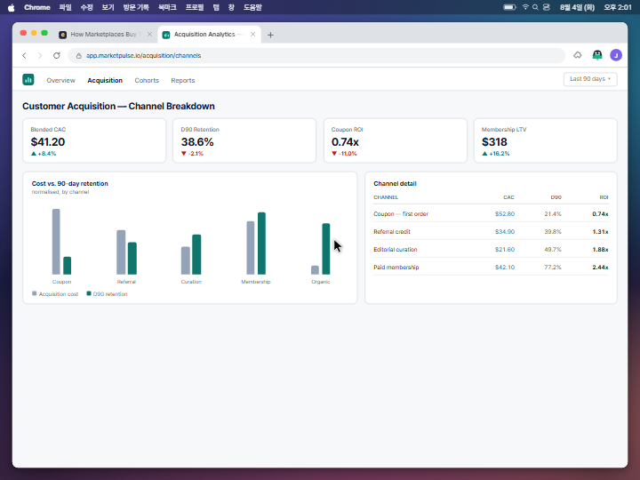
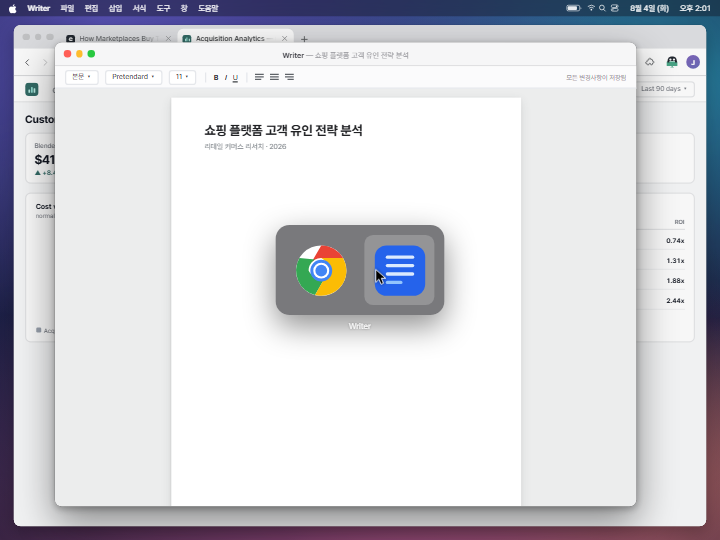
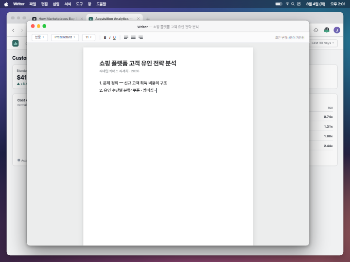
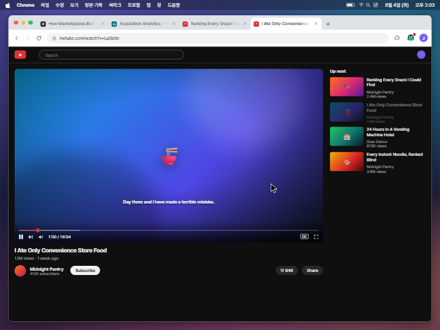
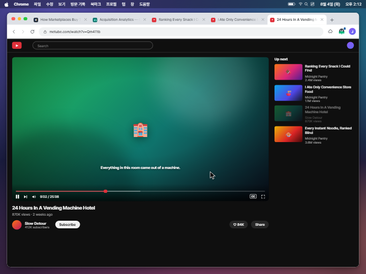
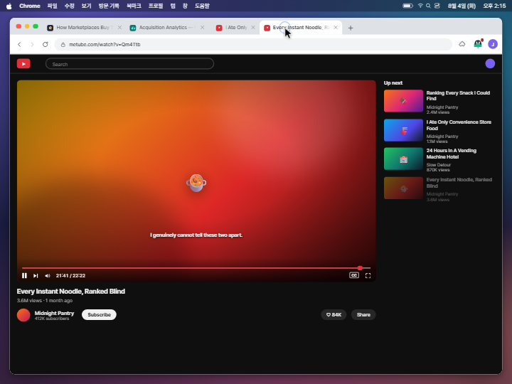
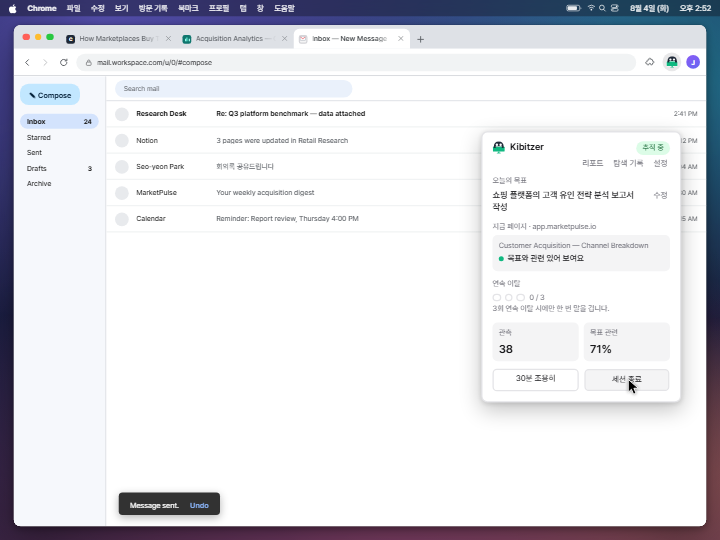

# Kibitzer 홍보 영상 — 콘티 (Phase A)

1440×1080 (4:3) · 30fps · **1040프레임 ≈ 34.7초** · macOS 데스크톱 (Dock 숨김, 메뉴바 시계 노출)

이 문서는 **Phase A 산출물**입니다. 각 씬의 핵심 UI를 실제 React 컴포넌트로 구현하고, 실제 컴포지션에서 키 비트 프레임을 그대로 뽑은 스틸입니다 — 별도의 목업 HTML이 아니라 Phase B에서 그대로 애니메이션이 입혀질 바로 그 컴포넌트입니다.

**게이트: 아래 [카피 슬롯](#카피-슬롯-확정-필요)을 한 번에 확정해 주세요.** 확정되면 `src/copy.ts` 한 파일만 고치면 전부 반영됩니다.

```sh
cd apps/promo && npx remotion studio
```

---

## 씬 구성

| 씬 | 프레임 | 초 | 내용 |
|---|---|---|---|
| S1 목표 선언 | 0–140 | 0.0–4.7 | 새 탭 → 확장 아이콘 클릭 → 목표 타이핑 → `추적 시작` |
| S2 몰입 작업 | 140–280 | 4.7–9.3 | 기사 스크롤 → 통계 대시보드 → **Cmd-Tab → 에디터 앱**에서 개요 작성 |
| S3 첫 드리프트 | 280–420 | 9.3–14.0 | Cmd-Tab → 브라우저 → 영상 사이트 → 빨간 점 → 훈수 #1 → ✕ 무시 |
| S4 스누즈+시간경과 | 420–650 | 14.0–21.7 | 훈수 #2 → `5분만` → 파란 점 → 몽타주(2:07→2:14) → 훈수 #3 |
| S5 각성 | 650–780 | 21.7–26.0 | 프리즈 + 1.04 푸시인 → 정적 → 탭 3개 정리 → 목표 탭 복귀 |
| S6 칭찬+재개 | 780–870 | 26.0–29.0 | 칭찬 토스트 → Cmd-Tab → 에디터에서 이어서 작성 |
| S7 마무리 | 870–980 | 29.0–32.7 | 보고서 완성 → Cmd-Tab → 메일 `Send` → `세션 종료` → 세션 요약 |
| S8 엔드카드 | 980–1040 | 32.7–34.7 | 로고 + 워드마크 + 태그라인 |

효과음 4개(`ding` ×3, `celebrate` ×1)는 확장의 실제 WAV를 그대로 씁니다.

---

## 키 비트 스틸

### S1 — 목표 선언
| | |
|---|---|
|  |  |
| **f100** 목표 타이핑. 목표 선언 전이라 아이콘 점은 앰버(`no_goal`) | **f130** `추적 시작` 직후 → `추적 중` 초록 pill |

### S2 — 몰입 작업
| | |
|---|---|
|  |  |
| **f172** 기사 스크롤 정독 | **f200** 통계 대시보드로 탭 전환 |
|  |  |
| **f211** Cmd-Tab — 에디터는 **별도 앱**. 메뉴바가 `Writer`로 바뀌고 브라우저는 비활성 | **f272** 에디터 앱에서 보고서 개요 타이핑 |

### S3 — 첫 드리프트
| | |
|---|---|
|  |  |
| **f362** 훈수 #1. 아이콘 빨간 점, 마스코트가 카드 위로 빼꼼 | **f410** ✕로 닫고 다음 영상으로 계속 |

### S4 — 스누즈 + 시간 경과
| | |
|---|---|
|  |  |
| **f452** 훈수 #2 — 커서가 `5분만`으로 | **f556** 몽타주: 진행바 급가속, 자동재생, 시계 2:12 |
|  | |
| **f628** 스누즈 콜백 훈수 #3 | |

### S5 — 각성
| | |
|---|---|
|  |  |
| **f674** 프리즈 + 푸시인. 메뉴바 시계는 프레임에 남김 | **f718** 무관 탭을 하나씩 닫음 |

### S6–S8 — 복귀 · 마무리
| | |
|---|---|
|  |  |
| **f800** 칭찬 토스트 — 세이지 테두리, 웃는 눈, 버튼 없음 | **f880** 에디터 앱에서 보고서 완성 |
|  |  |
| **f924** 메일 `Send` | **f952** 대시보드에서 `세션 종료` |
|  |  |
| **f966** 세션 요약 | **f1020** 엔드카드 |

---

## 카피 슬롯 (확정 필요)

`src/copy.ts` 한 곳에 모여 있습니다. 확정된 문구를 주시면 그대로 반영합니다.

| 슬롯 | 현재 값 | 상태 |
|---|---|---|
| 목표 | 쇼핑 플랫폼의 고객 유인 전략 분석 보고서 작성 | **확정** |
| 훈수 #1 | 대단히 유익해 보이는 영상이군요. 보고서 목차엔 없겠습니다만. | 초안 (건조한 관전평 톤) |
| 훈수 #2 | 오늘 2번째 관전평입니다. 꾸준함만은 인정합니다. | 초안 (반복 카운트 톤) |
| 훈수 #3 | 5분만 시간을 달라시더니, 벌써 14분째인 건 아십니까? | 방향 확정, 문구 미세조정 가능 |
| 칭찬 | 복귀까지 14분. 기록적이라고는 하지 않겠습니다만, 나쁘지 않습니다. | 초안 |
| 태그라인 | 당신의 목표를 지켜보는 조용한 훈수꾼 | **초안 — 톤 결정 필요** |
| 엔드카드 서브 | 로컬에서 동작하는 주의력 가드 · Chrome 확장 | 초안 |
| 메일 제목/본문 | `Report — Shopping Platform Customer Acquisition` (영문) | 초안 — **한국어 전환 여부 결정 필요** |

> 메일만 영문인 게 어색하면 한국어로 바꿀 수 있습니다. 확정된 언어 분리 규칙(“훈수·팝업·목표는 한국어, 가짜 웹사이트는 영어”)에서 메일은 경계에 있어 초안은 계획대로 영어로 두었습니다.

---

## 실제 UI 재현 근거

목업이 아니라 **확장 소스의 실제 값을 옮긴 것**입니다.

| 요소 | 출처 | 재현 방식 |
|---|---|---|
| 훈수/칭찬 토스트 | `apps/extension/src/content/toastOverlay.ts` | shadow-root 스타일시트의 수치를 그대로 이식 — 300px 폭, `1.5px solid #10B981`(칭찬 `#79B7A0`), radius 12, `0 6px 24px rgba(0,0,0,.18)`, `right:18px/bottom:16px`, 메시지 13px/1.55, 컨텍스트·버튼 10.5/11.5px. peek·hands SVG는 좌표까지 동일(`circle cx32 cy24 r15`, `rect x6/47 y4 w11 h8 rx4`) |
| 팝업 (설정/대시보드/요약) | `popup.html` + `popup.ts`의 `renderSetup`/`renderDashboard`/`renderSummary` | 320px 폭, `14px 16px 16px` 패딩, pill 12px, 입력 14px, 버튼 13px, 요약 진행바는 **accent 블루**(브랜드 그린 아님), 행 구성·문구 동일 |
| 아이콘 상태 점 | `background.ts`의 `STATUS_DOT_COLOR` | 앰버 `#ba7517`(목표 없음) / 빨강 `#a32d2d`(훈수 대기) / 파랑 `#185fa5`(스누즈) / 정상 추적은 **점 없음** |
| 로고 | `apps/extension/icons/icon-128.svg` | SVG 도형 좌표 그대로 React 포팅 |
| 효과음 | `apps/extension/src/offscreen/*.wav` | 파일 그대로 복사 사용 |

**초기 렌더에서 잡아 고친 실제 오차**: 토스트 마스코트 크기(46px→30px), 카드 패딩(13→12), 브랜드/컨텍스트 색(`#71717a`/`#9ca3af` → `#6b7280`), 버튼 패딩(5×8→5×10), 칭찬 토스트에도 ✕가 있다는 점, 팝업 요약 진행바 색(그린→블루), 설정 화면 라벨(`시간 예산` → `사용 가능 시간`), pill 크기.

### 홍보용으로 가정한 부분 (실제 제품과 다름)
- **훈수 #3 (스누즈 콜백)**: 실제 v1은 스누즈 만료 후 조용히 재개하며 전용 재훈수가 없습니다. 사용자 요청에 따라 “있다고 가정”하고 연출했습니다.
- **세션 요약 수치**: 실제 세션 데이터가 아닌 연출용 값입니다.
- 나머지 상태 전이(점 색 변화 타이밍, 칭찬 조건)는 실제 동작을 따릅니다.

---

## 연출 결정 메모

- **에디터는 브라우저 탭이 아니라 별도 앱**입니다. Cmd-Tab 스위처가 뜨고, 메뉴바 앱 이름이 `Chrome` ↔ `Writer`로 바뀌며, 비활성 창은 신호등 색이 빠지고 그림자가 줄어듭니다.
- 그 결과 **칭찬 토스트는 브라우저의 목표 관련 탭(통계 대시보드)에서 뜹니다.** 확장은 탭 안에만 그릴 수 있으므로, 네이티브 앱 위에 토스트를 띄우면 거짓이 됩니다. 복귀 → 브라우저에서 칭찬 → Cmd-Tab으로 작성 재개 순서입니다.
- **사이트 워드마크는 전부 제거**하고 아이콘만 남겼습니다(영상 사이트·뉴스·대시보드). 탭 제목과 URL 호스트는 남깁니다 — 훈수의 컨텍스트 줄(`host - title`)이 제품의 실제 동작이기 때문입니다.
- **딴짓에 쇼핑몰 화면은 쓰지 않습니다.** 목표가 쇼핑 플랫폼 리서치라 관련 작업으로 오독될 수 있어, 딴짓은 영상 사이트로 일원화했습니다.
- 시간 경과는 **진행바 급가속 + 자동재생 + 메뉴바 시계 점프**로 표현합니다(`Easing.in(quad)`로 뒤로 갈수록 빨라짐).
- S5 푸시인은 **메뉴바 아래에만** 적용해 시계가 프레임에서 사라지지 않게 했습니다.

---

## 남은 조정 후보

- 길이: 34.7초. 30초로 줄이려면 S4 몽타주와 S2를 압축하면 됩니다(`src/timeline.ts` 상수만 수정).
- 엔드카드 태그라인 톤.
- 메일 카피 언어.

## 구조

```
apps/promo/
  src/timeline.ts          # 모든 비트 프레임 = 단일 진실원
  src/copy.ts              # 모든 카피
  src/scenes/script.ts     # 프레임 → 화면 상태 + 커서 경로
  src/components/          # desktop / browser / extension / toast / sites / brand
  scripts/render-stills.mjs
  storyboard/              # 이 문서의 PNG
```

```sh
node scripts/render-stills.mjs              # 전체 스틸 재렌더
node scripts/render-stills.mjs s3-nudge-1   # 한 장만
```
