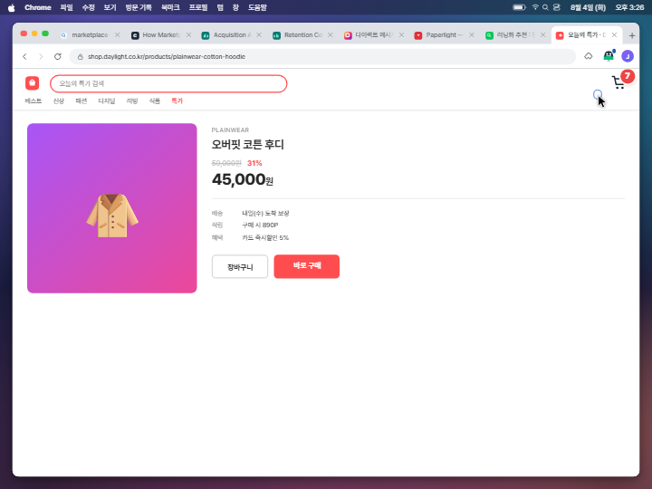

# Kibitzer 홍보 영상 — 콘티 (Phase A)

1440×1080 (4:3) · 30fps · **1612프레임 ≈ 53.7초** · macOS 데스크톱 (Dock 숨김, 메뉴바 시계 노출)

이 문서는 **Phase A 산출물**입니다. 각 씬의 핵심 UI를 실제 React 컴포넌트로 구현하고, 실제 컴포지션에서 키 비트 프레임을 그대로 뽑은 스틸입니다 — 별도의 목업 HTML이 아니라 Phase B에서 그대로 애니메이션이 입혀질 바로 그 컴포넌트입니다.

**게이트: 아래 [카피 슬롯](#카피-슬롯-확정-필요)을 한 번에 확정해 주세요.** 확정되면 `src/copy.ts` 한 파일만 고치면 전부 반영됩니다.

```sh
cd apps/promo && npx remotion studio
```

---

## 씬 구성

| 씬 | 프레임 | 초 | 시계 | 내용 |
|---|---|---|---|---|
| S1 목표 선언 | 0–140 | 0.0–4.7 | 2:00 | 새 탭 → 확장 아이콘 클릭 → 목표 타이핑 → `추적 시작` |
| S2 리서치 루프 | 140–546 | 4.7–18.2 | 2:04→3:02 | **리서치 ↔ 에디터 3회 왕복.** 빠른 타이핑, ⌘C/⌘V 2회, 문서가 눈에 띄게 쌓임 → **감속 → 엔터 두 번 → 커서만 깜빡** |
| S3 딴짓① 메시지 | 546–818 | 18.2–27.3 | 3:04→3:11 | 새 탭 → `g` + Tab 자동완성 → 피드 → DM → 세 사람 번갈아 답장 → 링크로 받은 음악 재생 → 훈수 #1 → ✕ 무시 |
| S4 딴짓②③ 쇼핑 | 818–1104 | 27.3–36.8 | 3:14→3:29 | 훈수 #2 → `5분만` → 포털 검색 → 쇼핑몰 목록 스크롤 → 상품 클릭 → **장바구니 0→7**, 중간에 DM 2회 왕복 → 훈수 #3 |
| S5 정지 | 1104–1176 | 36.8–39.2 | 3:29 | 프리즈 + 1.04 푸시인 · **약 1.6초 정적** |
| S6 정리·복귀 | 1176–1330 | 39.2–44.3 | 3:30→3:31 | 무관한 탭 4개를 오른쪽부터 정리 → 에디터를 한 번 열어봄 → 새 리서치 주제 → **칭찬 토스트** |
| S7 마무리 | 1330–1552 | 44.3–51.7 | 3:38→3:55 | 3장 작성 + 도표 → 메일 `Send` → `세션 종료` → 세션 요약 |
| S8 엔드카드 | 1552–1612 | 51.7–53.7 | — | 로고 + 워드마크 + 태그라인 |

효과음 4개(`ding` ×3, `celebrate` ×1)는 확장의 실제 WAV를 그대로 씁니다.

---

## S2 — "한 시간의 리서치"를 13초에

리서치가 실제처럼 보이려면 **읽는 장면**이 아니라 **읽은 것이 문서가 되는 장면**이 필요합니다. S2는 브라우저 ↔ 에디터를 세 번 왕복하고, 왕복마다 메뉴바 시계가 15분씩 뜁니다.

| 왕복 | 프레임 | 하는 일 |
|---|---|---|
| 1 | 146–258 | 기사 스크롤 정독 → Cmd-Tab → **1장 제목 + 본문 빠르게 타이핑** |
| 2 | 258–380 | 대시보드 → **표 두 행 드래그 선택 → ⌘C** → Cmd-Tab → **⌘V (인용 블록이 통째로 등장)** → 2장 작성 |
| 3 | 380–488 | 기사 복귀 → **인용구 선택 → ⌘C** → Cmd-Tab → **⌘V** → 마지막 문단 |

- 타이핑은 문자당 0.5프레임(≈60자/초) — 읽는 속도보다 빠른, 몰입한 사람의 속도입니다.
- **⌘C/⌘V는 화면 하단 키 칩으로 명시**합니다. 붙여넣기는 화면상 "블록이 갑자기 생기는" 것뿐이라, 키 이름이 없으면 아주 빠른 타이핑과 구분되지 않습니다.
- 붙여넣은 블록은 왼쪽 괘선 + **출처 한 줄**(`app.marketpulse.io — Channel detail`)을 답니다. 인용구 밑에 호스트명을 손으로 치는 사람은 없으므로, 이게 붙여넣기의 증거가 됩니다.
- 마지막 문단만 문자당 0.8프레임으로 **눈에 띄게 느려집니다.** 이어서 엔터 두 번 → 빈 줄에 커서만 깜빡이는 상태가 **50프레임(1.7초)** 이어집니다. 이 공백이 다음 씬 전체를 성립시킵니다.

`s2-write-1` ↔ `s2-doc-full` 두 장을 나란히 보면 쌓인 양이 보입니다.

---

## 딴짓 3단 구성

### ① 메시지 (S3)
새 탭에서 **`g` 한 글자만 치고 Tab**으로 자동완성 — 자주 가는 곳에 도달하는 데 드는 노력이 얼마나 적은지가 이 비트의 요점입니다. 피드를 잠깐 훑고 바로 DM.

세 사람에게 번갈아 답장합니다. 두 번째 사람에게 답장을 치는 도중 **세 번째 대화가 파랗게 점등**하고, 그쪽으로 옮겨 갑니다. 그 대화에서 **뮤직비디오 링크**를 받아 클릭 → 새 탭에서 재생 → 다시 DM. 여기서 훈수 #1이 뜨고, **✕로 닫습니다.**

> 음악은 이제 **DM에서 받은 링크**로 들어옵니다. 사용자가 고른 딴짓이 아니라 딴짓에 딸려온 것이라, S6 정리 때 함께 닫힙니다.

### ② 포털 (S4)
`5분만`을 누른 직후 새 탭 → 포털에서 "러닝화 추천" 검색 → 쇼핑 특가 배너 클릭.

### ③ 쇼핑몰 (S4)
**목록 페이지를 스크롤**하다 가운데쯤 상품(4번째 카드)을 클릭 → 상품 페이지를 넘겨 다니며 `장바구니` 연타. 배지가 **0→7**, 장바구니 총액 408,400원.

중간에 **DM 탭으로 두 번 돌아갑니다.** 돌아갈 때마다 안 읽음 배지가 껑충 뛰어 있고 열려 있는 대화 상대가 바뀌어 있습니다 — 두 카운터가 동시에 오르는 게 시간 경과의 실체입니다.

마지막에 장바구니 페이지로 착지하고, 그 위에 훈수 #3이 뜨면서 **전부 멈춥니다.**

---

## 훈수 토스트 크기

이 컷에는 토스트 줌인이 없으므로 **토스트 전체를 1.5배로 확대**했습니다(`theme.ts`의 `TOAST_SCALE`). 내부 CSS 값은 `toastOverlay.ts`의 실제 값을 한 글자도 바꾸지 않았고, 앵커(우하단 18/18)를 원점으로 하는 `transform: scale(1.5)` 한 줄만 걸었습니다. 실측 재현과 영상 가독성을 둘 다 지키는 방법입니다.

---

## 키 비트 스틸

### S1 — 목표 선언
| | |
|---|---|
|  |  |
| **f100** 목표 타이핑. 선언 전이라 아이콘 점은 앰버(`no_goal`) | **f130** `추적 시작` 직후 → `추적 중` 초록 pill |

### S2 — 리서치 루프
| | |
|---|---|
|  |  |
| **f172** 기사 스크롤 정독 | **f240** Cmd-Tab → 에디터에서 빠른 작성 (**이 시점의 문서 양**) |
|  |  |
| **f292** 대시보드 표 두 행 드래그 선택 + ⌘C | **f313** ⌘V — 출처가 달린 인용 블록이 통째로 등장 |
|  |  |
| **f410** 기사 인용구 선택 + ⌘C | **f430** 두 번째 붙여넣기 |
|  |  |
| **f484** 한 시간 뒤의 문서 — 2개 장 + 붙여넣기 2개 + 본문 | **f524** 엔터 두 번, 빈 줄에 커서만 깜빡 (3:02) |

### S3 — 딴짓① 메시지
| | |
|---|---|
|  |  |
| **f589** `g` 한 글자 → 자동완성 → Tab | **f612** 피드 스크롤 |
|  |  |
| **f652** 첫 번째 사람에게 답장 중 | **f694** 답장 도중 다른 대화가 점등 |
|  |  |
| **f722** 링크로 받은 뮤직비디오 카드 | **f740** 새 탭에서 재생 |
|  | |
| **f792** 훈수 #1 — 1.5배 토스트. 아이콘 빨간 점 | |

### S4 — 딴짓②③ 포털 → 쇼핑몰
| | |
|---|---|
|  |  |
| **f846** 훈수 #2 — 커서가 `5분만`으로 | **f900** 포털에 "러닝화 추천", 쇼핑 특가 배너 |
|  |  |
| **f932** 목록을 스크롤하다 가운데 상품 선택 | **f970** 상품 페이지 · `장바구니` |
|  |  |
| **f990** DM 왕복 — 그새 배지가 25로 | **f1078** 장바구니 7개 · 408,400원 |
|  |  |
| **f1102** 스누즈 콜백 훈수 #3 | **f1132** 전부 멈춤 + 푸시인 · 정적 |

### S6–S8 — 정리 · 복귀 · 마무리
| | |
|---|---|
|  |  |
| **f1202** 무관한 탭을 오른쪽부터 정리 — 닫을 때마다 오후가 역순으로 스쳐 감 | **f1268** 문서를 한 번 열어봄. 아까 그 빈 줄 |
|  |  |
| **f1336** 새 리서치 주제 위에서 칭찬 토스트 | **f1442** 3장 + 도표까지 완성 |
|  |  |
| **f1490** 메일 `Send` | **f1538** 세션 요약 |
|  | |
| **f1594** 엔드카드 | |

```sh
node scripts/render-stills.mjs            # 전체
node scripts/render-stills.mjs s3-nudge-1 # 한 장
```

---

## 카피 슬롯 (확정 필요)

전부 `src/copy.ts` 한 곳에 있습니다.

| 슬롯 | 현재 문구 | 상태 |
|---|---|---|
| 목표 | 쇼핑 플랫폼의 고객 유인 전략 분석 보고서 작성 | **확정** |
| 훈수 #1 (DM) | 대화가 대단히 활발하시군요. 보고서 목차엔 없는 항목입니다만. | 초안 |
| 훈수 #2 (반복) | 오늘 2번째 관전평입니다. 꾸준함만은 인정합니다. | 초안 |
| 훈수 #3 (스누즈 콜백) | 5분만 시간을 달라시더니, 벌써 14분째인 건 아십니까? **장바구니는 7개가 되었고요.** | 앞문장 확정 / **뒷문장은 뺄 수 있음** |
| 칭찬 | 26분 만의 복귀입니다. 기록이라고는 못 하겠습니다만, 돌아오긴 하셨군요. | 초안 — **시간이 26분으로 바뀌어 갱신됨** |
| 태그라인 | 당신의 목표를 지켜보는 조용한 훈수꾼 | **초안 — 톤 결정 필요** |
| 엔드카드 서브 | 로컬에서 동작하는 주의력 가드 · Chrome 확장 | 초안 |
| 메일 제목/본문 | `Report — Shopping Platform Customer Acquisition` (영문) | 초안 — **한국어 전환 여부 결정 필요** |

시계가 실제로 맞습니다: `5분만` 클릭이 3:15, 훈수 #3이 3:29 → **정확히 14분**. 딴짓 시작 3:04, 복귀 3:30 → **26분**. 문구의 숫자를 바꾸면 `timeline.ts`의 `clockSteps`도 같이 고쳐야 합니다.

### 훈수 #2 대안
쇼핑을 훈수 #2 시점으로 당기면 이 영상의 핵심 아이러니를 직접 찌를 수 있습니다:
> "쿠폰 유인 전략의 효과를 몸소 검증하고 계시는군요."

현재는 훈수 #2가 DM 위에서 뜨므로 쓰지 않았습니다. 원하시면 S4 순서를 바꿔 넣겠습니다.

---

## 실제 UI 재현 근거

목업이 아니라 **확장 소스의 실제 값을 옮긴 것**입니다.

| 요소 | 출처 | 재현 방식 |
|---|---|---|
| 훈수/칭찬 토스트 | `apps/extension/src/content/toastOverlay.ts` | shadow-root 스타일시트 수치를 그대로 이식 — 300px 폭, `1.5px solid #10B981`(칭찬 `#79B7A0`), radius 12, `0 6px 24px rgba(0,0,0,.18)`, 메시지 13px/1.55, 컨텍스트·버튼 10.5/11.5px, 등장 `cubic-bezier(.2,.8,.3,1)`. peek·hands SVG는 좌표까지 동일(`circle cx32 cy24 r15`, `rect x6/47 y4 w11 h8 rx4`). **영상용 1.5배 확대는 값 수정이 아니라 바깥 `transform: scale(1.5)` 한 줄** |
| 팝업 (설정/대시보드/요약) | `popup.html` + `popup.ts`의 `renderSetup`/`renderDashboard`/`renderSummary` | 320px 폭, `14px 16px 16px` 패딩, pill 12px, 입력 14px, 버튼 13px, 요약 진행바는 **accent 블루**(브랜드 그린 아님), 행 구성·문구 동일 |
| 아이콘 상태 점 | `background.ts`의 `STATUS_DOT_COLOR` | 앰버 `#ba7517`(목표 없음) / 빨강 `#a32d2d`(훈수 대기) / 파랑 `#185fa5`(스누즈) / 정상 추적은 **점 없음** |
| 로고 | `apps/extension/icons/icon-128.svg` | SVG 도형 좌표 그대로 React 포팅 |
| 효과음 | `apps/extension/src/offscreen/*.wav` | 파일 그대로 복사 사용 |

**초기 렌더에서 잡아 고친 실제 오차**: 토스트 마스코트 크기(46px→30px), 카드 패딩(13→12), 브랜드/컨텍스트 색(`#71717a`/`#9ca3af` → `#6b7280`), 버튼 패딩(5×8→5×10), 칭찬 토스트에도 ✕가 있다는 점, 팝업 요약 진행바 색(그린→블루), 설정 화면 라벨(`시간 예산` → `사용 가능 시간`), pill 크기.

### 홍보용으로 가정한 부분 (실제 제품과 다름)
- **훈수 #3 (스누즈 콜백)**: 실제 v1은 스누즈 만료 후 조용히 재개하며 전용 재훈수가 없습니다. 사용자 요청에 따라 "있다고 가정"하고 연출했습니다.
- **세션 요약 수치**: 실제 세션 데이터가 아닌 연출용 값입니다.
- 나머지 상태 전이(점 색 변화 타이밍, 칭찬 조건)는 실제 동작을 따릅니다.

---

## 연출 결정 메모

- **에디터는 브라우저 탭이 아니라 별도 앱**입니다. Cmd-Tab 스위처가 뜨고, 메뉴바 앱 이름이 `Chrome` ↔ `Writer`로 바뀌며, 비활성 창은 신호등 색이 빠지고 그림자가 줄어듭니다.
- 그 결과 **칭찬 토스트는 브라우저의 목표 관련 탭에서 뜹니다.** 확장은 탭 안에만 그릴 수 있으므로, 네이티브 앱 위에 토스트를 띄우면 거짓이 됩니다. 정리 → 문서 확인 → 브라우저에서 새 리서치 → 칭찬 순서입니다.
- **탭 정리는 같은 클릭 4번이 아닙니다.** 활성 탭을 닫으면 옆 탭으로 떨어지므로, 닫는 동안 쇼핑몰 → 포털 → 음악 → DM이 역순으로 스쳐 지나가고 마지막에 목표 관련 페이지에 착지합니다.
- **사이트 워드마크는 전부 제거**하고 아이콘만 남겼습니다. 브랜드 세이프티를 위해 **호스트명도 전부 가상**입니다(`gramline.com`, `narae.com`, `shop.daylight.co.kr`, `metube.com`, `commerceweekly.com`, `app.marketpulse.io`). 탭 제목과 호스트는 남기는데, 훈수의 컨텍스트 줄(`host - title`)이 제품의 실제 동작이기 때문입니다.
- **쇼핑몰 상품은 전부 개인 소비재**입니다. 목표가 쇼핑 플랫폼 리서치라 "관련 작업"으로 오독될 수 있는데, 개인 소비 + 장바구니 카운터로 명확히 분리했습니다. 오히려 **고객 유인 전략을 분석하다가 본인이 유인당하는** 구조가 이 영상의 중심 농담입니다.
- S5 푸시인은 **메뉴바 아래에만** 적용해 시계가 프레임에서 사라지지 않게 했습니다.

---

## 남은 조정 후보

- **길이 53.7초.** 요청하신 리서치 실감 + 딴짓 3단을 다 넣은 결과입니다. 40초대로 줄이려면 ① S2 왕복 3회 → 2회, ② DM 왕복 2회 → 1회, ③ 정적 구간 단축 순으로 자르면 됩니다. 전부 `src/timeline.ts` 상수만 고치면 됩니다.
- 엔드카드 태그라인 톤 / 메일 카피 언어 / 훈수 #2 위치(위 대안 참조).

## 구조

```
apps/promo/
  src/timeline.ts          # 모든 비트 프레임 = 단일 진실원
  src/copy.ts              # 모든 카피 + 보고서 블록
  src/scenes/script.ts     # 프레임 → 화면 상태 + 커서 경로 + 문서 작성 스케줄
  src/components/          # desktop / browser / extension / toast / sites / brand
  scripts/render-stills.mjs
  storyboard/              # 이 문서의 PNG
```
