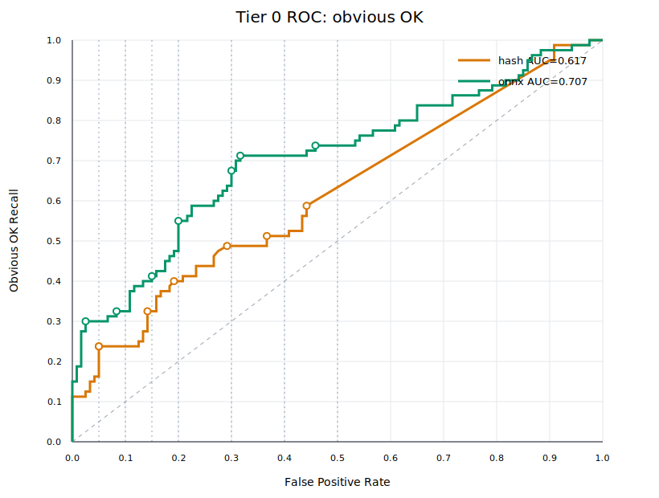

# Tier 0 Embedding Benchmark

Methods comparison on 200 "anchor-page title" pair.
No cross-validation is used. Each method selects its threshold on all 200 pairs.
Positive means `obvious OK`; higher scores predict OK.

## Dataset

- Pairs: 200 across 40 anchors
- Short anchors (<=3 words): 35
- Short titles (<=6 words): 39
- Short anchor-title pairs: 36
- Anchor groups with English OK title: 16
- Legacy fixture pairs: 0

## Overall

| Method | Source | Dimensions | Cold ms | Warm ms | ROC AUC | partial AUC FPR<=30% | Average precision |
|---|---|---:|---:|---:|---:|---:|---:|
| hash (baseline) | builtin:hash | 256 | 5.1 | 5.0 | 0.6169 | 0.3139 | 0.5734 |
| [KoEn-E5-Tiny](https://huggingface.co/exp-models/dragonkue-KoEn-E5-Tiny/blob/main/onnx/model_qint8_arm64.onnx) | builtin:onnx | 384 | 748.2 | 479.9 | 0.7066 | 0.4274 | 0.6833 |

## Operating Points

| FPR budget | Method | Threshold Tau | Recall | Actual FPR | FP | Precision |
|---:|---|---:|---:|---:|---:|---:|
| 5% | hash | 0.499230 | 23.8% | 5.0% | 6 | 76.0% |
| 5% | onnx | 0.675508 | 30.0% | 2.5% | 3 | 88.9% |
| 10% | hash | 0.499230 | 23.8% | 5.0% | 6 | 76.0% |
| 10% | onnx | 0.596833 | 32.5% | 8.3% | 10 | 72.2% |
| 15% | hash | 0.377964 | 32.5% | 14.2% | 17 | 60.5% |
| 15% | onnx | 0.538493 | 41.2% | 15.0% | 18 | 64.7% |
| 20% | hash | 0.267261 | 40.0% | 19.2% | 23 | 58.2% |
| 20% | onnx | 0.489521 | 55.0% | 20.0% | 24 | 64.7% |
| 30% | hash | 0.204124 | 48.8% | 29.2% | 35 | 52.7% |
| 30% | onnx | 0.442900 | 67.5% | 30.0% | 36 | 60.0% |
| 40% | hash | 0.159901 | 51.2% | 36.7% | 44 | 48.2% |
| 40% | onnx | 0.434145 | 71.2% | 31.7% | 38 | 60.0% |
| 50% | hash | 0.048912 | 58.8% | 44.2% | 53 | 47.0% |
| 50% | onnx | 0.389173 | 73.8% | 45.8% | 55 | 51.8% |

## Tag Slices

| Tag | Method | Count | OK | DRIFT | OK mean | DRIFT mean |
|---|---|---:|---:|---:|---:|---:|
| clickbait_ok | hash | 17 | 17 | 0 | 0.1525 | - |
| clickbait_ok | onnx | 17 | 17 | 0 | 0.4328 | - |
| cross_lingual | hash | 29 | 16 | 13 | -0.0067 | -0.0091 |
| cross_lingual | onnx | 29 | 16 | 13 | 0.4529 | 0.4058 |
| generic_hub | hash | 12 | 0 | 12 | - | -0.0183 |
| generic_hub | onnx | 12 | 0 | 12 | - | 0.2910 |
| ko_semantic_no_overlap | hash | 21 | 21 | 0 | 0.0624 | - |
| ko_semantic_no_overlap | onnx | 21 | 21 | 0 | 0.3724 | - |
| lexical_overlap_ok | hash | 44 | 44 | 0 | 0.3881 | - |
| lexical_overlap_ok | onnx | 44 | 44 | 0 | 0.6282 | - |
| lexical_overlap_trap | hash | 41 | 0 | 41 | - | 0.1723 |
| lexical_overlap_trap | onnx | 41 | 0 | 41 | - | 0.4528 |
| same_frame_trap | hash | 48 | 0 | 48 | - | 0.1542 |
| same_frame_trap | onnx | 48 | 0 | 48 | - | 0.4185 |
| short_anchor | hash | 175 | 70 | 105 | 0.2055 | 0.0895 |
| short_anchor | onnx | 175 | 70 | 105 | 0.4979 | 0.3661 |
| short_title | hash | 39 | 8 | 31 | 0.3380 | 0.0648 |
| short_title | onnx | 39 | 8 | 31 | 0.5317 | 0.3562 |
| typo_query | hash | 9 | 3 | 6 | 0.3323 | 0.0439 |
| typo_query | onnx | 9 | 3 | 6 | 0.6460 | 0.3865 |

## All Pair Scores

| ID | Anchor | Title | Label | Tags | hash | onnx |
|---|---|---|---|---|---:|---:|
| v2g01-dog-walk-training-01 | 강아지 산책 훈련 | 강아지 산책 훈련 하는 법 총정리 : 네이버 블로그 | OK | lexical_overlap_ok, short_anchor | 0.663325 | 0.832797 |
| v2g01-dog-walk-training-02 | 강아지 산책 훈련 | 짖음 심하고 낯가림 심한 강아지 사회화는 언제부터? - 네이버 지식iN | OK | ko_semantic_no_overlap, short_anchor | 0.159901 | 0.435173 |
| v2g01-dog-walk-training-03 | 강아지 산책 훈련 | 강아지 산책 필수템 하네스·리드줄 가격비교 \| 다나와 | DRIFT | lexical_overlap_trap, short_anchor | 0.197386 | 0.523681 |
| v2g01-dog-walk-training-04 | 강아지 산책 훈련 | 몰티즈 무료분양 후기 모음 - 네이버 카페 | DRIFT | same_frame_trap, short_anchor | 0.000000 | 0.244884 |
| v2g01-dog-walk-training-05 | 강아지 산책 훈련 | 요즘 넷플릭스 볼만한 거 추천좀 | DRIFT | short_anchor, short_title | 0.000000 | 0.175986 |
| v2g02-studio-interior-01 | 자취방 인테리어 | 자취방 인테리어 아이디어 - Google 검색 | OK | lexical_overlap_ok, short_anchor, short_title | 0.661438 | 0.852028 |
| v2g02-studio-interior-02 | 자취방 인테리어 | 6평 원룸, 좁아도 넓어 보이게 배치하는 법 | OK | ko_semantic_no_overlap, short_anchor | 0.000000 | 0.389173 |
| v2g02-studio-interior-03 | 자취방 인테리어 | 자취방 인테리어 소품 무료나눔 해요 - 당근 | DRIFT | lexical_overlap_trap, short_anchor | 0.433555 | 0.711491 |
| v2g02-studio-interior-04 | 자취방 인테리어 | 다이소 신상 정리함 털어봤습니다 - YouTube | DRIFT | same_frame_trap, short_anchor, short_title | 0.000000 | 0.242704 |
| v2g02-studio-interior-05 | 자취방 인테리어 | 잠잘 때 듣는 빗소리 ASMR 3시간 - YouTube | DRIFT | short_anchor | 0.000000 | 0.226639 |
| v2g03-coffee-beans-01 | 커피 원두 추천 | 산미 없는 원두 추천 순위 TOP10 - 다음 카페 | OK | clickbait_ok, lexical_overlap_ok, short_anchor | 0.428845 | 0.678435 |
| v2g03-coffee-beans-02 | 커피 원두 추천 | Best Coffee Beans for Pour Over 2024 - Reddit | OK | cross_lingual, short_anchor | 0.000000 | 0.482351 |
| v2g03-coffee-beans-03 | 커피 원두 추천 | 원두커피 카페인 함량 하루 권장량은? | DRIFT | lexical_overlap_trap, short_anchor, short_title | 0.264906 | 0.650333 |
| v2g03-coffee-beans-04 | 커피 원두 추천 | 스타벅스 2024 여름 신메뉴 프라푸치노 총정리 | DRIFT | same_frame_trap, short_anchor, short_title | 0.000000 | 0.355538 |
| v2g03-coffee-beans-05 | 커피 원두 추천 | 제주도 3박4일 가족여행 코스 : 네이버 블로그 | DRIFT | short_anchor | -0.125988 | 0.231968 |
| v2g04-honeymoon-prep-01 | 신혼여행 준비 | 신혼여행 조비물 체크리스트 - Google 검색 | OK | lexical_overlap_ok, short_anchor, short_title, typo_query | 0.342997 | 0.686732 |
| v2g04-honeymoon-prep-02 | 신혼여행 준비 | 허니문으로 몰디브 vs 발리 고민중이에요 - 네이버 지식iN | OK | ko_semantic_no_overlap, short_anchor | -0.066815 | 0.233742 |
| v2g04-honeymoon-prep-03 | 신혼여행 준비 | 신혼여행 대신 혼자 떠난 제주 한달살기 후기 | DRIFT | lexical_overlap_trap, short_anchor | 0.267261 | 0.507832 |
| v2g04-honeymoon-prep-04 | 신혼여행 준비 | 결혼식 축의금 얼마가 적당할까요 | DRIFT | same_frame_trap, short_anchor, short_title | 0.000000 | 0.344415 |
| v2g04-honeymoon-prep-05 | 신혼여행 준비 | 유럽 배낭여행 3주 경비 후기 - 브런치 | DRIFT | short_anchor | 0.073721 | 0.377452 |
| v2g05-car-maintenance-01 | 자동차 정기점검 | 자동차 정기점검 항목 총정리, 셀프로 확인하는 법 : 네이버 블로그 | OK | lexical_overlap_ok, short_anchor | 0.385758 | 0.752196 |
| v2g05-car-maintenance-02 | 자동차 정기점검 | (3) 엔진오일 언제 갈아야 하나요? 주행거리 기준 알려주세요 - 보배드림 | OK | ko_semantic_no_overlap, short_anchor | 0.000000 | 0.325975 |
| v2g05-car-maintenance-03 | 자동차 정기점검 | 자동차세 연납 신청 방법 - Google 검색 | DRIFT | same_frame_trap, short_anchor | 0.082479 | 0.305560 |
| v2g05-car-maintenance-04 | 자동차 정기점검 | 제네시스 GV80 vs 쏘렌토 하이브리드 비교 시승기 | DRIFT | same_frame_trap, short_anchor | -0.164957 | 0.213687 |
| v2g05-car-maintenance-05 | 자동차 정기점검 | 졸음운전 사고 블랙박스 모음.avi | DRIFT | short_anchor, short_title | 0.000000 | 0.303350 |
| v2g06-laptop-battery-01 | 노트북 배터리 관리 | 노트북 배터리 관리 잘하는 법, 80%만 채워라? : 네이버 블로그 | OK | clickbait_ok, lexical_overlap_ok, short_anchor | 0.659380 | 0.801163 |
| v2g06-laptop-battery-02 | 노트북 배터리 관리 | How to Maximize Your Laptop Battery Lifespan - Reddit | OK | cross_lingual, short_anchor | 0.000000 | 0.554520 |
| v2g06-laptop-battery-03 | 노트북 배터리 관리 | 노트북 배터리 부풀음 무상교체 후기 | DRIFT | lexical_overlap_trap, short_anchor, short_title | 0.460179 | 0.655335 |
| v2g06-laptop-battery-04 | 노트북 배터리 관리 | 맥북 프로 M4 vs 에어 M3 실사용 비교 | DRIFT | same_frame_trap, short_anchor | 0.000000 | 0.306169 |
| v2g06-laptop-battery-05 | 노트북 배터리 관리 | 가성비 무선이어폰 추천 top5 - 다나와 | DRIFT | short_anchor, short_title | -0.079057 | 0.264593 |
| v2g07-camping-gear-01 | 캠핑 장비 구매 | 캠핑 장비 구매 순서, 초보는 이것부터 사세요 : 네이버 블로그 | OK | clickbait_ok, lexical_overlap_ok, short_anchor | 0.612372 | 0.787509 |
| v2g07-camping-gear-02 | 캠핑 장비 구매 | 캠핑 4인용 텐트 추게 - Google 검색 | OK | lexical_overlap_ok, short_anchor, typo_query | 0.258199 | 0.495607 |
| v2g07-camping-gear-03 | 캠핑 장비 구매 | 캠핑장 예약 꿀팁, 성수기 자리 잡는 법 | DRIFT | lexical_overlap_trap, short_anchor | 0.361158 | 0.488225 |
| v2g07-camping-gear-04 | 캠핑 장비 구매 | 불멍 장작 화로 브이로그, 계곡 옆에서 - YouTube | DRIFT | same_frame_trap, short_anchor | 0.000000 | 0.248205 |
| v2g07-camping-gear-05 | 캠핑 장비 구매 | 다나와 : 가격비교 사이트 | DRIFT | generic_hub, short_anchor, short_title | 0.000000 | 0.371624 |
| v2g08-yoga-mat-01 | 요가매트 고르기 | 요가매트 고르는 법, 두께랑 재질만 보면 끝 : 네이버 블로그 | OK | lexical_overlap_ok, short_anchor | 0.377964 | 0.769095 |
| v2g08-yoga-mat-02 | 요가매트 고르기 | 필라테스 시작하는데 매트는 뭘 사야 하나요 - 네이버 지식iN | OK | ko_semantic_no_overlap, short_anchor | 0.072739 | 0.527681 |
| v2g08-yoga-mat-03 | 요가매트 고르기 | 요가매트 냄새 제거하는 법, 새 제품 사면 필수 | DRIFT | lexical_overlap_trap, short_anchor | 0.296500 | 0.625008 |
| v2g08-yoga-mat-04 | 요가매트 고르기 | 오늘의 홈트 루틴 공개, 초보자도 가능 - YouTube | DRIFT | same_frame_trap, short_anchor | 0.000000 | 0.340598 |
| v2g08-yoga-mat-05 | 요가매트 고르기 | 다이어트 도시락 일주일 식단 후기 | DRIFT | short_anchor, short_title | 0.000000 | 0.284697 |
| v2g09-fall-seafood-01 | 가을 제철 수산물 추천 | 가을 제철 수산물 추천 베스트5 : 네이버 블로그 | OK | lexical_overlap_ok | 0.774597 | 0.890000 |
| v2g09-fall-seafood-02 | 가을 제철 수산물 추천 | 전어 굴 과메기, 지금 먹어야 맛있는 이유 - 다음 블로그 | OK | ko_semantic_no_overlap | 0.049690 | 0.362535 |
| v2g09-fall-seafood-03 | 가을 제철 수산물 추천 | 가을 제철 등산코스 추천 TOP10 - 다음 블로그 | DRIFT | same_frame_trap | 0.632456 | 0.684487 |
| v2g09-fall-seafood-04 | 가을 제철 수산물 추천 | 겨울 제철 수산물 시세 전망 - Google 검색 | DRIFT | same_frame_trap | 0.451848 | 0.645207 |
| v2g09-fall-seafood-05 | 가을 제철 수산물 추천 | 수산물 유통업체 채용정보 - 잡코리아 | DRIFT | lexical_overlap_trap, short_title | 0.200000 | 0.458047 |
| v2g10-gold-price-01 | 금 시세 전망 | 오늘의 국제 금 시세 실시간 차트 : 네이버증권 | OK | lexical_overlap_ok, short_anchor | 0.340207 | 0.538493 |
| v2g10-gold-price-02 | 금 시세 전망 | 국제 금값이 계속 오르는 이유 정리 - 다음 블로그 | OK | ko_semantic_no_overlap, short_anchor | 0.000000 | 0.434145 |
| v2g10-gold-price-03 | 금 시세 전망 | 은 시새 전망 및 투자 전략 - Google 검색 | DRIFT | same_frame_trap, short_anchor, typo_query | 0.000000 | 0.517128 |
| v2g10-gold-price-04 | 금 시세 전망 | 전세 시세 전망 2024 하반기 : 네이버 블로그 | DRIFT | same_frame_trap, short_anchor | 0.568535 | 0.535937 |
| v2g10-gold-price-05 | 금 시세 전망 | 순금 목걸이 세공 원데이클래스 후기 : 네이버 블로그 | DRIFT | lexical_overlap_trap, short_anchor | 0.000000 | 0.237060 |
| v2g11-jeju-itinerary-01 | 제주도 여행 일정 짜기 | 제주도 3박4일 여행 일정표 총정리 : 네이버 블로그 | OK | lexical_overlap_ok | 0.516398 | 0.714031 |
| v2g11-jeju-itinerary-02 | 제주도 여행 일정 짜기 | 제주 서쪽 코스 동선 짜는 법 (렌터카 기준) - 티스토리 | OK | ko_semantic_no_overlap | 0.088561 | 0.484663 |
| v2g11-jeju-itinerary-03 | 제주도 여행 일정 짜기 | 부산 여행 일정 짜기 2박3일 - 다음 블로그 | DRIFT | same_frame_trap | 0.596285 | 0.609856 |
| v2g11-jeju-itinerary-04 | 제주도 여행 일정 짜기 | 제주도 전입신고 행정 일정 안내 - 제주시청 | DRIFT | same_frame_trap | 0.430706 | 0.543103 |
| v2g11-jeju-itinerary-05 | 제주도 여행 일정 짜기 | 제주항공 승무원 채용 일정 - Google 검색 | DRIFT | same_frame_trap | 0.288675 | 0.581174 |
| v2g12-laptop-gpu-compare-01 | 게이밍 노트북 그래픽카드 성능 비교 | RTX4060 vs RTX4070 노트북 그래픽카드 성능 비교표 - 퀘이사존 | OK | lexical_overlap_ok | 0.684762 | 0.690103 |
| v2g12-laptop-gpu-compare-02 | 게이밍 노트북 그래픽카드 성능 비교 | Laptop GPU benchmarks 2024: which chip should you buy? - Notebookcheck | OK | cross_lingual | 0.000000 | 0.575207 |
| v2g12-laptop-gpu-compare-03 | 게이밍 노트북 그래픽카드 성능 비교 | 노트북 CPU 성능 비교 (인텔 vs AMD) - 다나와 | DRIFT | same_frame_trap | 0.550689 | 0.647834 |
| v2g12-laptop-gpu-compare-04 | 게이밍 노트북 그래픽카드 성능 비교 | 스마트폰 카메라 성능 비교 2024 - YouTube | DRIFT | same_frame_trap | 0.445132 | 0.409928 |
| v2g12-laptop-gpu-compare-05 | 게이밍 노트북 그래픽카드 성능 비교 | 그래픽카드 채굴 수익 계산기 \| 인벤 | DRIFT | lexical_overlap_trap, short_title | 0.256495 | 0.530992 |
| v2g13-disc-exercise-01 | 허리디스크 운동 추천 | 허리디스크, 이 운동 안 하면 평생 고생합니다 - YouTube | OK | clickbait_ok, lexical_overlap_ok, short_anchor | 0.499230 | 0.688263 |
| v2g13-disc-exercise-02 | 허리디스크 운동 추천 | 디스크 있을 때 코어 강화하는 스트레칭 모음 : 네이버포스트 | OK | ko_semantic_no_overlap, short_anchor | 0.245145 | 0.534096 |
| v2g13-disc-exercise-03 | 허리디스크 운동 추천 | 목디스크 운동 추천 : 네이버 지식iN | DRIFT | same_frame_trap, short_anchor, short_title | 0.615385 | 0.758851 |
| v2g13-disc-exercise-04 | 허리디스크 운동 추천 | 허리디스크 명의 추천 병원 순위 - 다음 카페 | DRIFT | same_frame_trap, short_anchor | 0.463524 | 0.646489 |
| v2g13-disc-exercise-05 | 허리디스크 운동 추천 | (1) 홈트레이닝 채널 모음 - YouTube | DRIFT | generic_hub, short_anchor, short_title | 0.000000 | 0.370910 |
| v2g14-passport-reissue-01 | 여권 재발급 예약 | 여권 재발급 방문예약 하는 법 (정부24) : 네이버 블로그 | OK | lexical_overlap_ok, short_anchor | 0.532181 | 0.781563 |
| v2g14-passport-reissue-02 | 여권 재발급 예약 | 여권 유효기간 얼마 안남았을 때 준비서류 총정리 - 티스토리 | OK | ko_semantic_no_overlap, short_anchor | 0.220193 | 0.502033 |
| v2g14-passport-reissue-03 | 여권 재발급 예약 | 운전면허 갱신 예약 방법 - 도로교통공단 | DRIFT | same_frame_trap, short_anchor, short_title | 0.257130 | 0.454146 |
| v2g14-passport-reissue-04 | 여권 재발급 예약 | 여권 사진관 촬영 예약 할인 이벤트 - 카카오톡채널 | DRIFT | same_frame_trap, short_anchor | 0.473050 | 0.581678 |
| v2g14-passport-reissue-05 | 여권 재발급 예약 | 출입국사무소 비자 연장 예약 후기 : 네이버 카페 | DRIFT | same_frame_trap, short_anchor | 0.223957 | 0.528992 |
| v2g15-iphone-upgrade-timing-01 | 아이폰 교체 시기 | 아이폰 배터리 효율 80% 이하면 교체 시기 : 네이버 블로그 | OK | lexical_overlap_ok, short_anchor | 0.692902 | 0.693945 |
| v2g15-iphone-upgrade-timing-02 | 아이폰 교체 시기 | When should you actually upgrade your iPhone? - The Verge | OK | cross_lingual, short_anchor | 0.000000 | 0.573245 |
| v2g15-iphone-upgrade-timing-03 | 아이폰 교체 시기 | 갤럭시 교체 시기 신호 5가지 - YouTube | DRIFT | same_frame_trap, short_anchor | 0.622543 | 0.591057 |
| v2g15-iphone-upgrade-timing-04 | 아이폰 교체 시기 | 타이어 교채 시기 확인하는 법 - Google 검색 | DRIFT | same_frame_trap, short_anchor, typo_query | 0.263181 | 0.336869 |
| v2g15-iphone-upgrade-timing-05 | 아이폰 교체 시기 | 아이폰 케이스 할인 쿠폰 모음 - 쿠팡 | DRIFT | lexical_overlap_trap, short_anchor | 0.192847 | 0.438790 |
| v2g16-savings-rate-compare-01 | 적금 예금 금리 비교 | 2024 은행별 적금 예금 금리 비교표 : 네이버페이 | OK | lexical_overlap_ok | 0.714435 | 0.707264 |
| v2g16-savings-rate-compare-02 | 적금 예금 금리 비교 | 적금이랑 예금 뭐가 더 유리할까? 초보자 정리 - 브런치 | OK | ko_semantic_no_overlap | 0.288675 | 0.766866 |
| v2g16-savings-rate-compare-03 | 적금 예금 금리 비교 | 신용카드 혜택 비교 추천 순위 - 나무위키 | DRIFT | same_frame_trap | 0.204124 | 0.417705 |
| v2g16-savings-rate-compare-04 | 적금 예금 금리 비교 | 아파트 전세 대출 금리 비교 2024 - Google 검색 | DRIFT | same_frame_trap | 0.400000 | 0.427197 |
| v2g16-savings-rate-compare-05 | 적금 예금 금리 비교 | 보험 상품 비교 사이트 모음 : 네이버 카페 | DRIFT | generic_hub | 0.196116 | 0.315420 |
| v2g17-ts-generics-01 | 타입스크립트 제네릭 | How to constrain a generic type to keyof another type in TypeScript? - Stack Overflow | OK | cross_lingual, lexical_overlap_ok, short_anchor | 0.000000 | 0.322588 |
| v2g17-ts-generics-02 | 타입스크립트 제네릭 | 제네릭이 도대체 왜 필요한 걸까? (feat. 타입 추론) : 네이버 블로그 | OK | clickbait_ok, lexical_overlap_ok, short_anchor | 0.294628 | 0.700408 |
| v2g17-ts-generics-03 | 타입스크립트 제네릭 | Java Generics and Wildcards Explained (Full Guide) - YouTube | DRIFT | cross_lingual, lexical_overlap_trap, short_anchor | -0.117851 | 0.375766 |
| v2g17-ts-generics-04 | 타입스크립트 제네릭 | next.config.js: Module Federation setup guide — Next.js Docs | DRIFT | same_frame_trap, short_anchor | -0.089087 | 0.293292 |
| v2g17-ts-generics-05 | 타입스크립트 제네릭 | 새 탭 | DRIFT | generic_hub, short_anchor, short_title | 0.000000 | 0.333053 |
| v2g18-elden-ring-mods-01 | 엘든링 모드 설치 | Elden Ring Mod Engine keeps crashing on launch · Issue #742 · techiew/modengine2 | OK | cross_lingual, lexical_overlap_ok, short_anchor | -0.174078 | 0.511062 |
| v2g18-elden-ring-mods-02 | 엘든링 모드 설치 | 엘든링 모드 설치 총정리 (모드엔진2+넥서스모드) : 네이버 블로그 | OK | lexical_overlap_ok, short_anchor | 0.653275 | 0.819769 |
| v2g18-elden-ring-mods-03 | 엘든링 모드 설치 | skyrim moded crashes on startup fix - Google 검색 | DRIFT | cross_lingual, same_frame_trap, short_anchor, typo_query | 0.000000 | 0.397562 |
| v2g18-elden-ring-mods-04 | 엘든링 모드 설치 | r/Eldenring - Just beat Malenia after 47 attempts, I'm crying | DRIFT | lexical_overlap_trap, short_anchor | 0.000000 | 0.360036 |
| v2g18-elden-ring-mods-05 | 엘든링 모드 설치 | 쿠팡 - 로켓배송 특가 모니터암 | DRIFT | short_anchor, short_title | 0.000000 | 0.257670 |
| v2g19-paper-implementation-01 | 딥러닝 논문 구현 | Is there an official PyTorch implementation of this paper? · Discussion #58 · lucidrains/vit-pytorch | OK | cross_lingual, short_anchor | 0.000000 | 0.461708 |
| v2g19-paper-implementation-02 | 딥러닝 논문 구현 | 논문 구현 스터디 3주차 - Attention Is All You Need 코드 리뷰 : 네이버 블로그 | OK | lexical_overlap_ok, short_anchor | 0.565058 | 0.523642 |
| v2g19-paper-implementation-03 | 딥러닝 논문 구현 | Papers With Code | DRIFT | generic_hub, short_anchor, short_title | 0.000000 | 0.344748 |
| v2g19-paper-implementation-04 | 딥러닝 논문 구현 | How to write a strong Related Work section - Reddit r/MachineLearning | DRIFT | cross_lingual, same_frame_trap, short_anchor | 0.000000 | 0.336044 |
| v2g19-paper-implementation-05 | 딥러닝 논문 구현 | (1) Gmail | DRIFT | generic_hub, short_anchor, short_title | 0.000000 | 0.235309 |
| v2g20-gpu-temp-01 | 그래픽카드 온도 정상 범위 | Is 80C hotspot temp normal for an RTX 4070 under load? - r/buildapc | OK | cross_lingual | 0.067267 | 0.543623 |
| v2g20-gpu-temp-02 | 그래픽카드 온도 정상 범위 | 그래픽카드 정상 온도 범위 총정리 (아이들/로드시) : 네이버 블로그 | OK | lexical_overlap_ok | 0.779194 | 0.850529 |
| v2g20-gpu-temp-03 | 그래픽카드 온도 정상 범위 | CPU idle temps seem high, is this normal? - r/buildapc | DRIFT | cross_lingual, lexical_overlap_trap, same_frame_trap | 0.000000 | 0.551819 |
| v2g20-gpu-temp-04 | 그래픽카드 온도 정상 범위 | RTX 4070 vs RTX 4070 Super benchmark comparison - YouTube | DRIFT | cross_lingual, lexical_overlap_trap | 0.000000 | 0.376475 |
| v2g20-gpu-temp-05 | 그래픽카드 온도 정상 범위 | 다나와 - PC부품 최저가 비교 | DRIFT | generic_hub, short_title | 0.000000 | 0.361014 |
| v2g21-portugal-travel-01 | 포르투갈 여행 준비 | Portugal in 10 Days: The Perfect Itinerary (Lisbon, Porto, Algarve) - YouTube | OK | clickbait_ok, cross_lingual, short_anchor | 0.000000 | 0.481489 |
| v2g21-portugal-travel-02 | 포르투갈 여행 준비 | 포르투갈 여행 준비물 체크리스트 (유심, 환전, 콘센트) : 네이버 블로그 | OK | lexical_overlap_ok, short_anchor | 0.502519 | 0.690405 |
| v2g21-portugal-travel-03 | 포르투갈 여행 준비 | Is it safe to travel solo in Spain right now? - r/solotravel | DRIFT | cross_lingual, same_frame_trap, short_anchor | 0.000000 | 0.459571 |
| v2g21-portugal-travel-04 | 포르투갈 여행 준비 | Portugal vs Spain: which passport is stronger for visa-free travel? - Reddit | DRIFT | cross_lingual, lexical_overlap_trap, short_anchor | 0.000000 | 0.477848 |
| v2g21-portugal-travel-05 | 포르투갈 여행 준비 | 인스타그램 | DRIFT | generic_hub, short_anchor, short_title | -0.258199 | 0.225752 |
| v2g22-boardgame-rules-01 | 보드게임 룰 번역 | Official rules clarification thread for Gloomhaven (FAQ + Errata) - BoardGameGeek | OK | cross_lingual, lexical_overlap_ok, short_anchor | 0.000000 | 0.489521 |
| v2g22-boardgame-rules-02 | 보드게임 룰 번역 | 글룸헤이븐 룰북 번역 총정리 (오역 수정본) : 네이버 블로그 | OK | lexical_overlap_ok, short_anchor | 0.247594 | 0.577453 |
| v2g22-boardgame-rules-03 | 보드게임 룰 번역 | Gloomhaven vs Frosthaven: which should you buy first? - YouTube | DRIFT | cross_lingual, lexical_overlap_trap, short_anchor | 0.000000 | 0.290597 |
| v2g22-boardgame-rules-04 | 보드게임 룰 번역 | r/boardgames - Unpopular opinion: Wingspan is overrated | DRIFT | cross_lingual, same_frame_trap, short_anchor | 0.000000 | 0.423617 |
| v2g22-boardgame-rules-05 | 보드게임 룰 번역 | 쿠팡플레이 - 오늘의 추천 영화 | DRIFT | generic_hub, short_anchor, short_title | -0.157135 | 0.261664 |
| v2g23-git-rebase-01 | 깃 리베이스 충돌 | How do I resolve merge conflicts during a git rebase? - Stack Overflow | OK | cross_lingual, lexical_overlap_ok, short_anchor | 0.000000 | 0.457264 |
| v2g23-git-rebase-02 | 깃 리베이스 충돌 | 깃 리베이스 충돌 해결하는 방법 (rebase --continue/--abort) : 네이버 블로그 | OK | lexical_overlap_ok, short_anchor | 0.588348 | 0.793492 |
| v2g23-git-rebase-03 | 깃 리베이스 충돌 | git merge vs rebase: which one should your team use? - dev.to | DRIFT | cross_lingual, lexical_overlap_trap, short_anchor | 0.000000 | 0.411976 |
| v2g23-git-rebase-04 | 깃 리베이스 충돌 | Rebase and force-push keeps failing on protected branch · Issue #219 · cli/cli | DRIFT | cross_lingual, same_frame_trap, short_anchor | 0.000000 | 0.361097 |
| v2g23-git-rebase-05 | 깃 리베이스 충돌 | tortoisesvn conflict resovle tutorial - Google 검색 | DRIFT | lexical_overlap_trap, short_anchor, typo_query | 0.000000 | 0.429367 |
| v2g24-minecraft-modpack-01 | 마인크래프트 모드팩 설치 | CurseForge modpack won't launch after install, stuck on black screen · Issue #4821 · modpack-launcher/curse-launcher | OK | cross_lingual, lexical_overlap_ok, short_anchor | 0.000000 | 0.442900 |
| v2g24-minecraft-modpack-02 | 마인크래프트 모드팩 설치 | 포지(Forge)로 마인크래프트에 커스텀 콘텐츠 넣는 법 (초보자용) : 네이버 블로그 | OK | ko_semantic_no_overlap, short_anchor | 0.048912 | 0.496094 |
| v2g24-minecraft-modpack-03 | 마인크래프트 모드팩 설치 | Minecraft Forge vs Fabric: which mod loader should you use in 2024? - YouTube | DRIFT | cross_lingual, lexical_overlap_trap, short_anchor | 0.000000 | 0.409365 |
| v2g24-minecraft-modpack-04 | 마인크래프트 모드팩 설치 | r/feedthebeast - All the Mods 10 server keeps crashing, need help | DRIFT | cross_lingual, same_frame_trap, short_anchor | 0.000000 | 0.403217 |
| v2g24-minecraft-modpack-05 | 마인크래프트 모드팩 설치 | 네이버페이 - 이번달 명세서 | DRIFT | short_anchor, short_title | -0.272727 | 0.222837 |
| v2g25-galbijjim-01 | 갈비찜 만들기 | My Korean Mother-in-Law's Secret to Fall-Apart Braised Ribs - YouTube | OK | clickbait_ok, cross_lingual, short_anchor | 0.000000 | 0.371356 |
| v2g25-galbijjim-02 | 갈비찜 만들기 | 갈비찜 황금비율 양념장, 계량스푼으로 실패 없이 : 네이버 블로그 | OK | lexical_overlap_ok, short_anchor | 0.072169 | 0.675508 |
| v2g25-galbijjim-03 | 갈비찜 만들기 | 수원 3대 왕갈비 맛집 웨이팅 후기, 주차 꿀팁까지 : 네이버 블로그 | DRIFT | lexical_overlap_trap, short_anchor | 0.132453 | 0.385896 |
| v2g25-galbijjim-04 | 갈비찜 만들기 | 원팬 크림파스타 10분 완성, 설거지 없는 저녁 - YouTube | DRIFT | same_frame_trap, short_anchor | 0.000000 | 0.321258 |
| v2g25-galbijjim-05 | 갈비찜 만들기 | 제주 항공권 특가 뜨는 시간대 총정리 : 네이버 블로그 | DRIFT | short_anchor | 0.000000 | 0.176469 |
| v2g26-beginner-running-01 | 러닝 입문 | 무릎 다 나가고 후회하지 마세요, 처음 뛰는 분들 딱 3가지만 지키세요 - YouTube | OK | clickbait_ok, short_anchor | 0.000000 | 0.244446 |
| v2g26-beginner-running-02 | 러닝 입문 | 숨 안 차고 오래 달리는 호흡법, 처음 시작하는 분들께 : 네이버 블로그 | OK | ko_semantic_no_overlap, short_anchor | 0.000000 | 0.226503 |
| v2g26-beginner-running-03 | 러닝 입문 | 러닝타임 3시간인데 순삭, 올여름 최고의 영화 후기 : 네이버 블로그 | DRIFT | lexical_overlap_trap, short_anchor | 0.123091 | 0.380175 |
| v2g26-beginner-running-04 | 러닝 입문 | 헬스 초보 3분할 루틴 완벽 정리, 입문자 필독 : 네이버 블로그 | DRIFT | same_frame_trap, short_anchor | 0.117851 | 0.487407 |
| v2g26-beginner-running-05 | 러닝 입문 | 자취생 곰팡이 제거 꿀팁 총정리 - 오늘의집 | DRIFT | short_anchor | 0.000000 | 0.249927 |
| v2g27-cat-food-01 | 고양이 사료 고르기 | 집사라면 뒷면 성분표부터 확인하세요, 이 단어 있으면 바로 거르세요 - YouTube | OK | clickbait_ok, short_anchor | -0.051988 | 0.229725 |
| v2g27-cat-food-02 | 고양이 사료 고르기 | 습식 vs 건식 사료 뭐가 좋을까? 수의사가 알려드립니다 : 네이버 블로그 | OK | lexical_overlap_ok, short_anchor | 0.379628 | 0.501267 |
| v2g27-cat-food-03 | 고양이 사료 고르기 | 고양이 화장실 모래 추천 베스트 5, 먼지 없는 두부모래 - YouTube | DRIFT | same_frame_trap, short_anchor | 0.121716 | 0.392024 |
| v2g27-cat-food-04 | 고양이 사료 고르기 | 강아지 사료 급여량 계산기, 체중별 정리 : 네이버 블로그 | DRIFT | lexical_overlap_trap, short_anchor | 0.288675 | 0.571400 |
| v2g27-cat-food-05 | 고양이 사료 고르기 | 에어컨 전기세 아끼는 법, 제습 모드의 진실 - 클리앙 | DRIFT | short_anchor | 0.000000 | 0.195420 |
| v2g28-balcony-lettuce-01 | 베란다 상추 키우기 | 이제 마트에서 쌈채소 안 삽니다, 화분 하나로 무한리필 하는 법 - YouTube | OK | clickbait_ok, short_anchor | 0.000000 | 0.235846 |
| v2g28-balcony-lettuce-02 | 베란다 상추 키우기 | 상추 모종 심고 2주차 기록, 물주기 간격 정리 : 네이버 블로그 | OK | lexical_overlap_ok, short_anchor | 0.210819 | 0.438564 |
| v2g28-balcony-lettuce-03 | 베란다 상추 키우기 | 광주 원조 상추튀김 골목 먹방, 상추에 싸 먹는 튀김 후기 - YouTube | DRIFT | lexical_overlap_trap, short_anchor | 0.192897 | 0.466605 |
| v2g28-balcony-lettuce-04 | 베란다 상추 키우기 | 몬스테라 무늬종 가격이 이렇게 됐다고? 요즘 식테크 근황 - YouTube | DRIFT | same_frame_trap, short_anchor | 0.000000 | 0.294572 |
| v2g28-balcony-lettuce-05 | 베란다 상추 키우기 | 다음 Daum | DRIFT | generic_hub, short_anchor, short_title | 0.000000 | 0.198636 |
| v2g29-diy-oil-change-01 | 엔진오일 셀프 교환 | STOP Paying for Oil Changes! 10-Minute DIY Even Beginners Can Do - YouTube | OK | clickbait_ok, cross_lingual, short_anchor | 0.000000 | 0.458121 |
| v2g29-diy-oil-change-02 | 엔진오일 셀프 교환 | 엔진오일 셀프 교환 준비물 총정리, 폐유 처리까지 : 네이버 블로그 | OK | lexical_overlap_ok, short_anchor | 0.577350 | 0.776042 |
| v2g29-diy-oil-change-03 | 엔진오일 셀프 교환 | 중고차 볼 때 엔진오일 상태로 사고차 거르는 법 - 보배드림 | DRIFT | lexical_overlap_trap, short_anchor | 0.230940 | 0.550242 |
| v2g29-diy-oil-change-04 | 엔진오일 셀프 교환 | 셀프세차 입문 준비물, 버킷 2개로 시작하는 손세차 - YouTube | DRIFT | same_frame_trap, short_anchor | -0.158114 | 0.383944 |
| v2g29-diy-oil-change-05 | 엔진오일 셀프 교환 | OTT 요금제 또 인상, 계정 공유 단속 정리 - 클리앙 | DRIFT | short_anchor | 0.000000 | 0.259555 |
| v2g30-parking-account-01 | 파킹통장 금리 비교 | 월급 받자마자 이렇게 하세요, 하루만 맡겨도 이자가 붙습니다 - YouTube | OK | clickbait_ok, short_anchor | -0.054554 | 0.220913 |
| v2g30-parking-account-02 | 파킹통장 금리 비교 | 7월 파킹통장 금리 TOP 5, 저축은행 포함 총정리 : 네이버 블로그 | OK | lexical_overlap_ok, short_anchor | 0.414781 | 0.640930 |
| v2g30-parking-account-03 | 파킹통장 금리 비교 | 백화점 발레파킹 갑질 논란, 차주가 올린 블박 영상 - 보배드림 | DRIFT | lexical_overlap_trap, short_anchor | -0.046829 | 0.333059 |
| v2g30-parking-account-04 | 파킹통장 금리 비교 | 주택청약 25만원 상향 얹제부터 - Google 검색 | DRIFT | same_frame_trap, short_anchor, typo_query | 0.000000 | 0.328811 |
| v2g30-parking-account-05 | 파킹통장 금리 비교 | 여름 보양식 초계국수 레시피, 10분 완성 - 82쿡 | DRIFT | short_anchor | 0.000000 | 0.100588 |
| v2g31-it-cert-selfstudy-01 | 정보처리기사 독학 | 비전공자 정처기 두 달 합격, 학원 없이 기출만 돌린 방법 - YouTube | OK | clickbait_ok, short_anchor | 0.000000 | 0.253853 |
| v2g31-it-cert-selfstudy-02 | 정보처리기사 독학 | 정보처리기사 실기 독핰 후기 - Google 검색 | OK | lexical_overlap_ok, short_anchor, typo_query | 0.395628 | 0.755659 |
| v2g31-it-cert-selfstudy-03 | 정보처리기사 독학 | 컴활 1급 독학 3주 완성 후기, 엑셀 함수 정리 : 네이버 블로그 | DRIFT | same_frame_trap, short_anchor | 0.186501 | 0.456336 |
| v2g31-it-cert-selfstudy-04 | 정보처리기사 독학 | (1) 밈맛집TV - YouTube | DRIFT | generic_hub, short_anchor, short_title | 0.000000 | 0.196888 |
| v2g31-it-cert-selfstudy-05 | 정보처리기사 독학 | 국내 뚜벅이 여행 코스 추천, 기차로 떠나는 1박 2일 : 네이버 블로그 | DRIFT | short_anchor | 0.202548 | 0.127510 |
| v2g32-maesil-syrup-01 | 매실청 담그기 | 아무 설탕이나 쓰지 마세요, 100일 뒤에 후회합니다 - YouTube | OK | clickbait_ok, short_anchor | 0.000000 | 0.292864 |
| v2g32-maesil-syrup-02 | 매실청 담그기 | 청매실 10kg 꼭지 따고 소독하는 법, 유리병 열탕 소독까지 : 네이버 블로그 | OK | lexical_overlap_ok, short_anchor | 0.000000 | 0.446792 |
| v2g32-maesil-syrup-03 | 매실청 담그기 | 광양 매실 축제 먹거리 총정리, 아이랑 가볼 만한 곳 : 네이버 블로그 | DRIFT | lexical_overlap_trap, short_anchor | 0.064550 | 0.428126 |
| v2g32-maesil-syrup-04 | 매실청 담그기 | 오이지 무르지 않게 담그는 법, 국산 천일염 고르기 - 82쿡 | DRIFT | same_frame_trap, short_anchor | -0.078567 | 0.411185 |
| v2g32-maesil-syrup-05 | 매실청 담그기 | 아이폰 배터리 갑자기 뚝뚝 떨어질 때 확인할 것 - 클리앙 | DRIFT | short_anchor | 0.000000 | 0.141433 |
| v2g33-hwangeup-01 | 환급 | 미환급금 통합조회 서비스 - Google 검색 | OK | lexical_overlap_ok, short_anchor, short_title | 0.267261 | 0.528926 |
| v2g33-hwangeup-02 | 환급 | 내 돈 찾아줘! 안 찾아간 국민연금·세금 총정리 : 네이버 블로그 | OK | clickbait_ok, ko_semantic_no_overlap, short_anchor | 0.204124 | 0.262149 |
| v2g33-hwangeup-03 | 환급 | 쿠팡 반품하고 환불 언제 되나요 - 지식iN | DRIFT | same_frame_trap, short_anchor | 0.000000 | 0.279326 |
| v2g33-hwangeup-04 | 환급 | 환급형 vs 소멸성 보험료 차이 완벽정리 : 네이버 블로그 | DRIFT | lexical_overlap_trap, short_anchor | 0.204124 | 0.471141 |
| v2g33-hwangeup-05 | 환급 | (1) 이번주 등산모임 공지 - Daum 카페 | DRIFT | short_anchor | 0.000000 | 0.194346 |
| v2g34-isa-01 | 이사 | 전입신고 - 정부24 | OK | ko_semantic_no_overlap, short_anchor, short_title | 0.000000 | 0.226710 |
| v2g34-isa-02 | 이사 | 이삿날 놓치기 쉬운 전입신고·확정일자 총정리 : 네이버 블로그 | OK | clickbait_ok, lexical_overlap_ok, short_anchor | 0.000000 | 0.359494 |
| v2g34-isa-03 | 이사 | 사외이사 선임 공시 의무 안내 - 한국거래소 | DRIFT | lexical_overlap_trap, short_anchor | 0.200000 | 0.329301 |
| v2g34-isa-04 | 이사 | 이사회 안건 상정 절차 - 나무위키 | DRIFT | lexical_overlap_trap, short_anchor, short_title | 0.229416 | 0.466385 |
| v2g34-isa-05 | 이사 | 요즘 뜨는 인테리어 소품 10가지 : 네이버 블로그 | DRIFT | short_anchor | 0.000000 | 0.177167 |
| v2g35-baeksin-01 | 백신 | 예방접종도우미 우리아이 접종일정 조회 \| 질병관리청 | OK | ko_semantic_no_overlap, short_anchor, short_title | 0.000000 | 0.335022 |
| v2g35-baeksin-02 | 백신 | 돌 지난 아기 필수주사 순서 정리했어요 : 네이버 블로그 | OK | ko_semantic_no_overlap, short_anchor | 0.000000 | 0.140300 |
| v2g35-baeksin-03 | 백신 | 백선 부작용 궁금해요 - 지식iN | DRIFT | lexical_overlap_trap, short_anchor, short_title, typo_query | 0.000000 | 0.309011 |
| v2g35-baeksin-04 | 백신 | PC 백신 프로그램 추천 무료 - Google 검색 | DRIFT | lexical_overlap_trap, short_anchor | 0.426401 | 0.541511 |
| v2g35-baeksin-05 | 백신 | 요즘 볼만한 넷플릭스 신작 추천 - 왓챠피디아 | DRIFT | short_anchor | 0.000000 | 0.201091 |
| v2g36-visa-01 | 비자 | 베트남 전자비자 신청방법 및 필요서류 - Google 검색 | OK | lexical_overlap_ok, short_anchor | 0.208514 | 0.397057 |
| v2g36-visa-02 | 비자 | Korea Visa Types and Application Guide - Embassy of the Republic of Korea | OK | cross_lingual, ko_semantic_no_overlap, short_anchor | 0.000000 | 0.185407 |
| v2g36-visa-03 | 비자 | 비자카드 vs 마스터카드 해외결제 수수료 비교 - 네이버 블로그 | DRIFT | lexical_overlap_trap, short_anchor | 0.185695 | 0.434205 |
| v2g36-visa-04 | 비자 | 신한카드 비자 신규 발급 이벤트 - 신한카드 | DRIFT | lexical_overlap_trap, short_anchor | 0.359211 | 0.483488 |
| v2g36-visa-05 | 비자 | 환승 여행 짐싸기 준비물 체크리스트 : 네이버 블로그 | DRIFT | same_frame_trap, short_anchor | 0.000000 | 0.206240 |
| v2g37-multtae-01 | 물때 | 오늘의 물때 - 바다타임 조석예보 | OK | lexical_overlap_ok, short_anchor, short_title | 0.516398 | 0.596833 |
| v2g37-multtae-02 | 물때 | 사리 조금 뜻 알아야 갯벌체험 시간 안 놓쳐요 : 네이버 블로그 | OK | ko_semantic_no_overlap, short_anchor | 0.000000 | 0.322451 |
| v2g37-multtae-03 | 물때 | 세면대 물때 제거 베이킹소다 활용법 - 네이버 블로그 | DRIFT | lexical_overlap_trap, short_anchor | 0.436436 | 0.429276 |
| v2g37-multtae-04 | 물때 | 세탁기 통세척 물때 제거 : 네이버 통합검색 | DRIFT | lexical_overlap_trap, short_anchor | 0.436436 | 0.433845 |
| v2g37-multtae-05 | 물때 | Google | DRIFT | generic_hub, short_anchor, short_title | 0.000000 | 0.276884 |
| v2g38-deunggi-01 | 등기 | 등기우편 배달조회 - 인터넷우체국 | OK | lexical_overlap_ok, short_anchor, short_title | 0.500000 | 0.454383 |
| v2g38-deunggi-02 | 등기 | 내용증명 보낼 때 등기로 발송해야 하는 이유 : 네이버 블로그 | OK | lexical_overlap_ok, short_anchor | 0.176777 | 0.507724 |
| v2g38-deunggi-03 | 등기 | 등기부등본 인터넷 발급 방법 - 대법원 인터넷등기소 | DRIFT | lexical_overlap_trap, short_anchor | 0.208514 | 0.410707 |
| v2g38-deunggi-04 | 등기 | 전세 계약 전 등기부등본 필수 확인 항목 - 티스토리 | DRIFT | lexical_overlap_trap, short_anchor | 0.000000 | 0.372544 |
| v2g38-deunggi-05 | 등기 | 택배 파업으로 배송 지연 안내 - 쿠팡 | DRIFT | same_frame_trap, short_anchor | 0.000000 | 0.095309 |
| v2g39-iwol-01 | 이월 | 연차 이월 가능한가요? 근로기준법 기준 정리 - Google 검색 | OK | lexical_overlap_ok, short_anchor | 0.338062 | 0.450945 |
| v2g39-iwol-02 | 이월 | 못 쓴 휴가, 내년으로 넘길 수 있을까? : 네이버 블로그 | OK | clickbait_ok, ko_semantic_no_overlap, short_anchor | 0.000000 | 0.292149 |
| v2g39-iwol-03 | 이월 | 이월상품 최대 70% 세일 - 무신사 | DRIFT | lexical_overlap_trap, short_anchor, short_title | 0.250000 | 0.472522 |
| v2g39-iwol-04 | 이월 | 작년 이월재고 땡처리 모음전 - 지마켓 | DRIFT | lexical_overlap_trap, short_anchor, short_title | 0.242536 | 0.414037 |
| v2g39-iwol-05 | 이월 | 당근마켓 | DRIFT | short_anchor, short_title | 0.000000 | 0.243155 |
| v2g40-yeonmaljeongsan-01 | 연말정산 | 연말정산간소화 서비스 \| 홈택스 | OK | lexical_overlap_ok, short_anchor, short_title | 0.416025 | 0.572620 |
| v2g40-yeonmaljeongsan-02 | 연말정산 | Year-End Tax Settlement in Korea: A Guide for Foreign Employees - Life in Korea Blog | OK | cross_lingual, ko_semantic_no_overlap, short_anchor | 0.000000 | 0.336645 |
| v2g40-yeonmaljeongsan-03 | 연말정산 | 종합소득세 신고기간 및 신고방법 안내 - 국세청 | DRIFT | same_frame_trap, short_anchor | -0.208514 | 0.292003 |
| v2g40-yeonmaljeongsan-04 | 연말정산 | 모임 회비 정산 엑셀 템플릿 무료 다운 - 네이버 블로그 | DRIFT | lexical_overlap_trap, short_anchor | 0.087039 | 0.372696 |
| v2g40-yeonmaljeongsan-05 | 연말정산 | 13월의 보너스라던데 연봉 실수령액 계산기 - 사람인 | DRIFT | same_frame_trap, short_anchor | 0.106600 | 0.392669 |
