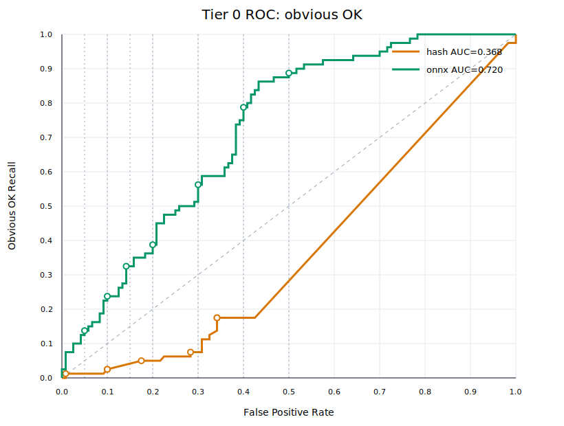

# Tier 0 Embedding Benchmark

Methods comparison on 200 "anchor-page title" pair.
No cross-validation is used. Each method selects its threshold on all 200 pairs.
Positive means `obvious OK`; higher scores predict OK.

## Dataset

- Pairs: 200 across 40 anchors
- Short anchors (<=3 words): 37
- Short titles (<=6 words): 200
- Short anchor-title pairs: 185
- Anchor groups with English OK title: 39
- Legacy fixture pairs: 32

## Overall

| Method | Source | Dimensions | Cold ms | Warm ms | ROC AUC | partial AUC FPR<=30% | Average precision |
|---|---|---:|---:|---:|---:|---:|---:|
| hash (baseline) | builtin:hash | 256 | 19.0 | 12.1 | 0.3680 | 0.0382 | 0.4013 |
| [KoEn-E5-Tiny](https://huggingface.co/exp-models/dragonkue-KoEn-E5-Tiny/blob/main/onnx/model_qint8_arm64.onnx) | builtin:onnx | 384 | 2333.8 | 1260.6 | 0.7199 | 0.3031 | 0.6043 |

## Operating Points

| FPR budget | Method | Tau | Recall | Actual FPR | FP | Precision |
|---:|---|---:|---:|---:|---:|---:|
| 5% | hash | 0.670820 | 1.2% | 0.8% | 1 | 50.0% |
| 5% | onnx | 0.641367 | 13.8% | 5.0% | 6 | 64.7% |
| 10% | hash | 0.426401 | 2.5% | 10.0% | 12 | 14.3% |
| 10% | onnx | 0.603713 | 23.8% | 10.0% | 12 | 61.3% |
| 15% | hash | 0.426401 | 2.5% | 10.0% | 12 | 14.3% |
| 15% | onnx | 0.573981 | 32.5% | 14.2% | 17 | 60.5% |
| 20% | hash | 0.408248 | 5.0% | 17.5% | 21 | 16.0% |
| 20% | onnx | 0.553277 | 38.8% | 20.0% | 24 | 56.4% |
| 30% | hash | 0.288675 | 7.5% | 28.3% | 34 | 15.0% |
| 30% | onnx | 0.493960 | 56.2% | 30.0% | 36 | 55.6% |

## Tag Slices

| Tag | Method | Count | OK | DRIFT | OK mean | DRIFT mean |
|---|---|---:|---:|---:|---:|---:|
| adjacent_topic | hash | 32 | 0 | 32 | - | 0.0265 |
| adjacent_topic | onnx | 32 | 0 | 32 | - | 0.3634 |
| cross_lingual | hash | 41 | 41 | 0 | 0.0179 | - |
| cross_lingual | onnx | 41 | 41 | 0 | 0.5534 | - |
| different_sense | hash | 32 | 0 | 32 | - | 0.3904 |
| different_sense | onnx | 32 | 0 | 32 | - | 0.5650 |
| easy_negative | hash | 42 | 0 | 42 | - | 0.0024 |
| easy_negative | onnx | 42 | 0 | 42 | - | 0.2224 |
| en_translation | hash | 41 | 41 | 0 | 0.0179 | - |
| en_translation | onnx | 41 | 41 | 0 | 0.5534 | - |
| ko_semantic_no_overlap | hash | 39 | 39 | 0 | 0.0757 | - |
| ko_semantic_no_overlap | onnx | 39 | 39 | 0 | 0.4634 | - |
| legacy_fixture | hash | 32 | 16 | 16 | 0.0353 | 0.0673 |
| legacy_fixture | onnx | 32 | 16 | 16 | 0.5217 | 0.2900 |
| lexical_overlap_trap | hash | 46 | 0 | 46 | - | 0.3485 |
| lexical_overlap_trap | onnx | 46 | 0 | 46 | - | 0.5391 |
| short_anchor | hash | 185 | 74 | 111 | 0.0526 | 0.1460 |
| short_anchor | onnx | 185 | 74 | 111 | 0.5111 | 0.3857 |
| short_title | hash | 200 | 80 | 120 | 0.0460 | 0.1415 |
| short_title | onnx | 200 | 80 | 120 | 0.5095 | 0.3814 |

## All Pair Scores

| ID | Anchor | Title | Label | Tags | hash | onnx |
|---|---|---|---|---|---:|---:|
| g01-legacy-01 | 국내 여행지 탐색 | 제주 관광 명소 추천 | OK | short_anchor, ko_semantic_no_overlap, short_title, legacy_fixture | 0.000000 | 0.522639 |
| g01-legacy-02 | 국내 여행지 탐색 | 부산에서 가볼 만한 곳 | OK | short_anchor, ko_semantic_no_overlap, short_title, legacy_fixture | 0.000000 | 0.507903 |
| g01-legacy-03 | 국내 여행지 탐색 | 국내 주식 시장 전망 | DRIFT | short_anchor, lexical_overlap_trap, short_title, legacy_fixture | 0.301511 | 0.365983 |
| g01-legacy-04 | 국내 여행지 탐색 | 프리미어리그 경기 하이라이트 | DRIFT | short_anchor, easy_negative, short_title, legacy_fixture | 0.000000 | 0.347679 |
| g01-generated-05 | 국내 여행지 탐색 | 국내 여행 보험 비교 | DRIFT | short_anchor, lexical_overlap_trap, short_title | 0.452267 | 0.632054 |
| g02-legacy-01 | 한국에서 가볼 만한 여행지 | Best places to visit in Korea | OK | en_translation, cross_lingual, short_title, legacy_fixture | 0.000000 | 0.619526 |
| g02-legacy-02 | 한국에서 가볼 만한 여행지 | A guide to sightseeing in Seoul | OK | en_translation, cross_lingual, short_title, legacy_fixture | -0.210819 | 0.550637 |
| g02-legacy-03 | 한국에서 가볼 만한 여행지 | How to invest in Korean stocks | DRIFT | easy_negative, short_title, legacy_fixture | 0.000000 | 0.267140 |
| g02-legacy-04 | 한국에서 가볼 만한 여행지 | Premier League match results | DRIFT | easy_negative, short_title, legacy_fixture | 0.000000 | 0.198475 |
| g02-generated-05 | 한국에서 가볼 만한 여행지 | 한국 여행 비자 안내 | DRIFT | lexical_overlap_trap, short_title | 0.258199 | 0.556275 |
| g03-legacy-01 | 파이썬 데이터 분석 | Pandas data analysis tutorial | OK | short_anchor, en_translation, cross_lingual, short_title, legacy_fixture | 0.000000 | 0.744807 |
| g03-legacy-02 | 파이썬 데이터 분석 | 데이터프레임 전처리 방법 | OK | short_anchor, ko_semantic_no_overlap, short_title, legacy_fixture | 0.175412 | 0.368151 |
| g03-legacy-03 | 파이썬 데이터 분석 | 홈베이킹 식빵 레시피 | DRIFT | short_anchor, easy_negative, short_title, legacy_fixture | 0.000000 | 0.244135 |
| g03-legacy-04 | 파이썬 데이터 분석 | 프로야구 오늘 경기 결과 | DRIFT | short_anchor, easy_negative, short_title, legacy_fixture | 0.000000 | 0.245025 |
| g03-generated-05 | 파이썬 데이터 분석 | 파이썬 서식지 정보 | DRIFT | short_anchor, lexical_overlap_trap, short_title | 0.223607 | 0.601526 |
| g04-legacy-01 | 크롬 확장 프로그램 개발 | Chrome extension Manifest V3 documentation | OK | en_translation, cross_lingual, short_title, legacy_fixture | 0.000000 | 0.573981 |
| g04-legacy-02 | 크롬 확장 프로그램 개발 | 브라우저 extension background service worker | OK | ko_semantic_no_overlap, short_title, legacy_fixture | 0.000000 | 0.421248 |
| g04-legacy-03 | 크롬 확장 프로그램 개발 | 크롬으로 보는 오늘의 뉴스 | DRIFT | lexical_overlap_trap, short_title, legacy_fixture | 0.074536 | 0.439534 |
| g04-legacy-04 | 크롬 확장 프로그램 개발 | 서울 아파트 매매 가격 | DRIFT | easy_negative, short_title, legacy_fixture | 0.000000 | 0.159046 |
| g04-generated-05 | 크롬 확장 프로그램 개발 | 크롬 도금 관리법 | DRIFT | lexical_overlap_trap, short_title | 0.174078 | 0.535680 |
| g05-legacy-01 | 반려견 건강 관리 | 강아지 예방접종과 동물병원 정보 | OK | short_anchor, ko_semantic_no_overlap, short_title, legacy_fixture | 0.000000 | 0.434963 |
| g05-legacy-02 | 반려견 건강 관리 | Healthy food and exercise for dogs | OK | short_anchor, en_translation, cross_lingual, short_title, legacy_fixture | 0.246183 | 0.565713 |
| g05-legacy-03 | 반려견 건강 관리 | 자바스크립트 비동기 프로그래밍 | DRIFT | short_anchor, easy_negative, short_title, legacy_fixture | -0.075378 | 0.148608 |
| g05-legacy-04 | 반려견 건강 관리 | 환율과 기준금리 뉴스 | DRIFT | short_anchor, easy_negative, short_title, legacy_fixture | -0.181818 | 0.182860 |
| g05-generated-05 | 반려견 건강 관리 | 반려동물 미용 예약 | DRIFT | short_anchor, lexical_overlap_trap, short_title | 0.087039 | 0.595640 |
| g06-legacy-01 | 머신러닝 모델 학습 | 신경망 훈련 데이터 준비 | OK | short_anchor, ko_semantic_no_overlap, short_title, legacy_fixture | 0.000000 | 0.452165 |
| g06-legacy-02 | 머신러닝 모델 학습 | Training a machine learning classifier | OK | short_anchor, en_translation, cross_lingual, short_title, legacy_fixture | 0.000000 | 0.558125 |
| g06-legacy-03 | 머신러닝 모델 학습 | 패션 모델의 런웨이 화보 | DRIFT | short_anchor, lexical_overlap_trap, short_title, legacy_fixture | 0.154303 | 0.354686 |
| g06-legacy-04 | 머신러닝 모델 학습 | 모델하우스 아파트 분양 안내 | DRIFT | short_anchor, lexical_overlap_trap, short_title, legacy_fixture | 0.072169 | 0.299126 |
| g06-generated-05 | 머신러닝 모델 학습 | 모델 촬영 포즈 | DRIFT | short_anchor, lexical_overlap_trap, short_title | 0.333333 | 0.382742 |
| g07-legacy-01 | 서울 날씨 | Seoul weekly weather forecast | OK | short_anchor, en_translation, cross_lingual, short_title, legacy_fixture | 0.000000 | 0.586255 |
| g07-legacy-02 | 서울 날씨 | 내일 서울 비 소식과 기온 | OK | short_anchor, ko_semantic_no_overlap, short_title, legacy_fixture | 0.353553 | 0.665829 |
| g07-legacy-03 | 서울 날씨 | 서울 부동산 아파트 시세 | DRIFT | short_anchor, lexical_overlap_trap, short_title, legacy_fixture | 0.377964 | 0.556572 |
| g07-legacy-04 | 서울 날씨 | 서울 지역 맛집 순위 | DRIFT | short_anchor, lexical_overlap_trap, short_title, legacy_fixture | 0.353553 | 0.426121 |
| g07-generated-05 | 서울 날씨 | 서울 산책 코스 | DRIFT | short_anchor, lexical_overlap_trap, short_title | 0.408248 | 0.572901 |
| g08-legacy-01 | 임베딩 모델 관련 논문 조사 | Semantic text embeddings research paper | OK | en_translation, cross_lingual, short_title, legacy_fixture | 0.000000 | 0.527637 |
| g08-legacy-02 | 임베딩 모델 관련 논문 조사 | Google Scholar multilingual E5 | OK | en_translation, cross_lingual, short_title, legacy_fixture | 0.000000 | 0.248262 |
| g08-legacy-03 | 임베딩 모델 관련 논문 조사 | YouTube 집중 음악 플레이리스트 | DRIFT | easy_negative, short_title, legacy_fixture | 0.000000 | 0.212236 |
| g08-legacy-04 | 임베딩 모델 관련 논문 조사 | 저녁 식사 배달 메뉴 추천 | DRIFT | easy_negative, short_title, legacy_fixture | 0.000000 | 0.193349 |
| g08-generated-05 | 임베딩 모델 관련 논문 조사 | 논문 표지 양식 | DRIFT | lexical_overlap_trap, short_title | 0.264906 | 0.400502 |
| g09-generated-01 | 뉴스 | 오늘 주요 헤드라인 | OK | short_anchor, ko_semantic_no_overlap, short_title | 0.000000 | 0.412771 |
| g09-generated-02 | 뉴스 | Latest news headlines | OK | short_anchor, en_translation, cross_lingual, short_title | 0.000000 | 0.537559 |
| g09-generated-03 | 뉴스 | 뉴스 앵커 이적 | DRIFT | short_anchor, lexical_overlap_trap, different_sense, short_title | 0.577350 | 0.524752 |
| g09-generated-04 | 뉴스 | 언론사 구독료 비교 | DRIFT | short_anchor, adjacent_topic, short_title | 0.000000 | 0.380321 |
| g09-generated-05 | 뉴스 | 피아노 악보 모음 | DRIFT | short_anchor, easy_negative, short_title | 0.000000 | 0.289256 |
| g10-generated-01 | 컴퓨터 쇼핑 | 노트북 가격 비교 | OK | short_anchor, ko_semantic_no_overlap, short_title | 0.000000 | 0.457013 |
| g10-generated-02 | 컴퓨터 쇼핑 | Computer shopping deals | OK | short_anchor, en_translation, cross_lingual, short_title | 0.000000 | 0.758715 |
| g10-generated-03 | 컴퓨터 쇼핑 | 컴퓨터 자격증 일정 | DRIFT | short_anchor, lexical_overlap_trap, different_sense, short_title | 0.436436 | 0.508981 |
| g10-generated-04 | 컴퓨터 쇼핑 | 키보드 청소 방법 | DRIFT | short_anchor, adjacent_topic, short_title | 0.000000 | 0.305622 |
| g10-generated-05 | 컴퓨터 쇼핑 | 근력 운동 루틴 | DRIFT | short_anchor, easy_negative, short_title | 0.000000 | 0.206093 |
| g11-generated-01 | 등기부등본 | 등기사항증명서 발급 | OK | short_anchor, ko_semantic_no_overlap, short_title | 0.000000 | 0.532294 |
| g11-generated-02 | 등기부등본 | Real estate registry copy | OK | short_anchor, en_translation, cross_lingual, short_title | 0.000000 | 0.239534 |
| g11-generated-03 | 등기부등본 | 등기 우편 조회 | DRIFT | short_anchor, lexical_overlap_trap, different_sense, short_title | 0.000000 | 0.562458 |
| g11-generated-04 | 등기부등본 | 전입신고 신청 | DRIFT | short_anchor, adjacent_topic, short_title | 0.000000 | 0.237490 |
| g11-generated-05 | 등기부등본 | 라면 끓이는 법 | DRIFT | short_anchor, easy_negative, short_title | 0.000000 | 0.230297 |
| g12-generated-01 | 코스피 | 국내 증시 지수 | OK | short_anchor, ko_semantic_no_overlap, short_title | 0.000000 | 0.433447 |
| g12-generated-02 | 코스피 | KOSPI index today | OK | short_anchor, en_translation, cross_lingual, short_title | 0.000000 | 0.578063 |
| g12-generated-03 | 코스피 | 코스피 상장 절차 | DRIFT | short_anchor, lexical_overlap_trap, different_sense, short_title | 0.522233 | 0.624314 |
| g12-generated-04 | 코스피 | 삼성전자 배당 일정 | DRIFT | short_anchor, adjacent_topic, short_title | 0.000000 | 0.298642 |
| g12-generated-05 | 코스피 | 아침 요가 영상 | DRIFT | short_anchor, easy_negative, short_title | 0.000000 | 0.202406 |
| g13-generated-01 | 여권 갱신 | 여권 재발급 신청 | OK | short_anchor, ko_semantic_no_overlap, short_title | 0.426401 | 0.653656 |
| g13-generated-02 | 여권 갱신 | Passport renewal application | OK | short_anchor, en_translation, cross_lingual, short_title | 0.000000 | 0.394371 |
| g13-generated-03 | 여권 갱신 | 여권 사진 보정 | DRIFT | short_anchor, lexical_overlap_trap, different_sense, short_title | 0.408248 | 0.639623 |
| g13-generated-04 | 여권 갱신 | 비자 면제 국가 | DRIFT | short_anchor, adjacent_topic, short_title | 0.000000 | 0.328072 |
| g13-generated-05 | 여권 갱신 | 축구화 사이즈 표 | DRIFT | short_anchor, easy_negative, short_title | 0.000000 | 0.285001 |
| g14-generated-01 | 전기요금 납부 | 한전 고지서 결제 | OK | short_anchor, ko_semantic_no_overlap, short_title | 0.000000 | 0.441522 |
| g14-generated-02 | 전기요금 납부 | Pay electricity bill | OK | short_anchor, en_translation, cross_lingual, short_title | 0.000000 | 0.579471 |
| g14-generated-03 | 전기요금 납부 | 전기차 충전요금 | DRIFT | short_anchor, lexical_overlap_trap, different_sense, short_title | 0.267261 | 0.660358 |
| g14-generated-04 | 전기요금 납부 | 가스요금 자동이체 | DRIFT | short_anchor, adjacent_topic, short_title | 0.125000 | 0.469524 |
| g14-generated-05 | 전기요금 납부 | 세계사 연표 정리 | DRIFT | short_anchor, easy_negative, short_title | 0.000000 | 0.158773 |
| g15-generated-01 | 부가세 신고 | 홈택스 신고서 작성 | OK | short_anchor, ko_semantic_no_overlap, short_title | 0.239046 | 0.434580 |
| g15-generated-02 | 부가세 신고 | VAT return filing | OK | short_anchor, en_translation, cross_lingual, short_title | 0.000000 | 0.306572 |
| g15-generated-03 | 부가세 신고 | 부가서비스 해지 | DRIFT | short_anchor, lexical_overlap_trap, different_sense, short_title | 0.125988 | 0.515597 |
| g15-generated-04 | 부가세 신고 | 소득세 환급 조회 | DRIFT | short_anchor, adjacent_topic, short_title | 0.000000 | 0.459818 |
| g15-generated-05 | 부가세 신고 | 등산화 끈 묶기 | DRIFT | short_anchor, easy_negative, short_title | 0.000000 | 0.221154 |
| g16-generated-01 | 아파트 청약 | 주택청약 당첨 발표 | OK | short_anchor, ko_semantic_no_overlap, short_title | 0.218218 | 0.641367 |
| g16-generated-02 | 아파트 청약 | Apartment lottery application | OK | short_anchor, en_translation, cross_lingual, short_title | 0.000000 | 0.552112 |
| g16-generated-03 | 아파트 청약 | 아파트 조명 추천 | DRIFT | short_anchor, lexical_overlap_trap, different_sense, short_title | 0.341882 | 0.552763 |
| g16-generated-04 | 아파트 청약 | 전세대출 금리 비교 | DRIFT | short_anchor, adjacent_topic, short_title | 0.000000 | 0.261186 |
| g16-generated-05 | 아파트 청약 | 클래식 음악 해설 | DRIFT | short_anchor, easy_negative, short_title | 0.113961 | 0.239874 |
| g17-generated-01 | 환율 | 달러 원 시세 | OK | short_anchor, ko_semantic_no_overlap, short_title | 0.000000 | 0.493960 |
| g17-generated-02 | 환율 | Currency exchange rates | OK | short_anchor, en_translation, cross_lingual, short_title | 0.000000 | 0.540919 |
| g17-generated-03 | 환율 | 환율 우대 쿠폰 | DRIFT | short_anchor, lexical_overlap_trap, different_sense, short_title | 0.577350 | 0.642851 |
| g17-generated-04 | 환율 | 미국 금리 일정 | DRIFT | short_anchor, adjacent_topic, short_title | 0.000000 | 0.319137 |
| g17-generated-05 | 환율 | 스케치북 추천 | DRIFT | short_anchor, easy_negative, short_title | 0.000000 | 0.168144 |
| g18-generated-01 | 금리 뉴스 | 기준금리 발표 속보 | OK | short_anchor, ko_semantic_no_overlap, short_title | 0.250000 | 0.616197 |
| g18-generated-02 | 금리 뉴스 | Interest rate news | OK | short_anchor, en_translation, cross_lingual, short_title | 0.000000 | 0.644326 |
| g18-generated-03 | 금리 뉴스 | 금리 높은 예금 | DRIFT | short_anchor, lexical_overlap_trap, different_sense, short_title | 0.408248 | 0.519571 |
| g18-generated-04 | 금리 뉴스 | 채권 가격 계산기 | DRIFT | short_anchor, adjacent_topic, short_title | 0.000000 | 0.306980 |
| g18-generated-05 | 금리 뉴스 | 캘리그래피 강좌 | DRIFT | short_anchor, easy_negative, short_title | 0.000000 | 0.253489 |
| g19-generated-01 | 타입스크립트 문서 | 타입 시스템 핸드북 | OK | short_anchor, ko_semantic_no_overlap, short_title | 0.200000 | 0.566747 |
| g19-generated-02 | 타입스크립트 문서 | TypeScript documentation | OK | short_anchor, en_translation, cross_lingual, short_title | 0.000000 | 0.407887 |
| g19-generated-03 | 타입스크립트 문서 | 문서 파쇄 견적 | DRIFT | short_anchor, lexical_overlap_trap, different_sense, short_title | 0.365148 | 0.386114 |
| g19-generated-04 | 타입스크립트 문서 | 자바스크립트 번들러 | DRIFT | short_anchor, adjacent_topic, short_title | 0.316228 | 0.468548 |
| g19-generated-05 | 타입스크립트 문서 | 제철 과일 달력 | DRIFT | short_anchor, easy_negative, short_title | 0.000000 | 0.240264 |
| g20-generated-01 | FastAPI 테스트 | pytest API 테스트 | OK | short_anchor, ko_semantic_no_overlap, short_title | 0.670820 | 0.689127 |
| g20-generated-02 | FastAPI 테스트 | FastAPI testing guide | OK | short_anchor, en_translation, cross_lingual, short_title | 0.288675 | 0.916700 |
| g20-generated-03 | FastAPI 테스트 | API 성능 테스트 | DRIFT | short_anchor, lexical_overlap_trap, different_sense, short_title | 0.530330 | 0.722041 |
| g20-generated-04 | FastAPI 테스트 | 파이썬 가상환경 | DRIFT | short_anchor, adjacent_topic, short_title | 0.000000 | 0.321182 |
| g20-generated-05 | FastAPI 테스트 | 수면 음악 모음 | DRIFT | short_anchor, easy_negative, short_title | 0.000000 | 0.185239 |
| g21-generated-01 | 리액트 라우터 | SPA 경로 설정 | OK | short_anchor, ko_semantic_no_overlap, short_title | 0.000000 | 0.232462 |
| g21-generated-02 | 리액트 라우터 | React Router documentation | OK | short_anchor, en_translation, cross_lingual, short_title | 0.000000 | 0.433951 |
| g21-generated-03 | 리액트 라우터 | 라우터 공유기 초기화 | DRIFT | short_anchor, lexical_overlap_trap, different_sense, short_title | 0.408248 | 0.558428 |
| g21-generated-04 | 리액트 라우터 | 상태관리 라이브러리 | DRIFT | short_anchor, adjacent_topic, short_title | 0.000000 | 0.189032 |
| g21-generated-05 | 리액트 라우터 | 도자기 만들기 체험 | DRIFT | short_anchor, easy_negative, short_title | 0.129099 | 0.238367 |
| g22-generated-01 | 논문 검색 | 학술 데이터베이스 조회 | OK | short_anchor, ko_semantic_no_overlap, short_title | 0.000000 | 0.422182 |
| g22-generated-02 | 논문 검색 | Academic paper search | OK | short_anchor, en_translation, cross_lingual, short_title | 0.000000 | 0.587928 |
| g22-generated-03 | 논문 검색 | 논문 인용 양식 | DRIFT | short_anchor, lexical_overlap_trap, different_sense, short_title | 0.408248 | 0.523248 |
| g22-generated-04 | 논문 검색 | 대학원 장학금 공고 | DRIFT | short_anchor, adjacent_topic, short_title | 0.000000 | 0.368110 |
| g22-generated-05 | 논문 검색 | 헤어스타일 추천 | DRIFT | short_anchor, easy_negative, short_title | 0.000000 | 0.282865 |
| g23-generated-01 | 영어 공부 | 회화 표현 암기 | OK | short_anchor, ko_semantic_no_overlap, short_title | 0.000000 | 0.246016 |
| g23-generated-02 | 영어 공부 | English study materials | OK | short_anchor, en_translation, cross_lingual, short_title | 0.000000 | 0.626675 |
| g23-generated-03 | 영어 공부 | 영어 유치원 비용 | DRIFT | short_anchor, lexical_overlap_trap, different_sense, short_title | 0.471405 | 0.534564 |
| g23-generated-04 | 영어 공부 | 토익 시험 접수 | DRIFT | short_anchor, adjacent_topic, short_title | 0.000000 | 0.346818 |
| g23-generated-05 | 영어 공부 | 주방 수납 아이디어 | DRIFT | short_anchor, easy_negative, short_title | 0.000000 | 0.202109 |
| g24-generated-01 | 일본 여행 | 도쿄 일정 짜기 | OK | short_anchor, ko_semantic_no_overlap, short_title | 0.000000 | 0.588994 |
| g24-generated-02 | 일본 여행 | Japan travel guide | OK | short_anchor, en_translation, cross_lingual, short_title | 0.000000 | 0.754880 |
| g24-generated-03 | 일본 여행 | 일본어 문법 기초 | DRIFT | short_anchor, lexical_overlap_trap, different_sense, short_title | 0.213201 | 0.417214 |
| g24-generated-04 | 일본 여행 | 엔화 환전 수수료 | DRIFT | short_anchor, adjacent_topic, short_title | 0.000000 | 0.266732 |
| g24-generated-05 | 일본 여행 | 농구 드리블 연습 | DRIFT | short_anchor, easy_negative, short_title | 0.000000 | 0.239764 |
| g25-generated-01 | 제주 맛집 | 서귀포 식당 추천 | OK | short_anchor, ko_semantic_no_overlap, short_title | 0.000000 | 0.555222 |
| g25-generated-02 | 제주 맛집 | Jeju restaurant recommendations | OK | short_anchor, en_translation, cross_lingual, short_title | 0.408248 | 0.574782 |
| g25-generated-03 | 제주 맛집 | 제주 항공권 특가 | DRIFT | short_anchor, lexical_overlap_trap, different_sense, short_title | 0.426401 | 0.477388 |
| g25-generated-04 | 제주 맛집 | 전국 맛집 순위 | DRIFT | short_anchor, adjacent_topic, short_title | 0.408248 | 0.613520 |
| g25-generated-05 | 제주 맛집 | 프린터 드라이버 설치 | DRIFT | short_anchor, easy_negative, short_title | 0.000000 | 0.181907 |
| g26-generated-01 | 혈압 관리 | 고혈압 생활습관 개선 | OK | short_anchor, ko_semantic_no_overlap, short_title | 0.213201 | 0.624197 |
| g26-generated-02 | 혈압 관리 | Blood pressure management | OK | short_anchor, en_translation, cross_lingual, short_title | 0.000000 | 0.763314 |
| g26-generated-03 | 혈압 관리 | 혈압계 배터리 교체 | DRIFT | short_anchor, lexical_overlap_trap, different_sense, short_title | 0.223607 | 0.587877 |
| g26-generated-04 | 혈압 관리 | 콜레스테롤 식단 | DRIFT | short_anchor, adjacent_topic, short_title | 0.000000 | 0.290215 |
| g26-generated-05 | 혈압 관리 | 기타 코드 표 | DRIFT | short_anchor, easy_negative, short_title | 0.000000 | 0.171491 |
| g27-generated-01 | 고양이 사료 | 묘령별 급여 방법 | OK | short_anchor, ko_semantic_no_overlap, short_title | 0.000000 | 0.260052 |
| g27-generated-02 | 고양이 사료 | Cat food recommendations | OK | short_anchor, en_translation, cross_lingual, short_title | 0.000000 | 0.542949 |
| g27-generated-03 | 고양이 사료 | 고양이 모래 탈취제 | DRIFT | short_anchor, lexical_overlap_trap, different_sense, short_title | 0.358569 | 0.519478 |
| g27-generated-04 | 고양이 사료 | 동물병원 접종 비용 | DRIFT | short_anchor, adjacent_topic, short_title | 0.000000 | 0.310757 |
| g27-generated-05 | 고양이 사료 | 엑셀 단축키 모음 | DRIFT | short_anchor, easy_negative, short_title | 0.113961 | 0.228348 |
| g28-generated-01 | 축구 일정 | 대표팀 경기 날짜 | OK | short_anchor, ko_semantic_no_overlap, short_title | 0.000000 | 0.553277 |
| g28-generated-02 | 축구 일정 | Football match schedule | OK | short_anchor, en_translation, cross_lingual, short_title | 0.000000 | 0.786254 |
| g28-generated-03 | 축구 일정 | 축구공 공기압 | DRIFT | short_anchor, lexical_overlap_trap, different_sense, short_title | 0.288675 | 0.465970 |
| g28-generated-04 | 축구 일정 | 스포츠 중계권 뉴스 | DRIFT | short_anchor, adjacent_topic, short_title | 0.000000 | 0.526138 |
| g28-generated-05 | 축구 일정 | 실내 식물 물주기 | DRIFT | short_anchor, easy_negative, short_title | 0.000000 | 0.265577 |
| g29-generated-01 | 영화 예매 | 극장 좌석 예약 | OK | short_anchor, ko_semantic_no_overlap, short_title | 0.000000 | 0.391044 |
| g29-generated-02 | 영화 예매 | Movie ticket booking | OK | short_anchor, en_translation, cross_lingual, short_title | -0.408248 | 0.510529 |
| g29-generated-03 | 영화 예매 | 영화 리뷰 평점 | DRIFT | short_anchor, lexical_overlap_trap, different_sense, short_title | 0.408248 | 0.421579 |
| g29-generated-04 | 영화 예매 | OTT 공개 일정 | DRIFT | short_anchor, adjacent_topic, short_title | 0.000000 | 0.333486 |
| g29-generated-05 | 영화 예매 | 자동차 세차 순서 | DRIFT | short_anchor, easy_negative, short_title | 0.000000 | 0.248108 |
| g30-generated-01 | 세탁기 비교 | 드럼 통돌이 가격 | OK | short_anchor, ko_semantic_no_overlap, short_title | 0.000000 | 0.336690 |
| g30-generated-02 | 세탁기 비교 | Washing machine comparison | OK | short_anchor, en_translation, cross_lingual, short_title | 0.000000 | 0.616105 |
| g30-generated-03 | 세탁기 비교 | 세탁기 필터 청소 | DRIFT | short_anchor, lexical_overlap_trap, different_sense, short_title | 0.341882 | 0.593941 |
| g30-generated-04 | 세탁기 비교 | 건조기 전기료 계산 | DRIFT | short_anchor, adjacent_topic, short_title | 0.000000 | 0.491895 |
| g30-generated-05 | 세탁기 비교 | 명상 호흡법 | DRIFT | short_anchor, easy_negative, short_title | 0.000000 | 0.218389 |
| g31-generated-01 | 무선 이어폰 | 블루투스 음질 리뷰 | OK | short_anchor, ko_semantic_no_overlap, short_title | 0.000000 | 0.417392 |
| g31-generated-02 | 무선 이어폰 | Wireless earbuds reviews | OK | short_anchor, en_translation, cross_lingual, short_title | 0.000000 | 0.632343 |
| g31-generated-03 | 무선 이어폰 | 무선 공유기 추천 | DRIFT | short_anchor, lexical_overlap_trap, different_sense, short_title | 0.455842 | 0.560483 |
| g31-generated-04 | 무선 이어폰 | 헤드폰 노이즈캔슬링 | DRIFT | short_anchor, adjacent_topic, short_title | 0.000000 | 0.451769 |
| g31-generated-05 | 무선 이어폰 | 손글씨 연습장 | DRIFT | short_anchor, easy_negative, short_title | 0.000000 | 0.269439 |
| g32-generated-01 | 커피 원두 | 싱글오리진 향미 비교 | OK | short_anchor, ko_semantic_no_overlap, short_title | 0.000000 | 0.281915 |
| g32-generated-02 | 커피 원두 | Coffee bean guide | OK | short_anchor, en_translation, cross_lingual, short_title | 0.000000 | 0.508592 |
| g32-generated-03 | 커피 원두 | 커피 머신 세척제 | DRIFT | short_anchor, lexical_overlap_trap, different_sense, short_title | 0.534522 | 0.568347 |
| g32-generated-04 | 커피 원두 | 카페 창업 비용 | DRIFT | short_anchor, adjacent_topic, short_title | 0.000000 | 0.414336 |
| g32-generated-05 | 커피 원두 | 야구 글러브 관리 | DRIFT | short_anchor, easy_negative, short_title | 0.000000 | 0.201315 |
| g33-generated-01 | 이사 견적 | 포장이사 비용 비교 | OK | short_anchor, ko_semantic_no_overlap, short_title | 0.204124 | 0.416537 |
| g33-generated-02 | 이사 견적 | Moving company quotes | OK | short_anchor, en_translation, cross_lingual, short_title | 0.000000 | 0.354409 |
| g33-generated-03 | 이사 견적 | 이사 날짜 달력 | DRIFT | short_anchor, lexical_overlap_trap, different_sense, short_title | 0.408248 | 0.526818 |
| g33-generated-04 | 이사 견적 | 입주 청소 가격표 | DRIFT | short_anchor, adjacent_topic, short_title | 0.000000 | 0.354665 |
| g33-generated-05 | 이사 견적 | 수학 퍼즐 게임 | DRIFT | short_anchor, easy_negative, short_title | 0.000000 | 0.198630 |
| g34-generated-01 | 택배 조회 | 운송장 배송 확인 | OK | short_anchor, ko_semantic_no_overlap, short_title | 0.000000 | 0.500289 |
| g34-generated-02 | 택배 조회 | Package tracking status | OK | short_anchor, en_translation, cross_lingual, short_title | 0.000000 | 0.438137 |
| g34-generated-03 | 택배 조회 | 택배 박스 구매 | DRIFT | short_anchor, lexical_overlap_trap, different_sense, short_title | 0.408248 | 0.701310 |
| g34-generated-04 | 택배 조회 | 우체국 영업시간 | DRIFT | short_anchor, adjacent_topic, short_title | 0.000000 | 0.253734 |
| g34-generated-05 | 택배 조회 | 프랑스어 발음 강의 | DRIFT | short_anchor, easy_negative, short_title | 0.000000 | 0.153586 |
| g35-generated-01 | 예방접종 | 독감 백신 예약 | OK | short_anchor, ko_semantic_no_overlap, short_title | 0.000000 | 0.479056 |
| g35-generated-02 | 예방접종 | Vaccination appointment schedule | OK | short_anchor, en_translation, cross_lingual, short_title | 0.000000 | 0.435159 |
| g35-generated-03 | 예방접종 | 예방접종 증명서 | DRIFT | short_anchor, lexical_overlap_trap, different_sense, short_title | 0.755929 | 0.764966 |
| g35-generated-04 | 예방접종 | 감기약 복용법 | DRIFT | short_anchor, adjacent_topic, short_title | 0.000000 | 0.294878 |
| g35-generated-05 | 예방접종 | 인테리어 색상표 | DRIFT | short_anchor, easy_negative, short_title | 0.000000 | 0.159018 |
| g36-generated-01 | 중고차 시세 | 차종별 매매 가격 | OK | short_anchor, ko_semantic_no_overlap, short_title | 0.000000 | 0.418519 |
| g36-generated-02 | 중고차 시세 | Used car prices | OK | short_anchor, en_translation, cross_lingual, short_title | 0.000000 | 0.524670 |
| g36-generated-03 | 중고차 시세 | 중고차 보험료 계산 | DRIFT | short_anchor, lexical_overlap_trap, different_sense, short_title | 0.358569 | 0.620436 |
| g36-generated-04 | 중고차 시세 | 신차 출시 일정 | DRIFT | short_anchor, adjacent_topic, short_title | 0.000000 | 0.464907 |
| g36-generated-05 | 중고차 시세 | 베란다 텃밭 만들기 | DRIFT | short_anchor, easy_negative, short_title | 0.000000 | 0.218870 |
| g37-generated-01 | 캠핑 장비 | 텐트 버너 추천 | OK | short_anchor, ko_semantic_no_overlap, short_title | 0.000000 | 0.446001 |
| g37-generated-02 | 캠핑 장비 | Camping gear checklist | OK | short_anchor, en_translation, cross_lingual, short_title | 0.000000 | 0.623654 |
| g37-generated-03 | 캠핑 장비 | 캠핑장 예약 날짜 | DRIFT | short_anchor, lexical_overlap_trap, different_sense, short_title | 0.213201 | 0.579797 |
| g37-generated-04 | 캠핑 장비 | 등산 코스 난이도 | DRIFT | short_anchor, adjacent_topic, short_title | 0.000000 | 0.266849 |
| g37-generated-05 | 캠핑 장비 | 주식 배당 캘린더 | DRIFT | short_anchor, easy_negative, short_title | 0.000000 | 0.221250 |
| g38-generated-01 | 사진 보정 | 색감 밝기 조절 | OK | short_anchor, ko_semantic_no_overlap, short_title | 0.000000 | 0.324457 |
| g38-generated-02 | 사진 보정 | Photo editing tutorial | OK | short_anchor, en_translation, cross_lingual, short_title | 0.408248 | 0.459405 |
| g38-generated-03 | 사진 보정 | 사진 인화 가격 | DRIFT | short_anchor, lexical_overlap_trap, different_sense, short_title | 0.408248 | 0.519229 |
| g38-generated-04 | 사진 보정 | 카메라 렌즈 추천 | DRIFT | short_anchor, adjacent_topic, short_title | 0.000000 | 0.453644 |
| g38-generated-05 | 사진 보정 | 도시락 반찬 레시피 | DRIFT | short_anchor, easy_negative, short_title | 0.000000 | 0.320409 |
| g39-generated-01 | 개인정보 설정 | 계정 공개 범위 | OK | short_anchor, ko_semantic_no_overlap, short_title | 0.000000 | 0.400526 |
| g39-generated-02 | 개인정보 설정 | Privacy settings guide | OK | short_anchor, en_translation, cross_lingual, short_title | 0.000000 | 0.603713 |
| g39-generated-03 | 개인정보 설정 | 개인정보 처리방침 | DRIFT | short_anchor, lexical_overlap_trap, different_sense, short_title | 0.500000 | 0.655082 |
| g39-generated-04 | 개인정보 설정 | 비밀번호 관리자 추천 | DRIFT | short_anchor, adjacent_topic, short_title | 0.000000 | 0.404810 |
| g39-generated-05 | 개인정보 설정 | 바느질 기초 방법 | DRIFT | short_anchor, easy_negative, short_title | 0.000000 | 0.281752 |
| g40-generated-01 | 자전거 정비 | 브레이크 체인 점검 | OK | short_anchor, ko_semantic_no_overlap, short_title | 0.000000 | 0.432637 |
| g40-generated-02 | 자전거 정비 | Bicycle maintenance guide | OK | short_anchor, en_translation, cross_lingual, short_title | 0.000000 | 0.482045 |
| g40-generated-03 | 자전거 정비 | 자전거 도로 지도 | DRIFT | short_anchor, lexical_overlap_trap, different_sense, short_title | 0.341882 | 0.624803 |
| g40-generated-04 | 자전거 정비 | 헬멧 안전 인증 | DRIFT | short_anchor, adjacent_topic, short_title | 0.000000 | 0.376986 |
| g40-generated-05 | 자전거 정비 | 웹툰 신작 순위 | DRIFT | short_anchor, easy_negative, short_title | 0.000000 | 0.162476 |
