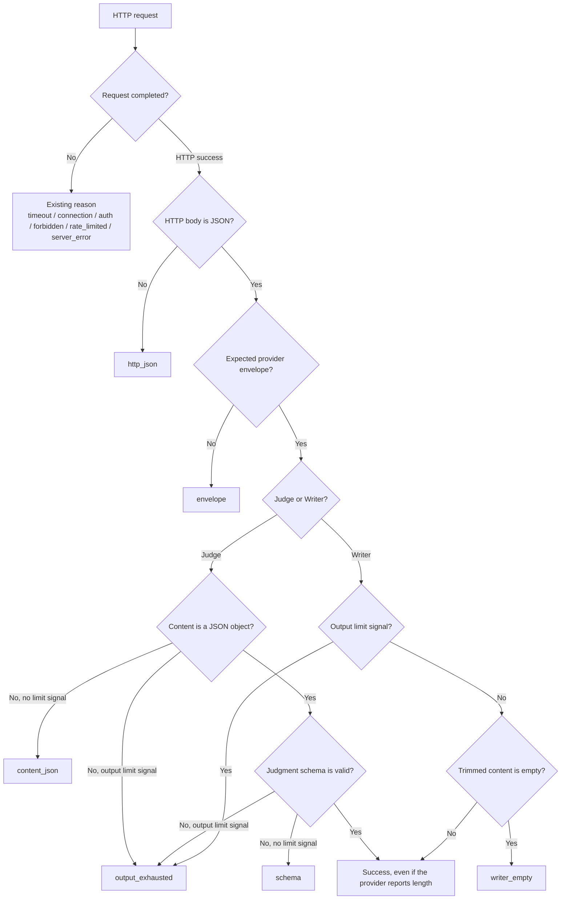

# Provider response failure classification

## Problem

The popup currently collapses every `invalid_response` into one warning:

> LLM 호출 오류 — 마지막 판정 요청이 실패했어요. Provider 응답을 판정 결과로 읽지 못했어요.

That message does not distinguish a non-JSON HTTP body, an unexpected provider
envelope, malformed model content, an invalid judgment schema, an empty Writer
message, or output truncated by the configured token budget. Those failures need
different operational responses, but the server previously retained only a broad
`reason` and exception class.

This change keeps the existing coarse `reason` contract and adds two safe fields:

- `phase`: the logical call that failed, `judge` or `writer`.
- `stage`: the response boundary that failed, or `null` for failures such as
  timeouts and authentication errors that happen outside response decoding.

Raw provider responses, prompts, URLs, and API keys are never written to health
or the event log.

## Classification flow



Network and HTTP status failures retain their existing `reason`; `phase` still
identifies which logical call failed and `stage` remains `null`.

## Stage contract and examples

| Stage | Boundary | Applies to | Representative response |
|---|---|---|---|
| `http_json` | HTTP 2xx body cannot be decoded as JSON | all calls | `upstream proxy error` |
| `envelope` | JSON body lacks OpenAI `choices[0].message.content` or Ollama `message.content`/`response` | all calls | `{"result":{"text":"..."}}` |
| `content_json` | Judge content is not a JSON object | Judge | `{"decision":"notify"` |
| `schema` | Parsed object violates the judgment contract | Judge | `{"decision":"maybe","reason_code":"off_goal","basis":"both"}` |
| `writer_empty` | Writer content is empty after trimming | Writer | `{"message":{"content":"   "}}` |
| `output_exhausted` | Invalid/incomplete Judge result or any Writer result reports the output limit | Judge/Writer | `{"message":{"content":"{\"decision\":\"not"},"done_reason":"length","eval_count":640}` |

Ollama output exhaustion is signaled by `done_reason == "length"` or
`eval_count >= max_output_tokens`. OpenAI-compatible output exhaustion is
signaled by `choices[0].finish_reason == "length"`.

Judge output is accepted when its JSON and schema are complete even if the
provider reports a length boundary. A Writer result with the same signal is
rejected because a plain-text sentence may be semantically truncated despite
looking non-empty; the existing local persona fallback then supplies the nudge.

## Health and event examples

An invalid Tier 1 judgment is exposed additively:

```json
{
  "last_result": "error",
  "reason": "invalid_response",
  "phase": "judge",
  "stage": "content_json",
  "checked_at": "2026-07-20T04:44:12.471625+00:00"
}
```

The corresponding existing event gains the same optional diagnostics while
retaining its original fields:

```json
{
  "observation_id": "obs_example",
  "error_type": "ProviderResponseError",
  "phase": "judge",
  "stage": "content_json"
}
```

Initial and successful health states set `phase` and `stage` to `null`. No
database migration is required because provider-error payloads are JSON.

## Acceptance criteria

- OpenAI-compatible and Ollama calls classify every response boundary above.
- Tier 1 sends its configured OpenAI-compatible output budget.
- Provider failures preserve existing lower-tier and Writer-fallback behavior.
- `/health` and provider-error events add `phase` and `stage` without replacing
  existing fields.
- A later successful logical call clears the detailed failure state.
- Server tests and the extension build pass without live provider calls.

Retries, JSON Schema structured output, and detailed popup copy are separate
follow-up changes.
